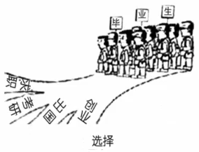
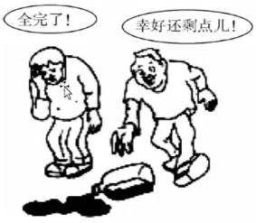

# 图画作文

## 第一段：介绍画面（6 行）

### 第一句：总体描述

| 中文                                                         | 英文                                                         |
| ------------------------------------------------------------ | ------------------------------------------------------------ |
| 这幅画描绘了一个普遍的社会**现象**，给人留下了多么深刻的印象！ | What an Impressive drawing it is in describing one of the most wide-spread social **phenomena** *(phenomenon 的负数形式)* ! |
| 如果不是看到了上面的这**幅触及灵魂的**画，一个**引人深思的**现象就会被忽略了：…… | <u>If it were not / Were it not</u> for the **soul-stirring** drawing above, a **thought-provoking** phenomenon would be neglected:【大写开头的句子】…… |
| 虽然我们通常都忽略了【主旨词】的现象，它仍是悬在人类头上的**达摩克利斯之剑**。 | The phenomenon of【主旨词】as we tend to ignore, it is **the Sword of Damocles** that still hangs over humankind. |
| 上图描述了：【内容】                                         | Portaryed in the drawing is such a scene:【内容】            |
| 画中出现了这样一个场景：【内容】                             | <u>Emerging from / What springs from</u> the drawing is such a scene:【内容】 |
| 一副非凡而且有意义的画**展现在**我们的眼前：【内容】         | Before our eyes **unfolds** an extraordinary and meaningful drawing:【句子】 |
| 展现在我们眼前的是一个具有启发性的场景：【内容】             | Laid out before our eyes is an enlightening scene:【内容】   |

### 第二句：细节描述

#### 单图：描述主被动关系，用定从联系起来。

1. 找到图上的核心事物，描述所在位置。

   介词短语 + 动作 + 核心事物：Beside the table sit two man.

   V-ing + 介词短语 + is / are + 核心事物：Sitting beside the table are two man.

2. 描述核心事物的动作、表情、言语等。

3. 描述周边事物。

合成：<u>On / In / Beside / ...</u>【地点】<u>sit / stand / lie</u>(s)【核心事物】,【非谓语 (doing ……)】, who【周边事物】.

**例**：

At a crossroads stand **a flock of** (一大群的) graduates, **wearing an air of** (带着 ... 的神情) confusion, who are face with many choices: ……

#### 多图：描述对比关系（单图也可能出现对比关系）。

1. 描述找到相同的内容（例如事件背景）。
2. 描述对象 1 以什么样的方式，做了什么；对象 2 以什么样的方式，做了什么。

合成：【描述背景】,【对象 1】【定从 / 非谓语】,【完整句子】while【对象 2】【定从 / 非谓语】,【完整句子】.

**例**：

Having seen the bottle spill out, one person, sighing that "All is over", falls into despair, while the other person, smiling as he feels so lucky to still have something left in the bottle, hurries to pick up the bottle.

#### 可描述内容不够时：阐述重要性。

要不是因为【核心事物】，我们就可能**忽视**了一个普遍现象：…… / 我们可能就会**忽视**【主旨词】的重要性了。

Were it not for the【核心事物】,【非谓语 / 介词短语 / 定从】, <u>we would **omit** the common phenomenon that …… / we would **disregard** the significance of 【主旨词】.</u>

### 第三句：文字说明或表达感受

| 中文                                                         | 英文                                                         |
| ------------------------------------------------------------ | ------------------------------------------------------------ |
| 标题是 “【标题】”。                                          | The caption indicates "【标题】".                            |
| 画的下方，有一个显眼的标题写道 “【标题】”。                  | At the bottom of the drawing, threre is an eye-catching sentence which reads "【标题】". |
| *（无法直译的标题）*画的下方有一个很**显眼的**句子，**大致意思**是：…… | At the bottom of the drawing, a sentence stands there **prominently**, which can be **briefly interpreted** in this way: …… |
| *（没有标题）*多么有启发性的一幅画啊！                       | <u>What an enlightening drawing it is! / What enlightening drawings they are!</u> |

## 第二段：主体

### 第一句：主旨句

| 中文                                                         | 英文                                                         |
| ------------------------------------------------------------ | ------------------------------------------------------------ |
| 直到我看到这幅画，我才意识到<u>【主旨词】的重要性 /【主题句】的事实</u>，我将从以下三个方面**解释**。 | Not until I see this drawing do I realize <u>the significance of【主旨词】/ the fact that【主题句】</u>, which can be **interpreted** by the following three aspects. |
| 乍一看这是一幅普通的画，但仔细思考后就会发现它**充满启发性**：人们必须要重视【主旨词】，我的**解释**如下。 | Common as it is at the first glance, the drawing is **brimming with illumination** after your serious pondering: individals are bound to put value on【主旨词】, which can **be accounted for** as follows. |
| 这幅引人深思的画传递的信息是【主旨词】是成功的关键，这可以通过以下所述来**解释**。 | The thought-provoking drawing conveys that【主旨词】is the key to success, which can be **explicated** by the following. |
| 隐藏在这幅画之中的事真正的人生哲学：【主题句】，可以从以下所述来**解释**。 | Behind the drawing lies a true philosophy of life:【主题句】, which can be **expounded** as follows. |
| 这幅画直击当今社会的核心问题：【某种现象】，其原因**列举**如下。 | This drawing goes straight to the core problem of the current society:【某种现象】, the reasons of which will be **set forth** as follows. |
| 【主旨词】被认为是一种比你从任何书上学到的东西都要高尚的品质，它的重要性**源自于**以下一系列的广泛因素。 | 【主旨词】has been considered a more noble quality than anything that you can learn from a book, and its significance **stems from** a broad range of factors as follows. |
| 这幅画**说明**了一个事实：【主旨词】，是人生成功的一个关键因素，是最不该**被忽视**的。 | The scene **crystallizes** a truth:【主旨词】, a <u>critical/crucial</u> component to life success, is the least to **disregard**. |
| 这幅画的关键在于 ……                                          | The **crux** of this drawing lies in ……                      |
| 一个**繁荣的**社会以【主旨词】为前提，该词是影响整个整个社会的一个大是非问题。 | A **thriving** society presupposes【主旨词】, one of the large questions of right and wrong affecting the entire society. |

补充：“如下” 的各种表达：

| 中文                | 英文                                                         |
| ------------------- | ------------------------------------------------------------ |
| …… 如下所【动词】。 | …… as【动词的过去分词 *(<u>given/shown/explained/……</u>)*】below. |
| …… 如下。           | …… as follows.                                               |
| 如下的【内容】      | The following【内容】                                        |

### 第二句 ~ 第四句：原因句

各个原因之间要使用连接词：

| 首先                       | 此外           | 最后               |
| -------------------------- | -------------- | ------------------ |
| Initially                  | Simultaneously | Ultimately         |
| First and foremost         | Moreover       | Last but not least |
| To <u>begin/start</u> with | In addition    | Third and last     |

#### 十大万能原因

- 经济
  1. 社会经济、科技
  2. 经济全球化、都市化
  3. 经济利益
- 文化思想
  4. 社会风气
  5. 社会思想转变
  6. 文化多样性、包容性
- 不同主体
  7. 政府、学校
  8. 传播媒体
  9. 个人
- 时代背景
  10. 疫情、后疫情

#### 1. 社会经济、科技

| 中文                                                         | 英文                                                         |
| ------------------------------------------------------------ | ------------------------------------------------------------ |
| 几乎每周都有技术和社会的进步，在五十年前看这是难以置信的。   | Hardly a week goes by without some advances in technology and society, which would have seemed incredible fifty years ago. |
| 引用**卡尔 · 海因里希 · 马克思**在《黑格尔法哲学（1843）》书中的一句话：“**经济基础**决定**上层建筑**”。 | A well-known saying from **Karl Heinrich Marx**'s *Critique of Hegel's Philosophy of Right*  (1843) should be quoted here: **Economic basis** decides **superstructure**. |
| 在信息量不断增长**的同时**，技术的发展也使得存储和向更多地方传递更多信息成为可能。 | **Coincident with** the growing quantity of information is the development of technology which enables the storage and delivery of more information to more locations than has ever been possible before. |
| 我们的一生正处于一个<u>以互联网为基础的社交网络时代 / 经济快速发展的时代</u>。 | Coincident with a period of <u>internet-based social networking / rapid economic development</u> is our lifetime. |
| 面对今天这样多元化的社会，大多数人都变得越来越【形容词】，<u>这导致了【某种坏现象】/ 这从【形容词】层面为【某种好现象】提供了必备基础</u>。 | In the face of **the very** *(表强调)* **pluralistic** society, many individuals, **if not nost**, are becoming increasingly【形容词】, which <u>triggers【某种坏现象】/ renders a fundamental basis in the【形容词 *(economic/……)*】level of doing【某种好现象】</u>. |
| 过去的几十年间，企业和消费者受益于跨境联系，【商品】供应充足，人们的幸福感很高。但由于疫情给商业和贸易关系继续带来压力，**这个繁荣的时期**正在发生部分倒退。这不可避免地导致了日常生活的变化：人们更倾向于做 …… | For the past few decades, companies and consumers benefited from cross-border connections that kept an abundant supply of【商品】, which helped the sense of happiness to stay high. But as the previous pandemic continues to weigh on bussiness and trading ties, **the period of thriving** appears to be undergoing a partial reversal, which unavoidably results in a routine shift: people tend to do …… |

#### 2. 经济全球化、都市化

| 中文                                                         | 英文                                                         |
| ------------------------------------------------------------ | ------------------------------------------------------------ |
| 伴随着**经济全球化和城市化**的进程加快，人类已经进入到一个崭新的历史时期，人们开始关注<u>更多的问题 / 更多的社会和个人的进步</u>，包括 …… | The human race having entered a completely new stage in its history, with the increasingly rapid **globalization and urbanization of economy**, brought to our attention are more problems / more enhancements both in individuals and society, including …… |

#### 3. 经济利益

不好的：

| 中文                                                         | 英文                                                         |
| ------------------------------------------------------------ | ------------------------------------------------------------ |
| 也许，这些人的**值得谴责的**行为可以解释为他们缺乏【某方面】的知识。然而最本质的原因在于这样一个事实：他们的**良知**屈服于了他们的自私，**沉溺在**了从【某件事】中获取巨额利益。 | Probably, these individuals'  **blameworthy** behavior can be interpreted by their lack of knowledge of【某方面】. The root case, however, lies in the fact that their **consciences** give way to selfishness and they **revel in** the huge profits made from【某件事】. |

好的：

| 中文                                                         | 英文                                                         |
| ------------------------------------------------------------ | ------------------------------------------------------------ |
| 也许，这些人的**令人满意的**行为可以解释为他们对【某方面】有**充足的认识**。然而最本质的原因在于这样一个事实：他们的**良知**从不屈服于他们的自私，也不**沉溺在**从【某件事】中获取巨额利益。 | Probably, these individuals'  **gratifying** behavior can be interpreted by their **sufficient appreciation** of【某方面】. The root case, however, lies in the fact that their **consciences** never give way to selfishness, nor do they **revel in** the huge profits made from【某件事】. |

#### 4. 社会风气

不好的：

| 中文                                                         | 英文                                                         |
| ------------------------------------------------------------ | ------------------------------------------------------------ |
| 主要原因归结为不良社会风气，如<u>信任 / 社会责任 / 基本伦理 / 道德、良心</u>的缺失，<u>利己主义 / 信任问题 / 扭曲的价值观</u>，等。 | Undesirable general mood of society should shoulder the blame, such as loss of <u>mutual trust / sense of social responsibility / basic ethics / morailty and conscience</u>, <u>egoism / credibility issue / distorted values towards life</u>, <u>and its like / and so on</u>. |
| 21 世纪的道德衰败，以及随之而来的对和谐社会的破坏，暗示了上述趋势的另一个重要因素。 | The decline of morality in the 21st century, with its consequent destruction of harmonious society, implies another contributor to the tendency mentioned above. |
| 缺乏对【主旨词】的意识 / 认识致使人类去做【某件事】，对【某些人或事】的**抱怨**充耳不闻。 | The lack of awareness and knowledge of【主旨词】pushes mankind to do【某件事】, turning a deaf ear to the **moan** of【某些人或事】. |
| 现代生活压力越来越大，导致**出现了这样的问题**：人们变得越来越唯利是图，忽略了【主旨词】。 | The <u>pressure / stress / strain</u> of morden life has **exposed a Pandora's box of** problems that individuals are becoming increasingly profit-oriented and thus disregard【主旨词】. |
| 道德衰败的趋势正在席卷我们国家 / 世界，表明一些传统价值观 —— **特别是**【主旨词】—— 已经逐渐消失。 | Among the trends sweeping across our <u>country / world</u>: moral decline, which indicates that some traditional values -- **notably**,【主旨词】-- have been fading away. |

好的：

| 中文                                                         | 英文                                                         |
| ------------------------------------------------------------ | ------------------------------------------------------------ |
| 文化融合的势头变得**不可阻挡**，人们对【某些人或事】的抱怨置若罔闻的日子已经一去不复返了。现在，对【主旨词】至关重要的道德和良心，绝对是我们生活中**不可或缺的一部分**。 | The momentum of cultural blending becoming **irresistible**, gone are the days when people turned a deaf ear to the moan of【某些人或事】. Now morality and conscience, critical to【主旨词】, are definitely **part and parcel** of our life. |
| 道德进步的趋势正在席卷我们国家 / 世界，表明一些传统价值观 —— **特别是**【主旨词】—— 得到了发扬。 | Among the trends sweeping across our <u>country / world</u>: moral enhancement, which indicates that some traditional values -- **notably**,【主旨词】-- have been carried forward. |

#### 5. 社会思想转变

| 中文                                                         | 英文                                                         |
| ------------------------------------------------------------ | ------------------------------------------------------------ |
| 这一趋势与人们对【主旨词】的观点和看法的转变密切相关。换句话说，【某件事】已经不再像过去那样重要了，这一事实表明了【某件事】才是真正重要的。 | The tendency has been bound up with the shift of folks' outlooks and perspectives on【主旨词】. <u>That is to say / In other words / Translated</u>, the fact that【某件事】is no longer as essential as it used to be, demonstrates what really counts is【某件事】. |
| 重要的是【主旨词】和【主旨词相关词】，而被贬低到边缘的是【主旨词反义词】。 | The words that have mattered are【主旨词】and【主旨词相关词】, while words degraded to the margin have been【主旨词反义词】. |

#### 6. 文化多样性、包容性

| 中文                                                         | 英文                                                         |
| ------------------------------------------------------------ | ------------------------------------------------------------ |
| 理性的选择非常重要，尤其是在关键时刻，因为它决定了未来。尽管如此，要**注意到**文化有着不可避免的多样性，每个人都面临着一系列的选择 —— 其中一些人选择了做【某件事】的方式。 | A <u>rational / reasonable</u> choice, especially at a critical moment, counts a lot due to the fact that it determines what the future holds. Despite the above, **noting** the inevitable divertisy of culture, there are an array of options facing every person -- and some of them choose the very way of doing【某件事】. |

#### 7. 政府、学校

| 中文                                                         | 英文                                                         |
| ------------------------------------------------------------ | ------------------------------------------------------------ |
| <u>地方行政部门 / 大学</u>在加强画里所展现的这些理念中起着至关重要的作用，并对【某件事】进行有效监督，使我们能够**及时了解**最新的消息，不遗余力的实现我们的目标。 | The <u>local administration / universities,</u> playing a crucial role in enhancing these ideas embodied in the drawing and exerting an effective supervision on【某件事】, <u>makes / make</u> it possible for us to **keep abreast of** the latest news and spare no efforts to achieve our goals. |
| <u>地方行政部门 / 大学</u>本该在**遏制**画里所展现的这些问题中发挥关键作用，却未能对【某件事】进行有效的监督。 | The <u>local administration / universities,</u> who supposed to play a crucial role in **curbing** these sorts of problems embodied in the drawing, <u>fails/ fail</u> to conduct effective supervision on【某件事】. |

#### 8. 传播媒体

| 中文                                                         | 英文                                                         |
| ------------------------------------------------------------ | ------------------------------------------------------------ |
| 各种各样的宣传，无论是报纸还是网络，都在**大力**提倡<u>真正重要的 / 使我们免受挫折的 / 让我们沉浸在幸福中的</u>不是【主旨词反义词】，而是【主旨词】，**诱导**人们做【某件事】。 | All kinds of publicity, be they newspapers or the Internet, advocate **vigorously** <u>what really matters is / what protects us from setbacks is / what makes us immerse in the honey of happiness is</u> less【主旨词反义词】than【主旨词】, **inducing** dwellers to do【某件事】. |
| 人们融入了媒体发起的【某种文化】文化 —— 这种文化强调【某个观点】—— 大众媒体进行了各种各样的报道和访谈。因此，人们选择做【某件事】并不奇怪。 | Folks are absorbed into a culture of【某种文化】-- placing emphasis on【某个观点】-- launched by the mass media that offer vast arrays of reports and interviews. Therefore, not at all surprising, individuals choose to do【某件事】. |

补充：两件事的程度比较：

| 中文                   | 英文                      |
| ---------------------- | ------------------------- |
| 不论是【A】还是【B】   | whether it is【A】or【B】 |
| 不论是【A】还是【B】   | be it / they【A】or【B】  |
| 与其说【A】不如说【B】 | more【A】than【B】        |
| 与其说【B】不如说【A】 | less【A】than【B】        |

#### 9. 个人

正面描述重要性：

| 中文                                                         | 英文                                                         |
| ------------------------------------------------------------ | ------------------------------------------------------------ |
| 【主旨词】是一种情感的力量，无论周围变得多么黑暗，它都能支持我们。 | 【主旨词】is a kind of emotional strength, which can support us no matter how dark the situation around us becomes. |
| 【主旨词】是美好未来的关键要素，而【某件事】可以让我们获得这种要素。 | It is【主旨词】, the component critical to a rosy future, that【某件事】can offer us. |
| 正是【主旨词】帮助我们到达成功的彼岸。                       | It is【主旨词】that helps us reach the other shore of success. |
| 正是【主旨词】赋予了每个人力量去**经受**挫折。               | It is【主旨词】that empowers everyone to **weather** setbacks. |
| 【主旨词】极其重要，它教会我们每个人自信面对困难。           | Especially significant is【主旨词】, which, for everyone, teaches us to respond to each **adversity** with confidence. |
| 【主旨词】会在不经意间点燃我们的生命，让我们摆脱困境。       | 【主旨词】will ignite our lives by accident and render us free from obstacles. |
| 【主旨词】用丰富的知识和长远的眼光武装了我们，这是任何**渴望**成功的人都必须具备的素质。 | 【主旨词】will equip us with abundant knowledge and long-term vision -- two essential qualifications that anyone who **yearns** for success is bound to possess. |
| 任何渴望成功的人都应该要意识到成功的路上充满了阻碍和困难，而这些在【主旨词】面前都会消失。 | Anyone who is eager to be successful is supposed to realize that the way to success is full of obstacles and hardships, which will fade away in the face of【主旨词】. |
| 困难和**失利**往往会使人气馁。但在无形中，它可以磨炼我们的意志，培养我们的自信和帮助我们学习如何更有效地**应对**挑战，在这个过程中【主旨词】是必不可少的。 | Hardships and **trails** tend to discourage people. But it can invisibly steel ourselves, cultivate our self-confidence and help us learn how to **cope with** many challenges effectively, during which【主旨词】is indispensable. |
| 不经历风雨，怎能见彩虹？只有经过急流，才能创造出许多难以言表的美丽，在这个过程中【主旨词】是必要的。 | How can we see the rainbow without experiencing storms? Only by going through the rapids can it be possible to buld many beauties beyond description, with【主旨词】being necessary. |
| 我们的一生都在激烈的竞争中度过，因此需要【主旨词】来帮助我们避免一个失败的未来。 | All our lives we've been in the midst of intense competition everywhere, so【主旨词】will be needed to avoid a future of underachievement. |

反面描述重要性：

| 中文                                                         | 英文                                                         |
| ------------------------------------------------------------ | ------------------------------------------------------------ |
| 盲目的<u>相信 / 做</u>【某件事】让年轻人一味地追求光鲜的外表，却没有重视内心的努力和坚持，而这正是人生观形成的关键因素。 | <u>Trusting / Doing</u>【某件事】blindly and ignoring【主旨词】makes the young seek the glamorous appearance simply but fail to value inner endeavor and persistence -- components critical to the formation of their views of life. |
| 鼓励个人去拒绝【主旨词】会让他们很**容易**落后于同龄人。     | Promoting individuals to reject【主旨词】will leave them **vulnerable** to lagging way behind their peers. |

举例描述重要性：

| 中文                                                         | 英文                                                         |
| ------------------------------------------------------------ | ------------------------------------------------------------ |
| 一个恰当的例子是【某人】，【他的头衔】，他的成功很大程度上源于他对【主旨词】的重视。 | A proper example is【某人】,【他的头衔】, whose success stems largely from his emphasis on【主旨词】. |
| 有一个恰当的好例子是【某人】，【他的头衔】，他揭示了一个简单却重要的事实：【主旨词】是成功不可或缺的关键。 | A good case in point is【某人】,【他的头衔】, which unveils a simple but crucial truth:【主旨词】is nothing but an indispensable key to success. |
| 根据中国国家统计局公布的数据，大约有【某个比例】的人做【某件事】。 | In light of the data published by the National Bureau of Statistics of China (NBC),【某个比例】percent of people, approximately, do【某件事】. |

#### 10. 疫情、后疫情

| 中文                                                         | 英文                                                         |
| ------------------------------------------------------------ | ------------------------------------------------------------ |
| 在**自愿隔离**带来的损失和新冠疫情带来的风险之间做权衡是一个**两难的选择**。鉴于此，我们不得不 …… | Weighing damage from **spontaneous quarantine** on the one hand with the risk of COVID-19 on the other hand is a choice  **between Scylla and Charybdis**. Noting this, we have no choice but …… |
| 随着新冠疫情在世界大部分地区逐渐减弱，**疫情防控措施**已全面解除。然而，从心理到生活习惯上，我们都仍然被新冠影响，因此**倾向于做** …… | As the COVID-19 pandemic continues to recede in most parts of the world, **pandemic control measures** are fully lifted. However, we, from psychology to lifestyle, are affected by it and **incline to do** …… |
| 由于对之前的疫情、**忙碌的**学习、工作和生活等当前形势的认识的提高，而生活的变化**反过来**又反映了重点的转移 —— 我们意识到，【主旨词】的重要性超过了其他的任何事情。 | On account for understanding of current situations like the previous pandemic, the **hectic** study and work life, the change of lifestyle **in turn** is a reflection of a shift of emphasis -- we are sensible of necessity of【主旨词】beyond anything else. |

## 第三段：归纳总结

### 第一句：结论句

正面的主题：

| 中文                                                         | 英文                                                         |
| ------------------------------------------------------------ | ------------------------------------------------------------ |
| 考虑到所讨论的内容，我们可以得出【主旨词】是至关重要的，需要采取更多的行动。 | Taking into account what has been argued, a conclusion that【主旨词】is overwhelmingly crucial, which needs more actions to be done. |
| 总之，【主旨词】是很重要的，并且还需要做更多。               | Altogether,【主旨词】is of the essence and more needs to be done. |
| *（如果不写二三句，直接总结）*总之，【主旨词】被认为不仅是【某件事】成功的**催化剂**，也是社会进步的基石。 | Altogether,【主旨词】is deemed as not only a **catalyst** for the success of【某件事】, but also a bedrock of social progress. |

负面的主题：

| 中文                                                         | 英文                                                         |
| ------------------------------------------------------------ | ------------------------------------------------------------ |
| 如上所述，必须立即对【某件事】采取**对立政策**来扭转这一**严峻的**形势。 | As has been mentioned above, **countermeasures** should be taken immediately so as to reverse the **grim** situation. |
| 总之，控制和**防范**上述现象的**具体**措施和策略如下。       | Altogether, **concrete** measures and strategies to control and **ward off** the phenomenon above can be proposed as below. |
| 【主旨词】如果随意地或不加限制地使用 —— 尽管事实上这个现象已经非常普遍了 —— 可能会是一把双刃剑。 | 【主旨词】, if handled carelessly or without restraint, -- despite the face that it is already particularly prevalent -- could prove to be a double-edged sword. |

### 第二句：建议句

#### 六大万能建议

1. 开展公德教育
2. 改善社会风气
3. 政府、学校
4. 名人影响力
5. 社会团体
6. 个人 

#### 1. 开展公德教育

一提到建议和措施，很多人就会想到必须要出台严厉**惩罚**的法律法规。事实上他们并不是通用的**万能灵药**。因此，……

At the mention of suggestions, it occurs to many people that strong **punitive** laws or regulations are bound to be issued. Actually, they are not a universal **panacea**. Thus, ……

Thus 后接以下句子：

| 中文                                                         | 英文                                                         |
| ------------------------------------------------------------ | ------------------------------------------------------------ |
| 解决这一问题的根本方法是开展广泛的社会道德教育，让人们真正意识到【主旨词】的重要性。 | The fundamental approach to <u>solving / coping with / handling</u> this problem is to launch extensive education on social morality, making people truly aware of the significance of【主旨词】. |
| 一场广泛的社会公德教育教育**运动**必将启动，从而在一开始就摒弃**不文明**行为。 | A widespread social morality education **campaign** is bound to be launched to abandon **uncivilized** behavior initially. |
| 不能指望通过**行政手段**在短时间内达到【主旨词】的目标，这必然是一个漫长的过程，而要耐心地教育人们，从长远来看才有可能完成目标。 | Do not expect to reach the goal of【主旨词】, which is apparently a long process, in a short time through **administrative measures**, but do keep educating people with patience and the goal might be reached in the long run. |

#### 2. 改善社会风气

| 中文                                                         | 英文                                                         |
| ------------------------------------------------------------ | ------------------------------------------------------------ |
| 我们一定要**营造**一种崇尚【主旨词】精神的氛围，奖励【某件事】的行为。 | We are supposed to **foster** a climate that values the【主旨词】spirit and reward【主旨词】activities about【某件事】. |
| 应鼓励人们走出自己的舒适区，培养对【主旨词】的基本**理解**。 | Every effort should be made to encourage people to step out of their comfort zone and cultivate the fundamental **appreciation** of【主旨词】. |
| 我们应该十分小心地**灌输**这样的观点：【主旨词】在追求成功中起着重要作用。 | Great care is supposed to take to **inculcate** the opinion that【主旨词】features in the pursuit of success. |

#### 3. 政府、学校

| 中文                                                         | 英文                                                         |
| ------------------------------------------------------------ | ------------------------------------------------------------ |
| **制定**严格执行的法律法规，**遏制**那些**违反**社会公德的<u>不当 / 不文明</u>行为，应成为政府**工作中的**重中之重。 | **Enacting** well-enforced laws or regulations to **curb** <u>inappropriate / uncivilized</u> behavior **in violation of** public virtues should be high on **the agenda of** our government. |
| 应该建立相关规定来严厉惩罚那些故意违反【某件事】规则的人。   | Relevant regulations should be established to severely punish those who violate rules about【某件事】deliberately. |
| 只有当政府在【某方面】不吝啬时，年轻一代和老一代人的**福祉**才能有**可观的**增长。 | Only when the government becomes a big spender on【某方面】does the **well-being** of the younger and the elder generation increase **substantially**. |
| 依靠政府补助和削减开始才是保证优质高等教育和使【某件事】成为可能的合理途径。 | Government subsidies and cost-cutting measures are more reasonable ways to ensure quality higher education and make it possible to do【某件事】. |
| 应当制定一个用合法合理的**方式**解决【某件事】和【另一件事】之间的纠纷的机制。 | A mechanism for resolving disputes between【某件事】and【另一件事】in a legitimate and rational **manner** should be formulated. |
| 当有形和无形的**激励**出现时，【主旨词】应当被优先考虑。     | When intangible and tangible **incentives** are presented,【主旨词】will be considered a priority. |

#### 4. 名人影响力

| 中文                                                         | 英文                                                         |
| ------------------------------------------------------------ | ------------------------------------------------------------ |
| 地方和中央的知名人士，特别是那些具有说服力、人脉极广的人，有义务做一些有帮助的事，比如说**大力**提倡【主旨词】。 | The local and central worthies especially those persuasive and well-connected ones, are obliged to do something helpful, say, advocating【主旨词】**vigorously**. |

#### 5. 社会团体

| 中文                                                         | 英文                                                         |
| ------------------------------------------------------------ | ------------------------------------------------------------ |
| 相关组织应当发起广泛获得关注的运动，帮助我们抛弃不良习惯、**重塑**健康价值体系，这绝对是**有必要的**。 | Related social organizations are supposed to launch high-visibility campaigns to help us discard undesirable habits and **remold** healthy value systems, which is absolutely **imperative**. |

#### 6.个人

| 中文                                                         | 英文                                                         |
| ------------------------------------------------------------ | ------------------------------------------------------------ |
| 【主旨词】是一种确定感，是可以培养的，是一种可以随时调用的天生的内在资源。尽管我们会经历恐惧、担忧和蔑视，我们也必须以**坚持不懈的精神**和对美好生活的内在追求唤醒它。 | 【主旨词】, possible to be cultivated, is a feeling of certainty -- a natural inner resource that can be called at any time. We, in spite of the fact that we will experience fear, worry and scorn, must wake it up with **perseverance** and inner pursuit of a better life. |
| 毋庸置疑，【主旨词】是成功**不可或缺的**关键。因此，如果你想实现目标，就应该勇敢一些，击倒自己内心的敌人。 | It is undoubtedly true that【主旨词】is an **indispensable** key to success. So if you want to achieve the goal, you should be courageous and knock down the enemy within yourself. |
| 生活中充满了障碍，但当你知道如何保持自己的心理健康时，生活就会变得更轻松 —— 例如，做一个【怎样的】人，这是所有大学生都应该学习的一课。 | Full of obstacles as life is, it can be easier when you know how to keep yourself mentally healthy -- for example, being <u>a / an</u>【怎样的】person, a lesson that all college students should take. |
| 毕业生是未来**社会主义事业**的合格建设者和可靠**接班人**，应该通过大量的<u>阅读 / 实践 / 锻炼</u>来提高自己。 | Graduates, the qualified builders and reliable **successors** of **socialist cause** in the years ahead, ought to improve themselves by lot of <u>reading / practicing / exercising</u>. |

补充：**社会主义 socialism**，**资本主义 capitalism**。 

#### 如果不好给出建议

| 中文                                                         | 英文                                                         |
| ------------------------------------------------------------ | ------------------------------------------------------------ |
| 成功解决【某件事】的问题需要全社会的共同努力。需要进行多方面的改革，也许这些改革不会**立刻**就**见效**。但是，我们不要怀疑我们前进的方向：为了国家的福祉。 | The success of addressing the problem of【某件事】demands joint efforts of the whole society. Many kinds of reforms are needed and perhaps they will not **bear fruit (结出果实)** all **instantaneously**. However, let's not have any doubt about the direction towards which we are moving: for the well-being of the nation. |

### 第三句：总结句

| 中文                                                         | 英文                                                         |
| ------------------------------------------------------------ | ------------------------------------------------------------ |
| 如果我们不遵循上面列举的措施，【主旨词】对于大多数居民来说，是一个在几年内**不可能实现的**目标。 | Should we not <u>comply with / conform to / abide by</u> these measures <u>mentioned / listed</u> above,【主旨词】would be an **impossible-to-be-realized** wish in a few years. |
| 如果我们希望未来能避免犯类似的错误，那么每个人 —— 尤其是那些最聪明、优秀的人 —— 都应该做【某件事】。**在结束之际**，引用奥斯卡 · 王尔德的一句**警句**：“除了【主旨词或反义词】，都没有错”。 | Supposing that we want to avoid making similar mistakes in the future, everybody -- especially the most intelligent and <u>prominent / outstanding</u> ones -- would do well to【某件事】. **To close**, an **epigram** of Oscar Wilde should be quoted here: "There is no fault except【主旨词或反义词】". |
| 如果不弄清**当今事态**，我们就会陷入**进退两难的境地**。     | Without a clear understanding of **the current state of affairs**, we would steer between **Scylla and Charybdis**. |
| 因为【主旨词】这朵花的盛开，春天才如此美妙；由于有【主旨词】这棵参天大树，森林才如此繁茂。虽然我们无法掌控生命的长短，但我们可以决定生命的高度，因为它取决于我们的信仰和【主旨词】。 | Spring is so brilliant due to the flower of【主旨词】in full bloom; forest is so dense due to the tree of【主旨词】in approaching the sky. Although the length of life cannot be commanded by us, we can still determin the height of life, for it <u>depends on / rests on</u> the faith and【主旨词】we possess. |
| 生活就像一艘**巨大的**船航行在海上，我们随时会遇到风暴或**礁石**，但如果我们坚持【主旨词】，船就不会沉没。 | Life is like a <u>huge / **colossal**</u> ship sailing on the sea, in which any moment we will meet storms or **reefs**, but if we insist on【主旨词】, the ship will never sink. |
| 让我们做好准备，拥抱我们共同努力建设的和谐有序的社会。       | Let's get prepared and embrace the harmonious and disciplined society constructed by out joint efforts. |
| *（双刃剑的结尾句）*如果人们用智慧和**谨慎**武装自己，他们就一定能利用在【主旨词】的优势的同时避开其潜在的缺点。 | Supposing that individuals are armed with <u>intelligence / intellect</u> and <u>caution / **discretion**</u>, they are bound to <u>sidestep / bypass</u> the potential drawbacks of【主旨词】as well as take advantage of al the virtues. |
