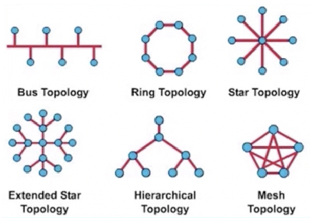

# 一、计算机网络

计算机网络是将**<u>独立的计算机系统</u>**通过**<u>通信设备与线路</u>**相互连接，由**<u>软件</u>**实现**<u>资源共享和信息传递</u>**的系统。

**<u>计算机网络的发展历史概括</u>**：

ARPAnet → 互联网（internet）→ 因特网（Internet）

简单网状结构 → 三级网络结构（主干网、地区网、校园或企业网） → 多层 ISP 结构

## 1.1 基本概念

简而言之，计算机网络是一个互联的、自治（无主从关系）的计算机系统的集合。

### 1.1.1 功能

计算机网络的主要功能有：**<u>数据通信</u>**、**<u>资源共享</u>**、**<u>分布式处理</u>**、**<u>提高可靠性</u>**和**<u>负载均衡</u>**。

数据通信是计算机网络最基础的功能。

资源共享可以是软件共享、数据共享或者硬件共享。

分布式处理的主要目的是提高可靠性和负载均衡。

### 1.1.2 组成

计算机网络从不同角度看，分别由这些内容组成：

① 从组成部分上看：由硬件、软件和协议组成。**<u>协议是计算机网络的核心</u>**。

② 从工作方式上看：由边缘部分（用户主机）和核心部分（为边缘提供连接性和交换服务）组成。

③ 从功能上看：由通信子网和资源子网组成。

### 1.1.3 分类

#### 1) 按范围分类

##### 个人区域网（PAN）

Personal Area Network，将消费级电子产品（如主机、键盘、鼠标等）用有线或无线技术连接起来构成的网络。

##### 局域网（LAN）

Local Area Network，一般认为局域网使用**<u>广播</u>**技术。

##### 城域网（MAN）

Metropolitan Area Network，大多采用以太网，常并入局域网讨论范围。

##### 广域网（WAN）

Wide Area Network，一般认为广域网使用**<u>交换</u>**技术。

##### 互联网（Internet）

不同的局域网通过广域网互相连接构成互联网。

#### 2) 按传输技术分类

##### 广播式网络

所有联网设备共享一个公共信道。

##### 点对点网络

每条物理线路连接一对计算机。

#### 3) 按拓扑结构分类

##### 总线形网络

优点是易于构建、易于增减节点；缺点是通信效率低，对任意一处故障敏感。

##### 环形网络

环中信号单向传递，可以是单环也可以是双环。典型应用是令牌环网。

##### 星形和拓展星形网络

中央设备早期是计算机，现在一般是交换机或路由器。多用于局域网。

##### 树形网络

每个结点向下拓展出若干个节点。

##### 网状网络

每个结点至少有两条链路与其他结点相连。多用于广域网。

#### 4) 按使用者分类

分为公用网（Public Network）和专用网（Private Network）。

#### 5) 按交换技术分类

##### 电路交换网络

源节点和目的节点之间建立一条专用通路（如果没有直接连接的线路，可以通过中间节点建立连接）。

**优点**：直接传送，时延低。

**缺点**：线路独占，线路容量利用率低，不便于进行差错控制。

##### 报文交换网络

也称为存储 - 转发网络，结点收到并存储整个报文后再转发到下一个节点。

**优点**：充分利用线路容量，可以实现不同链路之间的速率和格式转换，可以实现一对多、多对一的访问，可以实现差错控制。

**缺点**：增加了储存和处理的资源开销，增加了缓冲时延，需要额外机制来保证报文有序。

##### 分组交换网络

也称为包交换网络，与报文交换网络一样对分组存储 - 转发，但每个分组有长度限制，一个报文可以分为多个分组进行传输。

**优点**：缓冲区易于管理，分组传输时延更低，更易于标准化。

### 1.1.4 性能指标

#### 1) 速率（Speed）

也称为数据传速率、数据率或比特率，表示单位时间内主机通过数字信道传输的数据量，单位为 b/s（数字较大时，也可使用 **<u>kb/s = 1000 b/s，Mb/s = 10^6 b/s，Gb/s = 10^9 b/s</u>** 等）。

**注**：这里的 b 是比特（bit），与字节（Byte）的换算为 1 Byte = 8 bits。**<u>kB = 1024 B，MB = 2^20 B，GB = 2^30 B</u>**。

#### 2) 带宽（Bandwidth）

原先在模拟信号中表示通信线路允许的信号频率范围，单位为 Hz；**<u>在现在计算机网络中表示数字信道的最高传输速率，单位为 b/s</u>**。

#### 3) 吞吐量（Throughput）

单位时间内通过某个接口（或信道、网络）的数据量，单位为 b/s。

#### 4) 信道利用率

信道中有数据通过的**<u>时长占总时长的百分比</u>**。

#### 5) 时延

一个报文或分组从一端传送到另一端所需的总时长，由 4 部分构成：发送时延、传播时延、处理时延和排队时延。

① 发送时延：将报文或分组中所有的比特推向传输链路所需的时间，也称为**<u>传输时延</u>**。

**<u>发送时延 = 分组长度 ÷ 信道带宽</u>**（理想情况下用尽信道带宽，实际发送速率不一定等于带宽）。

② 传播时延：一个比特从链路一端传播到另一端所需的时间。

**<u>传播时延 = 信道长度 ÷ 电磁波在介质上的传播速率</u>**（一般为 2/3 光速）。

③ 处理时延：数据在节点为存储转发进行的必要处理所花费的时间。

④ 排队时延：数据在发送队列中等待转发端口可用的等待时长。

**注 1**：一般处理时延和排队时延都可忽略不计（除非特殊说明）。

**注 2**：“高速链路” 提高的是**<u>数据发送速率</u>**而不是数据传输速率，即降低数据发送时延而非降低传播时延。

#### 6) 往返时延（RTT）

Round-Trip Time，指发送端从发送一个短分组（即 RTT 不计发送时延）到接收到确认所需的时长。

#### 7) 时延带宽积

发送端发送的第一个比特到达接收端时，发送端已经发送了多少个比特。

**<u>时延带宽积 = 传播时延 × 信道带宽</u>**。

## 1.2 分层结构

分层的意义是将复杂的大系统分成若干较容易实现的层次。

分层的基本原则如下：

1. 每层之间功能相对独立，降低系统复杂度。
2. 各层之间耦合程度低，接口清晰，易于理解。
3. 各层的定义独立于实现方法，可以采用合适的技术实现。
4. 保持下层对上层的独立性，上层**<u>单向</u>**使用下层提供的服务。
5. 分层结构应能促进标准化工作。

分层后的网络**<u>从低到高</u>**依次为第 1 层、第 2 层、...、第 n 层。

第 n 层中活动的实体称为第 n 层实体。不同机器上的同一层称为对等层，同一层的实体称为对等实体。

### 1.2.1 协议数据单元（PDU）

Protocol  Data Unity，对等层之间传输的数据单位称为该层的 PDU。

PDU 由协议控制信息（PCI）和服务数据单元（SDU）组成。PCI 包含控制协议操作的信息。SDU 是高一层传来的需要传输的信息。

即**<u>第 n 层的 PDU</u>** 是由**<u>第 n 层的 PCI</u>** 加上**<u>第 n 层的 SDU</u>** 组成的，而**<u>第 n 层的 SDU</u>** 是**<u>第 n + 1 层的 PDU</u>**。记作 n-PDU = n-PCI + n-SDU，n-SDU = (n + 1)-PDU。

## 1.3 OSI 参考模型

全称为开放系统互连参考模型（OSI/RM，Open System Interconnection Reference Model）。

OSI 参考模型定义了 3 个重要概念（协议、接口、服务）和 7 层网络结构（从低到高分别为物理层、数据链路层、网络层、传输层、会话层、表示层、应用层）。

### 1.3.1 协议、接口、服务

#### 1) 协议

为网络中的数据交换建立的规则的集合称为网络协议（Network Protocol）。协议控制对等层之间如何通过对等实体进行通信，**<u>协议是水平的</u>**，不对等实体之间是没有协议的。

协议由语法、语义和同步三部分组成。语法规定了数据传输的格式，语义规定了要完成的功能（发出什么信息、完成什么动作、做出什么应答），同步规定了执行各种操作的条件和时序关系。

#### 2) 接口

接口是同一结点内**<u>相邻两层之间</u>**交换信息的连接点。只能为紧邻的层次之间定义接口，不能跨层定义。

在典型的接口上，相邻两层通过服务访问点（SAP，Service Access Point）进行交互。

#### 3) 服务

下层为**<u>紧邻的上层</u>**提供的功能调用称为服务。服务是通过 SAP **<u>单向</u>**提供给上层使用的，**<u>服务是垂直的</u>**。

下层中不是所有功能都叫服务，向高一层提供的功能才叫服务。

服务按照不同分类方式可以分为面向连接的服务和无连接服务、可靠服务和不可靠服务、有应答服务和无应答服务。

### 1.3.2 OSI 参考模型各层次

从下到上依次为物理层、数据链路层、网络层、传输层、会话层、表示层、应用层。

记忆技巧：**<u>“物联网淑慧试用”，即 “物、链、网、输、会、示、用”</u>**。

低三层称为 “通信子网”，路由器等中间设备只需要这三层就能完成传输的任务；高三层称为 “资源子网”，在两端的设备中有这三层，完成数据处理的功能；传输层起到承上启下的作用。

#### 1) 物理层（Physical Layer）

**功能**：在物理媒体上为数据链路层透明地传输原始比特流。

“透明地传输” 是指不管数据链路层递交的是什么比特组合都能传。

**<u>物理层规定了</u>**：

1. 接口标准，如802.11、RJ45 等。接口标准规定了接口的一些参数，例如机械形状、尺寸、交换电路的数量和排列等。
2. 传输模式，例如单工、半双工、全双工。
3. 传输速率，例如链路带宽等。
4. 通信的物理链路上传输的信号的意义和电气特征，例如表示二进制 0 和 1 使用的信号，还有比特同步的方法。

#### 2) 数据链路层（Data Link Layer）

**功能**：封装成帧、差错控制、流量控制、传输管理。

物理层的流量控制协调的是**<u>两个结点之间的</u>**传输速率。

广播网络中数据链路层还要控制各主机对共享信道的访问。

**协议**：SDLC、HDLC、PPP、STP、帧中继等。

#### 3) 网络层（Network Layer）

**功能**：路由选择、流量控制、拥塞控制、差错控制、网际互联。

网络层的流量控制协调的是**<u>端到端的</u>**传输速率。

**协议**：IP、IPX、ICMP、IGMP、ARP、RARP、OSPF 等。

#### 4) 传输层（Transport Layer）

**功能**：为端到端提供可靠的传输服务、流量控制、差错控制、复用分用、服务质量。

数据链路层提供的是点到点的通信，传输层提供的是端到端的通信。一个点是指一个 IP 地址或物理地址；端到端是指两个应用进程之间。

#### 5) 会话层（Session Layer）

允许不同主机上的各个进程之间进行会话。会话层提供的服务主要是为表示层实体建立连接并在连接上有序地传输数据，会话也称作**<u>建立同步</u>**。

#### 6) 表示层（Presentation Layer）

主要处理两个通信系统间交换信息的表示方式。数据压缩、加密和解密也是表示层可以提供的数据表示变换功能。

#### 7) 应用层（Application Layer）

用户与网络直接交互的界面。

**协议**：FTP、SMTP、HTTP 等。

## 1.4 TCP/IP 模型

源于 ARPAnet，是对已经出现的 TCP/IP 协议栈的描述。

TCP/IP 由于得到广泛运用而成为了事实上的国际标准。

### 1.4.1 TCP/IP 模型各层次

TCP/IP 模型层次从低到高分别为网络接口层、网际层、传输层、应用层。

#### 1) 网络接口层

对应 OSI 参考模型中的物理层和数据链路层。

实际上 TCP/IP 协议并未真正描述这一部分，只是指出主机必须使用某种协议与网络连接，以便网际层在网络上传递 IP 分组。

#### 2) 网际层

网际层是 TCP/IP 体系结构的关键部分。网际层为分组选择合适的路由，将分组发往任何网络。广泛使用的协议有 IPv4 和 IPv6。

#### 3) 传输层

提供两台主机上的进程之间（端到端）的会话服务。主要使用的协议有 TCP 和 UDP。

#### 4) 应用层

包含了 OSI 参考模型中所有的高层协议。常见的协议有 TelNet、FTP、DNS、SMTP、HTTP 等。

### 1.4.2 TCP/IP 模型与 OSI 参考模型的区别

1. 与 OSI 参考模型只有模型没有协议的实现相反，TCP/IP 模型是总结已有协议栈得出的模型。
2. OSI 参考模型**<u>在网络层提供无连接和面向连接的两种服务，在传输层仅有面向连接的服务</u>**。而 TCP/IP 认为可靠性是端到端需要解决的问题，所以**<u>在网际层仅提供无连接的服务，在传输层提供无连接和面向连接的两种服务</u>**。

## 1.5 教学使用的参考模型

使用了一种折中 5 层的体系结构：物理层、数据链路层、网络层、传输层、应用层。

物理层的 PDU 是**<u>比特</u>**，数据链路层的 PDU 是**<u>帧</u>**，网络层的 PDU 是**<u>分组</u>**，传输层的 PDU 是**<u>数据报</u>**。
