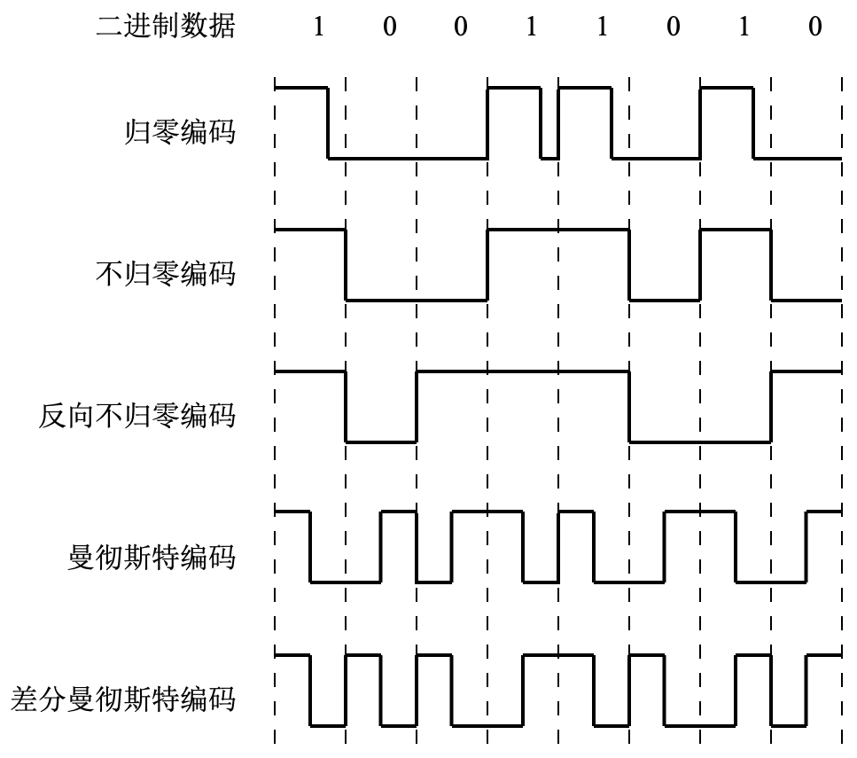

# 二、物理层

物理层考虑的是如何在传输媒体上传输比特流，而不指定具体的传输媒体是什么。

## 2.1 基本概念

### 2.1.1 数据（信号）、码元

#### 1) 数据

**<u>模拟数据（模拟信号）</u>**：连续变化的信号。

**<u>数字数据（数字信号）</u>**：取值为有限的几个的离散数值的信号。

数据的传输方式可以分为串行传输和并行传输：

**<u>串行传输</u>**：按照顺序 1 比特 1 比特地传输。远距离传输多用串行。

**<u>并行传输</u>**：多个比特通过多条信道同时传输。近距离高速传输常用并行。

#### 2) 码元

码元是指用一个固定时长的波形信号或数字脉冲来表示一位 k 进制的数，来代表不同的离散值。这个时长内的信号称为 k 进制码元，而该时长称为码元宽度。

一个码元可以携带若干个比特的信息。

### 2.1.2 信源、信宿、信道

**<u>信源</u>**是产生和发送数据的源头。**<u>信宿</u>**是接收数据的终点。

信道是信号传输的媒介。一个信道通常视为一条通信线路的逻辑部件，用来单向传输信息，所以一条通信线路往往包含一条发送信道和一条接收信道。

信道按照传输内容可以分为**<u>模拟信道</u>**和**<u>数字信道</u>**，按传输介质可以分为**<u>有线信道</u>**和**<u>无线信道</u>**。

在数字信道上传输称为**<u>基带传输</u>**，在模拟信道上传输称为**<u>宽带传输</u>**（数字信道上传输的是基带信号，模拟信道上传输的是宽带信道）。

信道按照双方通信的方式可以分为**<u>单工</u>**、**<u>半双工</u>**、**<u>全双工</u>**。

**<u>单工</u>**：只能从特定的一端发往另一端（例如无线广播、有线电视等）。只需要一条发送信道。

**<u>半双工</u>**：通信的双方都有收发功能，但是同一时间只能有一方发送信息。需要两条信道。

**<u>全双工</u>**：通信双方可以同时发送和接收数据。需要两条信道。

### 2.1.3 速率、波特、带宽

速率即数据传输速率，表示单位时间内传输的数据量。

#### 1) 码元传输速率

又称为**<u>波特率</u>**，表示单位时间内数字通信系统所传输的码元个数，单位为波特（Baud）。

码元速率与每个码元的进制数无关。

#### 2) 数据传输速率

又称为**<u>信息速率</u>**、**<u>比特率</u>**等，表示单位时间内数字通信系统所传输的比特数，单位为 b/s。

若一个码元携带 *n* 比特的信息，那么波特率为 *M* Baud 的码元传输速率对应的数据传输速率为 *nM* 比特每秒。

#### 3) 带宽

带宽原指模拟信道中能传输的最高频率和最低频率的差值，即频带宽度，单位为赫兹（Hz）。在现代计算机网络中表示**<u>单位时间内信道上能通过的最多比特数</u>**，即**<u>最高数据率</u>**，单位为 b/s。

## 2.2 模拟信道的奈氏准则和香农定理

在信道上传输的信号中的高频分量在传输的过程中很容易衰减，导致接收端收到的信号波形失去码元之间的清晰界限，这种现象称为**<u>码间串扰</u>**。

#### 1) 奈奎斯特采样定理

Nyquist Sampling Theorem，也称为**<u>奈氏准则</u>**，规定了在**<u>带宽为 *W* 的理想低通信道</u>**（“理想” 指信道没有噪声，“低通” 的意思是低于某个频率的信号都能通过该信道）中为了避免码间串扰，最高码元传输速率为 **<u>2*W*</u>** Baud。

如果一个码元能携带 *n* 个比特，则对应的最高数据传输速率为 2*nW* b/s。如果码元能表示的离散电平数目为 *V*，则 *n* = log₂*V*，即最高数据传输速率为 **<u>2*W* · log₂*V*</u>** b/s。

在奈氏准则下，如果要提高带宽一定的信道的数据传输速率，就要设法让每个码元携带更多的比特，此时就需要采用多元的调制方法。

#### 2) 香农定理

Shannon's Theorem，给出了带宽有限为 *W* 且有高斯白噪声干扰的信道，在**<u>可以不产生误差</u>**的要求下最高的数据传输速率，为 **<u>*W* · log₂(1 + *S*/*N*)</u>** b/s，其中 *S*/*N* 为信道的信噪比。

信噪比为信号平均功率和噪声平均功率之比，有时会以分贝（dB）为单位给出，*S*/*N* 与 分贝的换算为 **<u>dB = 10 × log₁₀(*S*/*N*)</u>**，例如 20 dB 表示的就是 *S*/*N* = 100，30 dB 表示的就是 *S*/*N* = 1000。

只要该信道上的数据传输速率低于香农定理规定的最高数据传输速率，就可以找到某种方法来实现无差错的传送。**<u>香农定理表明一个码元能携带的比特数是有限的</u>**（除非信噪比无穷大，然而实际上这是不可能的）。

## 2.3 编码与调制

将原始数据转为数字信号就叫编码；将原始数据转为模拟信号就叫调制。解码、解调是将转换后的信号还原为原始数据的过程。

### 2.3.1 数字数据 编码为 数字信号

#### 1) 归零编码（RZ）

用高电平表示 1，低电平表示 0（也可以采用相反的规定）；每个时钟周期的中间均需要跳变到低电平。

**优点**：为传输的双方提供了自同步机制。

**缺点**：信道中低电平太多，信道利用率太低。

#### 2) 不归零编码（NRZ）

高电平表示 1，低电平表示 0。与 NRZ 的区别是时钟周期中间不用跳变。

**优点**：一个时钟周期可以全部用来传输数据。

**缺点**：没有携带时钟信号，双方难以同步，如果想传输高速同步数据需要额外使用时钟线。

#### 3) 反向归零编码（NRZI）

用前一个时钟周期的信号的翻转表示 0，与前一个时钟周期的信号相同表示 1（信号翻转表示 1，不变表示 0）。

**优点**：既能携带时钟信号，又能尽量不损失信道带宽。

**<u>USB 2.0 通信使用的编码方式就是 NRZI 编码</u>**。

#### 4) 曼彻斯特编码（Manchester Encoding）

将一个码元分为两个相等的时间间隔，前半个码元为高电平、后半个码元为低电平表示 1；前半个低电平、后半个高电平表示 0。也可以采用相反的规定。

**优点**：每个码元中间都会发生翻转，携带规律的时钟信号。

**缺点**：需要的带宽是原来的两倍。

**<u>以太网使用的编码方式就是曼彻斯特编码</u>**。

#### 5) 差分曼彻斯特编码（Differential ME）

将一个码元分为两个相等的时间间隔，前半个码元的电平与上一个码元的后半个码元电平相同表示 1，不同表示 0。

**<u>局域网常用差分曼彻斯特编码</u>**。

#### 6) 4B/5B 编码

把待传输的数据每 4 个比特分为一组，按照一定的规则转换为相应的 5 位码。

由于 4 位的码元最多只有 16 种不同的组合，而 5 位有 32 种组合，所以多出来的 16 种可以保留作为控制码或其他用途。

### 2.3.2 数字数据 调制为 模拟信号

#### 1) 幅移键控（ASK）

通过改变载波信号的振幅来表示 1 和 0。比较容易实现，但抗干扰能力差。

#### 2) 频移键控（FSK）

通过改变载波信号的频率来表示 1 和 0。比较容易实现，抗干扰能力强，目前应用广泛。

#### 3) 相移键控（PSK）

通过改变载波信号的相位来表示 1 和 0。分为绝对调相和相对调相。

#### 4) 正交振幅调制（QAM）

不改变频率的情况下，将 ASK 和 PSK 结合起来，形成叠加信号。

设信道波特率为 B，信号使用 m 个相位，n 种振幅，则数据传输速率为 **<u>*B* · log₂(*mn*)</u>** b/s。

### 2.3.3 模拟数据 编码为 数字信号

最典型的例子是常用与将音频信号编码为数字信号的**<u>脉冲调制（PCM）</u>**。主要包括三个步骤：

1. **<u>采样</u>**：对模拟信号进行周期性扫描，把时间上连续的信号变为离散的信号。

   根据奈奎斯特采样定理，当采样频率大于等于模拟数据的最高频率的两倍时，得到的离散信号可以**<u>不失真地表示被采样的模拟数据，即无损采样。

2. **<u>量化</u>**：把采样取得的电平幅值按照一定的分级标准转化为对应的数字值。

3. **<u>编码</u>**：将量化结果转换为二进制编码。

### 2.3.4 模拟数据 调制为 模拟信号

为了保证传输的有效性，可能需要调制为较高的频率。

这种调制方式还可以使用频分多路复用技术（FDM，见 3.6.1），充分利用带宽资源。

## 2.4 交换方式

有**<u>电路交换</u>**、**<u>报文交换</u>**和**<u>分组交换</u>**三种交换方式。

### 2.4.1 电路交换

两个结点之间必须建立一条**<u>专用的物理通信路径</u>**。通常由双方之间的交换设备和链路段连接而成，该路径可能经过许多中间结点。整条路径在传输过程中一直被独占，用户始终占用端到端的固定传输带宽，直到通信结束后才会被释放。

电路交换技术分为三个阶段：连接、建立、数据传输和连接释放。

**<u>优点</u>**：① 通信延时小，实时性强；② 能保证有序传输；③ 不会出现冲突；④ 适用范围广泛，既能传输模拟信号，又能传输数字信号；⑤ 控制简单。

**缺点**：① 建立连接用时长；② 线路使用效率低；③ 灵活性差，中间任意一点出现故障都要重新建立连接；④ 难以规格化；⑤ 无法平滑通信量；⑥ 无法发现与纠正错误。

### 2.4.2 报文交换

报文交换在交换结点采用**<u>存储转发</u>**的方式进行传输。报文携带有目的地址、源地址等信息。

**优点**：① 无需建立连接，没有建立时延；② 动态分配线路；③ 提高传输可靠性，某条传输路径故障可以再选择另一条进行传输；④ 提高线路利用率，通信双方不独占某条传输路径；⑤ 提供多目标服务。

**缺点**：① 存储转发会带来转发时延；② 报文大小不定，要求网络结点具有较大的缓存空间；③ 只适用于数字信号。

报文交换多用于早期电报通信网中，现已被分组交换所取代。

### 2.4.3 分组交换

分组交换的基本思路与报文交换一致，也采用存储转发，但分组交换**<u>限制了每次传送的数据大小的上限</u>**，可以把大的数据块划分为小数据块，再加上一些控制信息（如目的地址、源地址、分组编号等）构成一个分组（Packet），以分组为单位在线路上传输。

**优点**：① 无建立时延；② 简化存储管理，降低设备成本；③ 加速传输，分组的传输是逐个被存储转发的，接收到一个正确无误的完整分组后就可以发往下一个结点，同时接受新的分组，而报文交换需要正确地完整地收到整个报文后才能向下一个结点转发；④ 减少出错概率和重发数据量，因为分组较短，出错的概率也必然降低，出错后重发的数据量也变少，提高了可靠性。

**缺点**：① 存储转发会带来转发时延；② 需要传输额外的信息量，每个小数据块都要加上必要的控制信息，传输和处理这些控制信息都会产生时延和资源开销，一定程度上降低了通信效率；③ 需要整理失序的分组，由于各个分组有可能经过不同的传输路径到达目的地，可能会出现丢失、失序或重复分组，需要整理收到的分组。

要传输的数据量很大，且传送时间远大于呼叫时间时，适合用电路交换传输。

当端到端的路径由多段链路组成时，采用报文交换或分组交换有利于提高信道利用率。其中分组交换比报文交换的时延低，尤其适合计算机之间突发式的通信。

分组交换根据提供的服务，可以分为**<u>无连接的数据报方式</u>**和**<u>面向连接的虚电路方式</u>**。

#### 1) 数据报

将完整地报文划分成带有编号的数据块，并加上源地址和目的地址等控制信息后，由网络结点自主选择转发路径。不同的分组可以走不同的路径，也可以按不同顺序到达目的结点。

**特点**：

1. 发送分组前不需要建立连接。发送方可以随时发送分组，结点可以随时接受分组。
2. 尽最大努力交付，不保证传输可靠性，分组可能丢失、失序、重复。
3. 每个分组独立传输，交换结点为每个分组独立选择传输路径，因此每个分组都需要携带源地址和目的地址。
4. 分组在交换结点存储转发时需要排队等待，会产生时延；处理分组的控制信息也会产生时延。
5. 对故障的适应能力强，网络中有很多冗余路径，当某个交换结点或某条链路出现故障时还可以寻找另一条路径。
6. 收发双方不独占某条链路，资源利用率高。

#### 2) 虚电路

在分组发送之前，要求收发双方建立一条逻辑上的虚电路，并且**<u>虚电路连接一旦建立，对应的物理路径就唯一确定了</u>**。

整个通信过程分为三个阶段：**<u>虚电路建立</u>**、**<u>数据传输</u>**、**<u>虚电路释放</u>**。工作原理如下：

1. 每次建立虚电路时，需要选择一个目前未被使用的虚电路号分配给新的虚电路。源主机会发送一个特殊的**<u>呼叫请求分组</u>**给目的主机，该分组通过中间结点发往目的地，目的主机同意连接则回发一个**<u>呼叫应答分组</u>**。在呼叫和应答过程中虚电路的物理路径就已经确定。

2. 虚电路网络中的每个结点都维护一张虚电路表，表中记录了每一条工作中的虚电路的信息，包括在接受链路和发送链路上的虚电路号、前一结点和下一结点的标识。

3. **<u>虚电路在连接建立阶段进行路由选择</u>**，连接成功建立后传输路径就唯一确定了。所以使用虚电路传输的分组**<u>不再需要携带源地址和目的地址，携带虚电路号即可</u>**。传输过程中网络结点不对分组进行路由选择，只进行差错控制。

4. 传输结束后源主机发送**<u>释放请求分组</u>**来拆除这条虚电路，逐段断开整个链接。

**特点**：① 虚电路连接的建立和释放需要时间，对于少量的短分组来说显得浪费时间，虚电路方式适合用于长时间、频繁的交换数据；② 虚电路的路由选择体现在连接建立阶段；③ 虚电路提供了可靠的通信功能，能保证分组**<u>正确且有序</u>**地到达；④ 可以对两端进行流量控制，接收方来不及接收数据时可以通知发送方暂缓发送；⑤ 分组携带的是虚电路号，相对于携带源地址和目的地址来说开销较小。

虚电路有一个**<u>致命弱点</u>**：当虚电路上的某个结点或某条链路出现故障时，**<u>所有使用该结点或链路的虚电路连接都将被破坏</u>**。

虚电路之所以是 “虚” 的，是因为虚电路使用的物理链路不是专用的，每个结点或链路都可能有若干条虚电路通过。

**注**：网络上的传输**<u>是否有确认与网络层提供的两种服务没有任何关系</u>**。

## 2.5 传输介质

传输介质不属于物理层的范畴，位于物理层之下，相当于 “第 0 层”。

传输介质可以分**<u>为导向传输介质</u>**（铜线、光纤等）和**<u>非导向传输介质</u>**（空气、真空等）。

### 2.5.1 双绞线

双绞线的带宽取决于铜线的粗细和传输的距离。通信距离一般为几百米到几千米，距离太远时要**<u>用放大器放大模拟信号</u>**或**<u>用中继器将失真的数字信号整形再生</u>**。

#### 1) 非屏蔽双绞线（UTP）

Unshielded Twisted Pair，**<u>每两根</u>**特定按照规则并排绞合（**<u>绞合可以减少相邻导线的电磁干扰</u>**）。

价格便宜，**<u>在有线电话网和局域网中大量使用</u>**。

#### 2) 屏蔽双绞线（STP）

Shielded Twisted Pair，每对绞合的线和四对线外都有一层金属丝网屏蔽层，进一步加强电磁屏蔽能力。价格比非屏蔽双绞线贵。

### 2.5.2 同轴电缆

同轴电缆从外到内分别为绝缘保护层、网状外导体屏蔽层、绝缘层和内导体。

由于金属编织网制的外导体屏蔽层的存在，**<u>同轴电缆具有良好的抗干扰特性</u>**，被应用于**<u>较远距离、较高速传输的场景</u>**，但价格比双绞线更贵。

按阻抗特性通常分为两种：

1. 75 Ω 的**<u>宽带同轴电缆</u>**，主要用于传输宽带模拟信号（例如有线电视等）。

2. 50 Ω 的**<u>基带同轴电缆</u>**，主要用于传输基带数字信号（例如局域网等）。

在网络层中会讲到，基带同轴电缆按粗细可以分为**<u>粗基带同轴电缆</u>**（早期用于 10Base5 总线，最大传输距离 500 m）和**<u>细基带同轴电缆</u>**（早期用于 10Base2 总线，最大传输距离 185 m）。

### 2.5.3 光导纤维（光纤）

光纤由纤芯和包层构成。

为了保证光信号的强度和质量，需要保证光在纤芯内传输时**<u>只发生全反射</u>**；光从高折射率的介质射向低折射率的介质时，折射角会大于入射角，因此只要入射角大于某个临街角度就会发生全反射；正因如此，**<u>光纤包层的折射率比纤芯低</u>**。

光纤通信就是利用光纤传递光脉冲，有光表示 1，无光表示 0。

**特点**：

1. 由于可见光的频率约为 10⁸ MHz，因为带宽极大，可以实现非常高速的传输。
2. 传输损耗小，中继距离长，非常适合远距离传输。
3. 抗雷电和电磁干扰性能好，尤其适合有大电流脉冲干扰的环境。
4. 无串音干扰，也不容易被窃听或截取，保密性好。
5. 体积小，重量轻。

#### 1) 单模光纤

内径 8 ~ 10 μm。传输单束光，光源为定向性很强的半导体激光。单模光纤直径约为一个光的波长，光线在里面沿直线传播，不发生多次反射，所以衰减很小（几千米甚至数十千米都不用中继），适用于远距离传输。

#### 2) 多模光纤

内径 62.5 μm。可以在一根光纤中传输从不同角度射入的多条光线，光源为发光二极管。光脉冲在多模光纤中会逐渐衰减和色散，造成失真，只适用于近距离传输。

### 2.5.4 无线传输介质

#### 1) 无线电波

**特点**：

1. 无线电波具有较强的穿透力，可以传递很长的距离。
2. 无线电波信号向所有方向散播，所以有效范围内接收设备无需对准某个方向，简化通信连接。

无线电广泛应用于通信领域。

#### 2) 微波、红外线、激光

这些都是**<u>高带宽</u>**的无线通信，都是**<u>视线介质</u>**。

**特点**：都需要发送方和接收方之间存在一条视线（Line-of-sight）通路，有很强的方向性，都沿直线传播。

红外和激光还要把原始信号转换为各自的红外信号和激光信号再传输。

微波通信频率较高，频段带宽也很宽，通信信道容量较大。由于微波信号传输距离有限，需要使用地面中继站或同步卫星来接力。

微波通信的优点是容量大，距离远，覆盖广；缺点是保密性差，时延长，受气候影响大，成本高。

## 2.6 物理层接口特性

规定物理层接口的 “协议”，主要有以下内容：

1. **<u>机械特性</u>**：接口形状、尺寸、引脚数量、排列，锁定装置等。
2. **<u>电气特性</u>**：接口电缆的各条线上的电压范围。
3. **<u>功能特性</u>**：某条线上某一电平的电压表示什么意义。
4. **<u>规程特性</u>**：不同功能的工作过程和时序关系。

常见的接口标准有 RJ 45、ADSL、SONET/SDH 等。

## 2.7 物理层设备

物理层无源（被动）设备：包括各种插座、电缆等。

**<u>物理层有源（主动）设备</u>**：

#### 1) 中继器（Repeater）

对输入信号**<u>再生</u>**（整型、放大，而不是单纯的将衰减信号直接放大）后输出。

中继器的作用是简单地扩大网络规模，两端的网络是两个网段，使用中继器连接的两个网络仍是一个局域网。中继器**<u>不能连接两个不同速率的局域网</u>**。

由于网络标准对信号的延迟范围做了具体的规定，所以中继器不能无限使用。10Base5 以太网规范中的 “5-4-3” 原则：互相串联的中继器个数不能超过 4 个，并且 4 个中继器串联的 5 段通信介质中，只有 3 段可以挂接计算机（其余两段只能用作拓展通信范围，不能挂接计算机）。

**注**：**<u>放大器</u>**和中继器都起到放大信号的作用，但放大器是直接放大衰减的模拟信号，而中继器是再生衰减的数字信号。

#### 2) 集线器（Hub）

可以看成多端口中继器，也是把从一个端口收到的信号再生，然后转发到除了输入端口以外的所有工作中的端口。

如果同时有多个端口输入，那么输出时会发生冲突，导致这些数据都无效。**<u>中继器和集线器都不能分割冲突域</u>**。

集线器的作用是扩大网络的传播范围，**<u>不具备定向传输能力</u>**。

