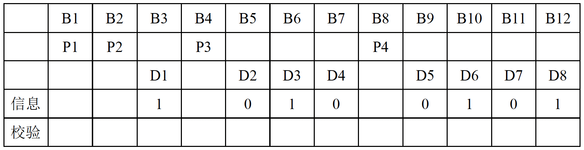

# 三、数据链路层

## 3.1 数据链路层可以为网络层提供以下几种服务

1. 无确认无连接服务，适合实时通信或误码率较低的通信信道，如以太网。

2. 有确认无连接的服务。适合误码率较高的通信信道，如无线通信。

3. 有确认面向连接的服务。适合通信可靠性、实时性要求较高的场合。

注：**<u>面向连接的服务一定有确认</u>**，不存在无确认但面向连接的服务。

## 3.2 链路管理

主要用于面向连接的服务，管理连接的建立、维持和释放。

## 3.3 组帧

将一段数据的前后分别添加**<u>首部</u>**和**<u>尾部</u>**就构成了一帧。

组帧主要解决帧界定、帧同步与透明传输的问题。

- 帧界定：帧的首部和尾部中有很多控制信息，它们的一个重要作用就是确定帧的界限。

- 帧同步：接收方能正确地收到发送方发来的帧。

- 透明传输：无论待传输的数据是什么比特组合，都能在链路上进行有效的传输。

通常有四种方法实现组帧：字符计数法、字节填充的首尾定界符法、零比特填充的首尾标志法和物理层违规编码法。**目前较常用后两种方法**。

### 3.3.1 字符计数法

在每个帧的头部有一个计数字段，这个字段标明整个帧（包括这个字段本身）的长度。

**缺点**：如果计数字符在传输的过程中出错，就会失去帧边界的划分依据，后面所有的帧都无法正确接收，收发双方失去同步。

### 3.3.2 字节填充的首尾定界符法

每一帧都有一个控制字符 SOH 放在帧的最前面，表示帧的开始；一个控制字符 EOT 放在帧的最后面，表示帧的结束。

如果传输的数据中恰巧包含与控制字符内容一样的字节，为了防止误判，会在传输数据中的 “假标记” 前加上一个转义符 ESC；如果数据中恰巧包含与转义符 ESC 内容一样的字节，会在 “假转义符” 前再加上一个 ESC。即 **<u>ESC 紧跟着出现的控制字符和转义字符都不会被认为是特殊标记</u>**。

**缺点**：兼容性差，只适用于整数个字节的帧例如 ASCII 信息流。

### 3.3.3 零比特填充的首尾标志法

帧界标记为 0111 1110。规定在数据中不允许出现连续的六个 1，如果数据中有连续的五个 1，发送方就在这五个 1 后面加一个 0；接收方收到连续的五个 1 后，自动删除后面紧跟着的 0 就可以恢复原信息。

**优点**：零比特填充法很容易被硬件实现，性能优异。

### 3.3.4 物理层违规编码法

将不可能出现在数据流中的序列用作帧界标记。

例如，在 4B/5B 编码中，有 16 种不会出现在 4B/5B 编码后的信息中的序列，可以使用这些序列作为标记；曼彻斯特编码中，也不会出现一个比特时间内一直维持高电平或一直维持低电平的信号，这两种冗余的信号可以作为帧界标记。

**优点**：不需要任何填充技术即可实现透明传输。

**缺点**：只适用于采用冗余编码的信道。

**<u>局域网 IEEE 802 就采用了这种方法。</u>**

## 3.4 差错控制

差错控制可以分为检错编码和纠错编码。

- 常见的检错编码有奇偶校验码和循环冗余码。
- 常见的纠错编码有海明码。 

### 3.4.1 奇偶校验码

由 *n* 为信息位和1位校验位组成。

如果是奇校验码，则加上校验位后这 *n* + 1 位共中有奇数个 1；如果是偶校验码，则加上校验位后这 *n* + 1 位中共有偶数个 1。

**缺点**：如果出错位的个数是偶数，则无法发现出错。

### 3.4.2  循环冗余码（CRC）

**<u>可以检测出最多 *r* 位错误的 CRC</u>**：

1. 收发双方约定一个**<u>阶数为 *r* 阶的生成多项式（写作二进制数共 *r* + 1 位）</u>**；
2. 发送方在 *m* 位的信息后加上 *r* 位的 0，用生成多项式去模 2 除（求异或）这 *m* + *r* 位的二进制数，得到一个余数，将这个余数拼接在这 *m* 位后面形成一个 m + *r* 位的码字；
3. 接收方收到一个码字字之后去除约定好的生成多项式，能被整除说明信息传输无误。

**优点**：CRC 可以在硬件上实现，速度很快。

**注**：CRC其实可以纠正错误，但在数据链路层中只用来检测错误。

**例**：假设生成多项式 G(*x*) = *x*^4 + *x* + 1（4 阶，写作二进制为 10011），待传输信息为 1101 0110。

发送方：

在原信息后加上 4 个 0，变成 1101 0110 0000，用模 2 除法除以生成多项式：

得到余数 0110。将 0110 追加到原信息后得 1101 0110 0110 即为一个码字。

接收方：

收到 1101 0110 0110 后对这个码字进行模 2 除法：

得到余数为 0 即可以被整除，则说明传输信息无误；不能被整除，则说明传输出错。

有一些特殊的多项式因为具有很好的特性，所以成为了标准。生成多项式的标准有 CRC-12，CRC-16，CRC-32（用于以太网）等。

### 3.4.3 海明距离

对于两个不同的码字来说：两个码字之间不同位的个数（例：1001 0111 和 1100 0110 的海明距离为 3）。

对于一种编码方式来说：这种编码所有的码字中，**<u>任意两个码字</u>**的海明距离的**<u>最小值</u>**为这种编码方式的海明距离。

海明距离的意义 —— 检错纠错码：

如果一种编码方式**<u>能检测出 *d* – 1 位的差错</u>**，那么这种编码方式的<u>**海明距离为 *d***</u>：一个码字至少要变化 *d* 位才能变成另外一个码字（如奇偶校验码海明距离为 2，即至少需要变化 2 位才能变成另一个码字，奇偶校验码能检测出发生了 1 位跳变的错误码字）。

如果一种编码方式**<u>能纠正最多 *d* 位的差错</u>**，那么这种编码方式的**<u>海明距离为 2*d* + 1</u>**：一个码字变化 *d* 位后仍距离原来的码字最近（距离原来的码字 *d* 位，距离下一个码字 *d* + 1 位，距离其他的码字更远）。

### 3.4.4 海明码

如果要传输 *m* 位数据，要使编码方式能纠一位错，则至少需要 *r* 位冗余位，*m* 与 *r* 满足不等式：**<u>(*m* + *r* + 1) ≤ 2^*r*</u>**。

纠一位错的海明码的校验位是：码字中所有编号为2的乘方的位；其他位均为数据位。

纠一位错的海明码的校验位的内容为：包括自身的值在内的一些位的奇偶校验结果。

如何找到错误：将所有不正确的校验位的编号相加得到的结果就是出错的位的编号。

**例（<u>纠一位错的偶校验海明码</u>）**：

数据位共 8 位（*m* = 8），则计算得到校验位应有 4 位，分别为 1、2、4、8 位。假设要传输的数据为 1010 0101：

**<u>注意：编号时最低位为 D1，最高位为 D*m*。</u>**

编码过程：

P1 为码字中编号转化为二进制数后，最低位是 1 的所有位的偶校验（即第 1、3、5、7、9、11 位的偶校验），分别是「P1」、1、0、0、0、0，则「P1」应为 1：

P2 为码字中编号转化为二进制数后，倒数第二位是 1 的所有位的偶校验（即第 2、3、6、7、10、11 位的偶校验），分别是「P2」、1、1、0、1、0，则「P2」应为 1：

P3 为码字中编号转化为二进制数后，倒数第三位是 1 的所有位的偶校验（即第 4、5、6、7、12 位的偶校验），分别是「P3」、0、1、0、1，则「P3」应为 0：

P4 为码字中编号转化为二进制数后，最高位是 1 的所有位的偶校验（即第 8、9、10、11、12 位的偶校验），分别是「P4」、0、1、0、1，则「P4」应为 0：

所以，传输数据 1010 0101 的纠一位错海明码为 1010 0010 0111。

纠错过程：

如果收到的信号第 9 位出错，变为 101<u>1</u> 0010 0111，此时对于 P1 来说 1<u>0</u>1<u>1</u> 001<u>0</u> 011<u>1</u> 偶校验出错，P2 1<u>01</u>1 0<u>01</u>0 0<u>11</u>1 偶校验无误，P3 <u>1</u>011 0<u>010 0</u>111 偶校验无误，P4 <u>1011 0</u>010 0111 偶校验出错；

而 P1 为码字中第 1 位，P4 为码字中第 8 位，所以出错的位编号是 8 + 1 = 9，此时接收方翻转第 9 位即可得到正确的信息。

## 3.5 流量控制

控制发送方帧发送的速率，保证接收方有足够的空间来接受帧。

数据链路层的流量控制控制的是相邻两节点之间数据链路上的流量（而传输层的流量控制控制的是源端到目的端之间的流量）。

### 3.5.1 停止 - 等待流量控制

发送方每发送一帧，都要等待接收方的应答信号到来，收到应答后才能发送下一帧。如果收不到应答信号，发送方就会一直等待。

**缺点**：传输效率很低。

### 3.5.2 滑动窗口流量控制

发送方将当前发送窗口中序列号对应的帧发出，接收方检查收到的帧的序列号是否是接收窗口中的序列号：如果接收到的帧在接收窗口内，则回发确认帧给发送方并将接收窗口向下滑动；发送方收到确认帧后，检查是否为发送窗口内的序号，如果是则表明接收方已成功接收，就滑动发送窗口，并根据窗口发送后面对应序列号的帧。

滑动窗口技术前后两次的窗口中序列号不能重叠，否则协议将失败。

相关计算：

**<u>信道利用率</u>**：滑动窗口技术中，在发送方没有收到确认帧时，一直是阻塞状态，假设信道速率为 *B* bps，发送一次只能发送一个大小为 *K* bits 的帧，从开始发送到收到第一个确认帧需要 *T* s，则信道利用率为 *K* / *BT*，信道利用率较低；如果发送方一次能发送 *W* 个帧（窗口大小为 *W*），则信道利用率为 *W* · *K* / *BT*。可计算出一次发送多少帧（窗口大小为多大）能使信道利用率为 100%。

**<u>信道吞吐率</u>**：信道利用率 × 发送方的发送速率。

**<u>信道容量（带宽 - 延迟积）</u>**：一帧从开始发送到到达目的地的时间（延迟）里信道上可以容纳多少帧，假设信道速率为 *B*，延迟为 *D*，则带宽 - 延迟积为 *B* · *D*（所以窗口大小 W = 2 × *BD* + 1 时可以使信道利用率达到 100%，应设置 W ≤ 2 × *BD* + 1）。

## 3.6 可靠传输机制

**注**：实际有线网络中连接本身较为可靠，在数据链路层很少使用可靠传输。本文档按照 408 考纲写在这里。

### 3.6.1 自动重传请求技术（ARQ）

Automatic Repeat Request，也叫肯定确认重传技术（PAR, Positive Acknowledgement with Retransmission）。

发送方每发出一个帧就启动一个重传定时器，并等待接收方确认帧的到来：如果定时器超时之前收到确认帧，则发送下一帧并重置定时器；否则重传这一帧，并再次启动定时器等待确认帧的到来。

**<u>捎带确认：将确认捎带在一个要发送给对方的数据帧中。可以提高传输效率。</u>**

ARQ 协议主要有：停止 - 等待协议，回退 n 帧协议（GBN）和选择重传协议（SR）。

从滑动窗口的角度看，这三个协议的区别是：

- 停止 - 等待协议：发送窗口大小 = 1，接收窗口大小 = 1。
- 回退 n 帧协议：发送窗口大小 > 1，接收窗口大小 = 1。
- 选择重传协议：发送窗口大小 > 1，接收窗口大小 > 1。

窗口大小为 1 的时候可以保证收到的帧是有序的。

**<u>数据链路层的窗口大小在传输的过程中是固定的</u>**（与传输层的滑动窗口不同）。

### 3.6.2 停止 - 等待协议

发送方在发送一次后停止并等待，接收方在接收到后回复一个确认帧，发送方收到确认帧再发送下一帧。

由于每次只发一帧就停止并等待，发送的帧交替使用 0 和 1 来标识即可，即**<u>只需要 1 bit 用于编号</u>**。

到达接收方的帧如果经过前面所述的差错检验技术后发现已被破坏，接收方就会丢弃这一帧，并不回发确认帧。发送方在发送时会启动一个超时计时器，如果计时器超时后仍未收到接收方回复的确认帧则认为传输出现问题，于是重发这个未被确认的帧并再次启动计时器。

如果是确认帧在回发的路上被破坏，发送方也收不到确认帧，超时后也会重发这一帧，接收方收到同样编号的数据帧时会丢弃并再次发送一个对应的确认帧。

**缺点**：信道利用率很低。

### 3.6.3 回退 n 帧协议（GBN）

发送方无需等待上一帧的确认，可连续发送多帧。

传输的过程中可能中间的帧会损坏或丢失，当接收方检测出失序后，会保存最后收到的有序帧，并将这一帧后的所有帧丢弃（接收方只允许按顺序接收）。发送方未收到确认帧超时后，会重发收到的最后一个确认帧后的所有帧。

**例**：发送方发出了序列号为 0 ~ 9 的十个帧，只收到了 0、2、3 帧的确认，则发送方会重传 4 ~ 9 这六个帧（虽然没收到 1 的确认帧，但是收到了 3 的确认帧说明 1 已经被成功接收了，否则回退 n 帧的协议不会接收序列号为 3 的帧）。

**<u>累积确认：接收方不一定每个帧都回复一个确认帧，接收方对某一帧的确认表明该帧和此前所有的帧都已准确无误地收到。</u>**

若采用 *n* 比特对帧编号，则**<u>发送窗口的尺寸 Wt 应满足 1 < Wt < 2^n</u>**。若发送窗口尺寸大于 2^n – 1 接收方会无法分辨新旧帧。

**优点**：提高了信道利用率。

**缺点**：重传时必须把错误帧后的所有正确发送的帧也重传了，效率降低（当通信信道质量差错误率高的时候回退 n 帧协议效率可能比停止 - 等待协议还低）。

### 3.6.4 选择重传协议（SR）

发送方和接收方的窗口大小都大于 1，一次可以发送或接收多个帧。

接收方发现接收到出错帧后，只丢弃出错帧，缓存并确认所有正确帧；发送方发现只有出错帧的定时器超时，其他帧都收到确认，所以只重传出错帧；接收方正确接收重发的帧后，再与缓存下来的之前收到的帧重新排序并提交。

适用于出错率较高的网络环境。

若采用 *n* 比特对帧编号，则**<u>发送窗口的尺寸 Wt 和接受窗口的尺寸 Wr 应满足 Wt = Wr = 2^(n – 1)</u>**。若窗口尺寸大于序号范围的一半，当确认帧丢失导致发送方重传时，接收方会无法分辨新旧帧。

## 3.7 介质访问控制（MAC）

采取一定措施使广播式信道（常见为总线型、星形拓扑）的通信不发生冲突。

- 常见的静态划分 MAC 方法有信道划分 MAC。
- 常见的动态划分 MAC 方法有随机访问 MAC 和轮询访问 MAC。

### 3.7.1 信道划分介质访问控制

多路复用技术实质是通过分频、分时、分码等技术将一条物理信道分为多个互不干扰的子信道，让多个用户共享一条信道的空间或时间，将广播信道转变为点对点信道。

#### 1) 频分多路复用（FDM）

Frequency Division Multiplexing，将一条物理信道的带宽分割成若干个带宽相同或不同的子信道，共享信道空间。

为防止子信道之间干扰，相邻信道之间还需要加入保护频带。

**优点**：充分利用带宽，传输效率高；较容易实现，技术较为成熟。

#### 2) 波分多路复用（WDM）：

Wavelength Division Multiplexing，在一根光纤中传输多种不同波长的光信号，即光的频分多路复用。

由于可见光处于频谱的高频段，有很大的带宽可以使用。

#### 3) 时分多路复用（TDM）

Time Division Multiplexing，将一条物理信道按时间分成若干时间片，轮流地分给多个信号使用，共享信道时间。

**缺点**：由于数据的突发性，一个用户对分配到的子信道利用率一般不高。

#### 4) 统计时分多路复用（STDM）

Statistics TDM，是对 TDM 的一种改进，并不固定分配时隙，而是按需动态分配：统计复用器会按顺序扫描每个用户终端的输入缓冲，若某个端口有信息需要传输则会分配一个时间片，没有则跳过；扫描一轮之后重新从头开始扫描。

**优点**：多分配给使用量大的用户，不分配给不使用的用户：如果此时没有其他用户在使用，一个用户最多可以分配到物理信道的完整带宽。

**缺点**：技术复杂，一般只用于高速远程通信如 ATM。

#### 5) 码分多路复用（CDM / CDMA）

Code Division Multiple Access，原理如下：

① 传输每一个比特时都需要使用 *m* 个很短的时间间隔，这些很短的时间间隔被称为 “码片”（通常一个比特会使用 64 个码片或 128 个码片）；

② 每个用户拥有唯一的码片序列，并且所有用户的码片序列两两正交；当一个用户需要发送 “1” 这个比特时就发送他的码片序列，需要发送 “0” 时就发送他的码片序列的反码，没有内容需要发送则不发送任何序列；

③ 所有的用户同一时间发送的信号会在进行线性叠加之后一起传输。

④ 接收方想要知道某个特定用户 A 发送了什么，只需要**<u>使用该用户的码片序列与信号进行归一化内积运算</u>**（归一化内积：两个向量的内积除以向量维数），根据叠加原理其他信号都与 A 用户的码片正交所以会在内积结果中被过滤掉，即可得出 A 用户发送的是 1 还是 0 或是没有发送。

在 CDMA 中按照惯例将 1 写为 *+1*，0 写为 *–1*。

**例**：假设 *m* = 4。

① 用户 A 的码片序列为 *1(–1)1(–1)*，用户 B 的码片序列为 *11(–1)(–1)*，用户 C 的码片序列为 *1(–1)(–1)1*，这三个码片相互正交。

② 某时刻 A 需要发送 1，B 需要发送 0，C 没有需要发送的内容：那么 A 会发送 *1(–1)1(–1)*，B 会发送 *(–1)(–1)11*，C 则发送 *0000*。

③ 此时叠加信号为 *1(–1)1(–1)* + *(–1)(–1)11* + 0000 = *0(–2)20*。

③ 如果想知道 A 发送的比特是什么，则使用此信号 *0(–2)20* 和 A 的码片序列 *1(–1)1(–1)* 做归一化内积，得到 (0 + 2 + 2 + 0) / 4 = +1，可知 A 发送的是高电平。

如下图所示。

### 3.7.2 随机访问介质访问控制

所有用户可以随时使用信道的全部带宽发送数据，不采用集中控制的方式解决信道上发生的冲突，但需要每个用户按照一定规则反复地重传，直到数据无冲突地通过信道。

常见的协议有 ALOHA 协议、CSMA 协议、CSMA/CD 协议、CSMA/CA 协议等。

#### 1) ALOHA 协议

**<u>“不听直接说”</u>**：当站点需要发送数据时，可以不进行任何检测，随时发送数据。

如果在一段时间内未收到确认，则认为传输过程中发生了冲突，那么发送站点会等待一段随机的时间之后再次发送数据，直到发送成功。

**缺点**：纯 ALOHA 协议的网络一个数据帧成功发送的概率很低，吞吐量极大值约为 18.4%。

#### 2) 时隙 ALOHA 协议（Slotted ALOHA）

所有站点在时间上同步，将时间划分为一段段等长的时隙，规定只能在每个时隙的开头才能发送。

发生冲突后重传的策略与纯 ALOHA 协议相似。

减少了随意性，从而减少了产生冲突的可能，吞吐量极大值约为 36.8%。

#### 3) 载波侦听多路访问协议（CSMA）

Carrier Sense Multiple Access，**<u>“先听再说”</u>**：当站点需要发送数据时，先监听一下信道，发现信道空闲后再发送数据。

根据监听方式和发现信道忙后的处理方式不同，可以分为三种不同的 CSMA 协议：

##### ① 非坚持 CSMA

当站点需要发送数据时，先监听信道：

如果信道忙，那么放弃监听，等待一个随机时间后再重新开始监听；

如果信道空闲，那么立即发送数据。

如果发生冲突，那么等待一段随机时间后再重新开始监听。

##### ② 1 - 坚持 CSMA

当站点需要发送数据时，先监听信道：

如果信道忙，那么持续监听，直到信道空闲；

如果信道空闲，那么立即发送数据。

如果发生冲突，那么等待一段随机时间后再重新开始监听。

（“1 - 坚持” 的含义为：以 1 的概率发送，坚持监听）

##### ③ p - 坚持 CSMA

p - 坚持适用于时隙信道。当站点需要发送数据时，先监听信道：

如果信道忙，那么持续监听（下一个时隙再开始监听），直到信道空闲；

如果信道空闲，那么以 *p* 的概率立即发送，以 1 – *p* 的概率推迟到下一个时隙；

如果下一个时隙信道仍然空闲，那么仍以 *p* 的概率立即发送，以 1 – *p* 的概率推迟到下一个时隙。

（“p - 坚持” 的含义为：以 *p* 的概率发送，坚持监听）

#### 4) 带碰撞检测的载波侦听多路访问协议（CSMA/CD）

CSMA with Collision Detection，**<u>“先听再说，边说边听”</u>**：是一种对 CSMA 协议的改进方案，**<u>适用于总线型网络或半双工网络</u>**。

在发送前先监听信道是否空闲，如果信道忙则持续监听，如果信道空闲则立即发送（1 - 坚持）。

**<u>碰撞检测</u>**：边发送边监听，如果监听到产生碰撞则立即停止发送，等待一段随机时间（二进制指数退避算法）后再尝试发送。

**<u>冲突窗口（也叫争用期，检测到冲突最长需要的时间）</u>**：为最远的两个用户之间传输延迟 *τ* 的两倍（2*τ* 即端到端的往返时间：如果一个工作站发出的帧即将到达最远的工作站，但此时最远的工作站也发帧导致冲突，则需要等帧从最远的地方回来到才能发现冲突）。

CSMA/CD 要求发送有效帧的时间要大于等于冲突窗口（防止一个短帧发送得很快，无法知道后面发生了冲突而失败），所以需要规定了一个最短帧长，长度小于这个最短帧长的都是无效帧。**<u>最短帧长 = 2 × 总线传播时延 × 数据传输速率</u>**。

以太网规定争用期取 51.2 μs，对于 10 Mb/s 的以太网，**<u>最短帧长为 64 B</u>**。

**<u>二进制指数退避算法</u>**：发生冲突后，按照以下规则尝试重传：

① 确定基本退避时间，一般取 2*τ*（即争用期）；定义参数 *k* 为尝试重传的次数，**<u>但不超过 10</u>**，即 *k* = min { 「重传次数」, 10 }。

② 重传前的退避时长为：从离散整数集合 { 0, 1, 2, ... , 2^*k* – 1 } 中随机取一个数 *r*，则退避时长为 *r* · 2*τ*。

③ 当重传次数达到 16 次但仍不能成功时，说明网络太拥挤，则放弃发送并向上层报告错误。

#### 5) 带碰撞避免的载波侦听多路访问协议（CSMA/CA）

CSMA with Collision Avoidance，是一种对 CSMA 协议的改进方案，由 802.11 标准定义，**<u>广泛应用于无线局域网</u>**。

由于无线信道的通信质量远不如有线信道，802.11 使用肯定确认重传技术。

要发送数据前，首先要**<u>对信道进行预约</u>**：

① 源站在发送之前先广播一个很短的请求发送（RTS，Request to Send）控制帧，该帧包含了源地址、目的地址和本次通信所需时长，RTS 帧能被源站通信范围内所有其他站点和 AP 听到。

② AP 收到 RTS 帧后，若信道空闲， 则 AP 会广播一个允许发送（CTS，Clear to Send）控制帧，该帧包含发送许可和通信所需时长，CTS 帧能被 AP 服务范围内所有站点听到。

CTS 帧主要有两个目的：许可源站发送，告诉其他站点在预约期内不要发送。

### 3.7.3 轮询访问介质访问控制：令牌传递协议

站点不能随机地发送信息，需要在一个主站的控制下单独使用信道，主站以循环的方式轮流询问每个站点是否需要发送数据。

典型的轮询访问 MAC 是令牌传递协议，主要用在令牌环网中。原理如下：

① 一个令牌沿着环形总线（逻辑上是环形，物理上是星形拓扑）在各节点中依次传递。令牌是一个特殊的 MAC 控制帧，本身不包含信息。

② 一个站点希望传送帧时，需要等待令牌；站点收到令牌后，修改令牌中的一个标志位，并在令牌中附加携带自己要传输的数据，将令牌变为一个数据帧，然后发往下一个站点。

③ 数据帧沿着环路传输，接收到的站点一边转发数据，一边查看帧的目的地址，决定是否需要复制该帧进行进一步处理。

④ 令牌在环网中转了一圈后回到发送该帧的源站，源站收到后不再转发并查看该帧是否在传输过程中出现错误，如果有误则重传。

⑤ 源站完成传输后，重新产生一个令牌并发往下一个站点，交出信道控制权。

轮询访问 MAC 适用于负载非常高的广播网络。

## 3.8 局域网（LAN）

局域网有以下特点：① 地理范围和站点数目有限；② 所有站点共享较高的总贷带宽；③ 较低的时延和较为可靠的物理信道（误码率低）；④ 各站点平等关系而非主从；⑤ 能进行广播和组播。

三者中常见的局域网：

|               | 令牌环网      | 以太网           | 光纤分布数字接口（FDDI） |
| ------------- | ------------ | --------------- | ---------------------  |
| 逻辑拓扑       | 环形         | 总线型           | 环形                    |
| 物理拓扑       | 星形         | 星形或拓展星形    | 双环结构                |
| 传输介质       | （基本弃用）  | 同轴电缆或双绞线  | 光纤                    |
| MAC 方法      | 轮训访问 MAC  | CSMA/CD         | 全双工通信，无需 MAC     |
| IEEE 对应标准  | 802.5        | 802.3           | 802.8                  |

（IEEE 802 只是一种广泛运用的标准，不等同于这几种局域网，例如以太网并非只有 IEEE 802.3 标准）

IEEE 802 标准只定义了相当于参考模型中的物理层和数据链路层的规范，并**<u>将数据链路层分为了介质访问控制（MAC）子层和逻辑链路控制（LLC）子层</u>**：MAC 层对上层屏蔽物理层访问的差异，主要功能有透明传输、组帧拆帧、差错检测；LLC 层为网络层提供无连接无确认、无连接有确认、面向连接和高速传输四种不同服务。

由于以太网的垄断地位，LLC 子层的作用已不大，现在许多网卡仅有 MAC 协议而没有 LLC 协议。

### 3.8.1 以太网与 802.3

严格来说，以太网是符合 DIX Ethernet V2 标准的局域网，但该标准与 IEEE 802.3 标准只有很小的差异，因此通常**<u>将 802.3 局域网称为以太网</u>**。

以太网为了简化通信，有以下特点：① 采用无连接无确认的工作方式，也不对数据帧进行编号；② 使用曼彻斯特编码。

**<u>以太网的传输介质</u>**（作为常识，要求掌握）：

|           | 10Base5       | 10Base2      | 10BaseT     | 10Base-FL       |
| --------- | ------------- | ------------ | ----------- | --------------- |
| 传输媒体   | 粗基带同轴电缆 | 细基带同轴电缆 | 非屏蔽双绞线  | 光纤对（850mm）  |
| 物理拓扑   | 总线型        | 总线型        | 星形         | 点对点通信       |
| 编码方式   | 曼彻斯特编码   | 曼彻斯特编码   | 曼彻斯特编码 | 曼彻斯特编码      |
| 最大段长   | 500 m         | 185 m        | 100 m       | 2000 m          |
| 最多节点数 | 100           | 30           | 2           | 2               |

**<u>802.3 的以太网 MAC 帧格式</u>**：

① 前导码：前七个字节全都是同步码 1010 1010，第八个字节是帧开始定界符 1010 1011。

② 目的地址与源地址：内容为物理地址（MAC 地址），写作十六进制形如 3c:22:fb:a5:4b:9c 的 48 位地址，前 24 位是 OUI 地址（OUI 地址即厂商代码，由 IEEE 统一分配）。

③ 长度：内容为数据段长度，单位为 Byte，**<u>最短 46 个字节，最长 1500 个字节</u>**（DIX 以太网帧的数据长度字段变为类型字段，表示交付给哪个协议实体处理；由于数据段长度不会大于 1500，因此 1501 ~ 65535 可用于类型段标识符）。

④ 数据：包含高层协议信息（例如 IP 数据报）。由于以太网规定帧长度最小为 64 字节，数据内容不足 46 字节（由 64 – 6 – 6 – 2 – 4 得来）时需要填充内容。

⑤ 校验和（FCS）：采用 32 位 CRC，校验范围从目的地址到数据段末尾，不校验前导码。

**<u>高速以太网</u>**：

速率大于等于 100 Mbps 的以太网。常见有以下几种：

① 100Base-T：在双绞线上传送 100 Mb/s 的基带信号的星形拓扑结构以太网。支持半双工和全双工，半双工 MAC 使用 CSMA/CD；全双工无冲突，不使用 MAC。一个网段的最大传输距离为 100 m。

② 千兆以太网：在双绞线上以 1Gb/s 的速率半双工（需要 CSMA/CD）或全双工地工作。与 10Base-T 和 100Base-T 技术向后兼容。

③万兆网：不再使用铜线只使用光纤，以 10 Gb/s 的速度，只工作在全双工模式下。

### 3.8.2 无线局域网与 802.11

无线局域网可分为了两大类：**<u>有固定基础设施的无线局域网</u>**和**<u>无固定基础设施的移动自组织网络</u>**。

有固定基础设施的无线局域网使用星形拓扑，中心称为**<u>接入点（AP，Access Point）</u>**，MAC 使用 CSMA/CA。使用 802.11 协议的无线局域网也叫做 Wi-Fi，服务范围的直径一般不超过 100 m。

AP 必须拥有一个服务集标识符（SSID， Service Set IDentifier）。802.11 规定一个 AP 所接入的移动站点和 AP 自身为一个基础服务集（BSS，Basic Service Set），BSS 内的通信和 BSS 之间的通信都必须经过 AP，AP 就是这个 BSS 的基站。

BSS 可以是孤立的，也可以接入一个分配系统（DS， Distribution System），**<u>各个 AP 与 DS 之间的连接是有线连接</u>**。如果不同 BSS 中的移动站要相互通信，就必须经过各自 BSS 的 AP，即 A >> AP1 → AP2 >> B。

**<u>802.11 的无线局域网 MAC 帧格式</u>**：

一个 802.11 局域网的 MAC 帧包含帧控制、帧持续期、地址 1、地址 2、地址 3、序号控制、地址 4、帧主体和校验和几个部分。其中最重要的是几个 MAC 地址字段：

这里仅讨论前三个地址的内容（第 4 个地址用于自组织），这三个地址的内容取决于帧控制字段中 “来自 AP” 和 “去往 AP” 两个字段的数值，如下表：

| 来自 AP  | 去往 AP | 地址 1                      | 地址2                      | 地址 3   |
| ------- | ------- | -------------------------- | -------------------------- | ------- |
| 1       | 0       | 接收地址（此时为目的地址）    | 发送地址（此时为 AP 地址）    | 源地址   |
| 0       | 1       | 接收地址（AP 地址）          | 发送地址（此时为源地址）      | 目的地址 |

源地址和目的地址是移动站点的 MAC 地址。地址 1 为直接接收数据的站点，地址 2 为实际发送数据的站点。

### 3.8.3 虚拟局域网（VLAN）

Virtual LAN，将一个较大的局域网分割为一些较小的、与地理位置无关的逻辑上的虚拟局域网，每个 VLAN 是一个广播域。

每一个 VLAN 会有一个 12 位的 VID，可表示 4094 个不同的 VLAN（0 和 4095 头尾两个保留）。

802.11ac 定义了支持 VLAN 的以太网帧格式，与 802.3 的帧格式仅有一处不同，**<u>只在源地址后插入了一个长度为 4 字节的 VLAN 标签</u>**：标签前两个字节固定不变为 0x8100，后两个字节中，前 4 位没有用，后面 12 位是 VID。插入了 VLAN 标签的以太网帧称为 802.11Q 帧，由于插入了 4 个字节， 802.11Q 帧的最大常有由 1518 字节变为 1522 字节。

VLAN 的范围可以跨越不同交换机，前提是交换机能够识别和处理 VLAN。接入交换机的主机并不知道、也不需要知道自己的 VID 是什么，只有交换机知道这个端口上的主机是属于哪个 VLAN 的，所以**<u>主机与交换机之前传递的仍然是标准的以太网帧，而交换机之前传递的是 802.11Q 帧</u>**。

如果主机需要广播到 VLAN 内，那么交换机会将这一帧转发到所有属于同一 VLAN 的端口上（如需跨交换机传递，则交换机之间会传递 802.11Q 帧，查看该帧对应的 VLAN 再转发标准以太网帧到对应端口上）；**<u>如果主机需要跨 VLAN 通信，那么就需要上层路由来解决</u>**，因为这属于在不同网络之间通信（就算两台机器都接到了同一个交换机上，只要所属 VLAN 不同就需要路由选择）。

## 3.9 广域网

广域网是指长距离交换网络。广域网不等于互联网，互联网是各种不同类型的网络连接在一起构成的，局域网可以通过广域网与另一个局域网相连接。

广域网由结点交换机和连接这些交换机的高速链路组成。结点之间都是点对点的连接（而非局域网的总线型连接），但为了提高可靠性，一个结点交换机通常与多个结点交换机相连。

### 3.9.1 广域网与局域网的区别和联系

|                  | 广域网                                                          | 局域网                                              |
| ---------------- | -------------------------------------------------------------- | -------------------------------------------------- |
| 连接方式          | 点到点的连接，全双工工作，不会产生冲突；一个结点交换机通常与多个结点交换机相连 | 普遍采用多点接入技术，会产生冲突，需要介质访问控制 |
| OSI 参考模型层次   | 物理层、数据链路层、网络层                                        | 物理层、数据链路层                                   |
| 着重点            | 资源共享                                                        | 数据传输                                            |

### 3.9.2 点对点协议（PPP）

Point-to-Point Protocol，该协议只支持全双工链路。PPP 协议应用在直接连接两个节点（如广域网结点交换机）的链路上。

**<u>PPP 协议有三个组成部分</u>**：

① 链路控制协议（LCP）：用于建立、配置、测试和管理数据链路。管理物理连接。

② 网络控制协议（NCP）：PPP 协议允许同时采用多种网络层协议，每个不同的网络层协议需要一个 NCP 来配置。管理逻辑连接。

③ 将 IP 数据报封装到串行链路的方法。

**<u>PPP 协议的帧格式</u>**：

① 标志字段：内容为帧界符 0x7E（0111 1110），在头部和尾部各占 1 字节，标志帧开始和帧结束。如果 0x7E 出现在其他地方，则需要做字节填充来实现透明传输，使用的转义符为 0x7D。

② 地址段 A 和控制字段 C：这两个字段目前未使用，统一规定 A 为 0xFF，C 为 0x03。

③ 协议：标志 LCP 或 NCP 协议。

④ 数据：包含高层协议信息（例如 IP 数据报）。由于点对点全双工传输不需要 CSMA/CD 协议，所以没有最小帧长限制，最大长度为 1500 字节。

⑤ 校验和（FCS）：采用 16 位 CRC，校验范围从地址字段到数据末尾，不校验前导码。

**<u>PPP 协议的特点</u>**：

① PPP 协议较为简单，是不可靠的传输协议，无编号、无确认、无纠错功能，只有检错功能。

② 只支持点对点的全双工通信。

③ PPP 两端可以使用不同的网络层协议。

④ PPP 是面向字节的，默认情况下 PPP 工作在异步线路上，使用字节填充法；若工作在同步线路上，则协议规定硬件需要完成比特填充的功能。

## 3.10 数据链路层设备

### 3.10.1 网桥的概念

两个以太网通过网桥的两个端口连接后形成了一个更大的以太网，而原来的每一个以太网都称为一个网段。网桥工作在链路层的 MAC 子层，**<u>可以隔离以太网的冲突域</u>**。

### 3.10.2 局域网交换机

交换机的实质是一个多端口的网桥，每个端口都与主机或集线器或另一个交换机相连，**<u>通常情况下每个端口都是全双工的</u>**。交换机对于连接在上面的主机是透明的。

**<u>交换机主要有两种交换方式</u>**：

① 直通式交换机：只检查帧的目的地址，获取到地址后立刻传送。速度快，但不智能，也无法支持不同速率的端口交换。

② 存储转发式交换机：将收到的帧缓存，检查数据无误再把帧转发出去，有误则直接丢弃。可靠性高，支持不同速率的端口交换，但延迟较大。

决定一个帧应该转发到某个端口还是应该被丢弃的功能称为**<u>过滤</u>**。交换机的过滤和转发借助于交换表完成。交换表的每个表项应该至少包含一个 MAC 地址和这个 MAC 地址所对应的端口号。这张交换表通过交换机的自学习功能维持。

**<u>交换机的自学习功能</u>**：

① 一开始交换表是空的，当交换机从端口收到帧后就会将帧广播到除了来源端口以外的所有端口。

② 交换机会记录每个端口发来的帧中的源地址，来确定每个端口可以到达哪些 MAC 地址，从而构建交换表。

③ 交换表的每个表项都设有一定的有效时间，过时的地址信息会被删除。

④ 交换机再收到帧的时候，会根据交换表来决定广播（目的地址是未知地址）、转发（目的地址是已知地址）还是丢弃（目的地址和源地址在同一个端口上）。

### 3.10.3 关于冲突域和广播域

冲突域：一个用户发送消息时有可能和其他用户产生冲突的网络范围。

广播域：一个用户在局域网内发出广播信号时，能收到这个广播的范围。

| 设备名称          | 能否隔离冲突域   | 能否隔离广播域   |
| ---------------- | -------------- | -------------- |
| （物理层）中继器   | ×              | ×              |
| （物理层）集线器   | ×              | ×              |
| （链路层）网桥     | √              | ×              |
| （链路层）交换机   | √              | ×              |
| （网络层）路由器   | √              | √              |
