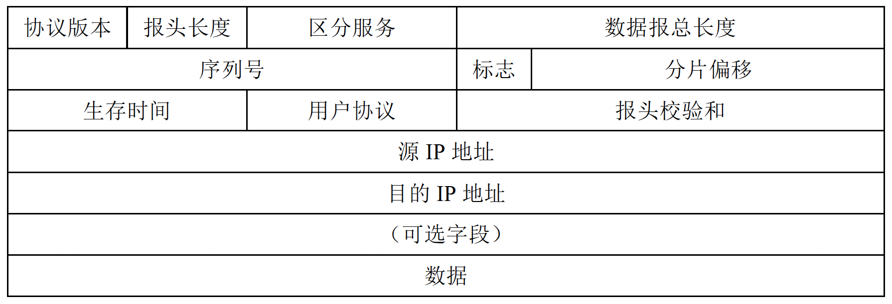
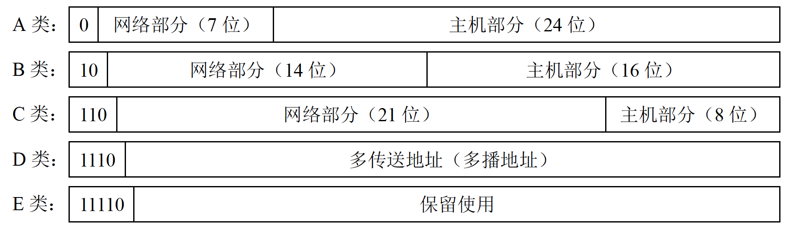

# 四、网络层

网络层的功能：连接异构的网络，向上层提供简单灵活的、无连接的、尽最大努力交付（可能丢失、重复、失序或超时）的数据报服务。

由于历史遗留，许多有关文献也把网络层的**<u>路由器</u>**称作**<u>网关</u>**。

路由器主要完成两个功能，分别是路由选择和分组转发：路由选择按照复杂的路由算法，根据网络拓扑的变化情况，改变所选择的路由；分组转发按照转发表将 IP 数据报从合适的端口发出，管理转发队列和任务调度。

## 4.1 软件定义网络（SDN）的基本概念

网络层可以抽象地划分为数据平面和控制平面，转发是数据平面实现的功能，而路由选择是控制平面实现的功能。在传统互联网中，每台路由器都有数据平面和控制平面。

软件定义网络（SDN，Software-Defined Networking）是近年新兴的一种创新型网络架构，采用了**<u>集中式的控制平面和分布式的数据平面</u>**：① 有一个远程控制器掌握各主机和整个网络的状态，为每个分组计算出最佳路由，然后将转发表下发给路由器；② 路由器变得简单了，不再需要路由选择软件，只需要收到分组后查找转发表，简单转发即可。SDN 还为开发者提供了强大的编程接口，使网络具有很好的可编程性。

SDN 并非要把整个互联网都从分布式的变为集中控制的，这是不现实的。一些大型数据中心之间的广域网使用 SDN 模式构建可以使网络的运行效率更高。

SDN 可以分为三层结构，最上层的是面向开发者的**<u>网络控制应用程序</u>**，中间层是 **<u>SDN 控制器</u>**，最下层是**<u>受控的网络设备</u>**。① SDN 控制层为最上层提供的编程接口称为**<u>北向接口</u>**，北向接口提供了丰富的 API；② SDN 控制器与网络设备建立的双向会话接口成为**<u>南向接口</u>**，通过南向接口协议（**<u>如 Openflow</u>**）SDN 控制器就可以兼容不同的硬件设备，可以在设备中实现上层应用的逻辑；③ SDN 控制器集群内部的通信接口称为**<u>东西向接口</u>**。

**优点**：控制平面全局优化，适合高性能网络；灵活可编程，可以自动化；性能与成本兼顾。

**缺点**：安全问题，集中控制如果遭受攻击会导致整个网络崩溃；网络规模扩大后，控制器可能成为网络性能的瓶颈。

## 4.2 IPv4

Internet Protocol version 4，互联网通信协议版本 4。

### 4.2.1 IPv4 分组格式

1. 协议版本：占 4 位，表示 IP 协议的版本，IPv4 为 ***0100***（即十进制的 4），IPv6 为 ***0110***（即十进制的 6，但 IPv6 的分组格式与 IPv4 的不一样）。

2. 报头长度：占 4 位，表示这个分组的头部有多长，**<u>单位为 4 Byte</u>**，最小为 5（20 个字节），最大为 15（60个字节），整个 IP 分组去掉报头后就是数据。

3. 区分服务（Differentiated Service，DS）：占 8 位，表示这个分组的重要程度、优先级（用于保证某些用户的服务质量，现在基本不使用）。

4. 数据报总长度：占 16 位，表示包括报头和数据的总长度，**<u>单位为 Byte</u>**，最大 65535。

5. 序列号：占 16 位，表示这个分组的序列号（但是网络层并不提供可靠传输，这个序列号仅作为标识使用）。

6. 标志位：占 3 位，表示分组是否是分片。

7. 分片偏移： 占 13 位，如果分组是分片，则接收方可以根据这个偏移量来重组数据，**<u>单位为 8 Byte</u>**。

8. 生存时间（TTL）：占 8 位，单位为跳数，每经过一个路由器这个跳数就被减 1；当 TTL 变为 0 时路由器会丢弃这个分组，不再继续转发（防止一个分组在网络里无限循环）。

9. 用户协议：占 8 位，表示传输层使用的是什么协议，TCP 为 6，UDP 为 17。

10. 报头校验和：占 16 位，使用互联网校验和，校验范围是整个报头的内容。

11. 源 IP 地址、目的 IP 地址：均占 32 位，表示源主机和目的主机的 IP 地址。

12. 可选字段：可变长度（0 ~ 40 Byte），可选不同功能，可以没有（这个字段很少被使用）；**<u>如果可选字段有内容，则一定要是 4 Byte 的整数倍</u>**（因为报头长度字段的单位为 4 Byte），内容不够就需要在可选内容后填充至 4 Byte 的整数倍。

**注**：这里报头长度字段的单位为 4 Byte，数据报总长度字段的单位为 1 Byte，而分片偏移字段的单位为 8 Byte 是常考点（记忆技巧：**<u>“一种八片头饰”，即 “1 总，8 片，头 4”</u>**）。

### 4.2.2 IP 数据报分片

数据链路层能承载的最大数据量（MTU）限制着 IP 数据报的长度。由于 IP 数据报的最大长度为 65535 字节，当数据报过长时就需要对其进行分片处理。

每一个 IP 数据报在被创建时都有一个序列号，属于同一个报文的所有分片拥有的 (5.) 序列号字段都与原报文一致，接收方通过这个序列号来确定哪些分片属于同一个报文。

IP 分组格式中的 (6.) 标志位共有三位，其中只有后两位被使用，分别为 MF（More Fragment）位和 DF（Don't Fragment）位：① 只有当 DF = 0 使，这个 IP 数据报才能被分片处理；② MF = 0 表示这个分组是来自原始报文的最后一个分组。

接收方收到不同的分组后根据 (7.) 分片偏移中的值对原始数据报进行重组，分片偏移表示这个分组携带的数据的**<u>起始字节</u>**是原始数据报中的哪一个字节（用下面的例子理解更直观）。

**例**：假设有一个序列号为 2547 的，长度为 4000 B 的原始 IP 数据报（报头 20 B，数据 3980 B）需要在 MTU 为1500 B 的链路上传递，那么 3980 B ÷ 1480 B = 2 ······ 1020 B，即这个报文需要分成三个分组发送，有：

|            | 序列号 | MF   | DF   | 分片偏移               | 有效数据长度 |
| ---------- | ----- | ---- | ---- | --------------------- | ----------- |
| 原始数据报  | 2547   | 0    | 0    | 0                     | 3980 B     |
| 分组 1     | 2547   | 1    | 0    | 0                     | 1480 B     |
| 分组 2     | 2547   | 1    | 0    | 185（1480 ÷ 8 = 185） | 1480 B      |
| 分组 3     | 2547   | 0    | 0    | 370（2960 ÷ 8 = 185） | 1020 B      |

第 1 个分组携带的是第 0 字节到第 1479 字节；第 2 个分组携带的是第 1480 字节到第 2959 字节；第 3 个分组携带的是第 2960 字节到第 3979 字节。

### 4.2.3 IPv4 地址格式

写作形如 110.64.87.83（点分十进制）的 32 位地址，每个地址都有**<u>网络部分</u>**和**<u>主机部分</u>**。

IP 地址的特点：每一台接入互联网的主机都有一个 IP 地址，路由器的**<u>每一个端口</u>**也有一个 IP 地址（也就是说每个路由器都至少有两个 IP 地址：一个与主机连接，一个与 WAN 连接）。

#### 1) 分类 IP 地址

互联网早期采用的是分类 IP 地址，可按照以下规则分为 A、B、C、D、E 五类地址：

每一类 IP 地址的表示范围和应用场景分别为：

| 网络类别 | 应用场景 | 最大可用网络数 | 前 8 位可用范围  | 每个网络中的最大主机数  |
| ------- | ------- | ------------ | --------------- | -------------------- |
| A       | 大型网络 | 2^7 – 2      | 0 ~ 127         | 2^24 – 2             |
| B       | 中型网络 | 2^14         | 128 ~ 191       | 2^16 – 2             |
| C       | 小型网络 | 2^21         | 192 ~ 223       | 2^8 – 2              |

A 类网络的网络号范围为 1 ~ 126，B 类的网络号范围为 128.0 ~ 191.255，C 类的网络号范围为 192.0.0 ~ 223.255.255；D 类地址（224 ~ 239）用于多播，E 类地址（240 ~ 254）用于科研保留。

可用网络数和可用主机数 “2^k – 2” 中少 2 个的原因是有一些特殊地址。

#### 2) 特殊地址

| 网络号 | 主机号 | 用途                                                                                                             | 可作为源地址 | 可作为目的地址 |
| ----- | ---- - | --------------------------------------------------------------------------------------------------------------- | ------------ | ----------- |
| 全为 0 | 全为 0 | 即 0.0.0.0，在本网络内表示本主机（主机不知道自己的 IP 地址时才使用 0.0.0.0 作为源地址）                                 | √            | ×           |
| 全为 1 | 全为 1 | **<u>受限广播地址</u>**，即 255.255.255.255，表示广播到整个网络上（实际上路由器不会转发受限广播地址，所以是广播到本网络上） | ×            | √           |
| 全为 0 | -     | 表示本网络内某台主机                                                                                               | √            | ×           |
| -     | 全为 0 | **<u>网络地址</u>**，表示整个网络（是一个抽象的地址，不可以出现在地址字段）                                              | ×            | ×           |
| -     | 全为 1 | **<u>直接广播地址</u>**，可以给特定的某个网络进行广播                                                                 | ×            | √           |
| 127   | -     | **<u>环回地址</u>**，表示主机自己                                                                                   | √            | √           |

**注**：“ - ” 表示任意不全为 0 或全为 1 的数。

所以，A 类地址的可用网络数为 2^7 – 2 的原因是：全 0 地址保留给了本网络；127 为环回地址。

每个网络中最大主机数也去掉了 全 0 地址（网络地址）和全 1 地址（广播地址）。

## 4.3 网络地址转换（NAT）

Network Address Translation，是指将专用网络地址转换为公网地址，使得整个专用网只需要一个全球 IP 地址就可以与互联网通信。

专用网络划分出了部分 IP 地址作为私有地址，**<u>私有地址只用于 LAN，不能在 WAN 上传输，路由器对于目的地址是私有地址的分组一律不进行转发</u>**。

**优点**：由于私有地址可以在每个专用网重用，大大节省了 IP 地址池的消耗；同时也隐藏了网络内部结构，降低了内部网络受到攻击的风险。

**<u>私有 IP 地址网段如下</u>**：

1 个 A 类网段，为 **10**.0.0.0 ~ **10**.255.255.255；

16 个 B 类网段，为 **172.16**.0.0 ~ **172.31**.255.255；

256 个 C 类网段，为 **192.168.0**.0 ~ **192.168.255**.255。

**<u>NAT 的工作原理</u>**：

1. NAT 路由需要至少有一个全球 IP 地址，以便将与外网通信。

2. NAT 路由器持有一张 NAT 转换表，每个表项都应该有 { 私有 IP 地址：端口 } 和对应的 { 全球 IP 地址：端口 }，将私有 IP 地址映射到全球 IP 地址。

3. 用户以内网 IP 地址向互联网发送分组时，NAT 路由器查询 NAT 转换表中的映射，将分组中的 IP 地址替换成公网 IP，并且会更改传输层的数据段中的端口号。

4. 收到互联网发来的分组时，NAT 转换器根据接收端口号查 NAT 转换表，将分组的 IP 地址和端口重新换回内网 IP 和原先的端口，再发回内网中。

**注 1**：普通路由器工作在网络层，而 NAT 路由器需要查看和修改传输层中的内容。

**注 2**：王道书上说 **<u>NAT 表项只能由管理员添加</u>**，路由器收到不符合 NAT 表中任何一项的分组时直接丢弃。

**例**：假设此时 NAT 路由器中存在映射：192.168.0.25:47025 → 110.64.87.83:52128。

用户的内网 IP 是 192.168.0.25，这个用户向互联网发送了一帧，IP 地址和端口号如下：

经过 NAT 后，这个地址信息被转换为：

在收到外网发来这样的分组时：

目的地址和目的端口就会按照 NAT 转换表中记录的映射被转换回 192.168.0.25 和 47025 再传送到内网。

**<u>NAT 技术带来的问题</u>**：① 违背了 IP 地址的唯一性；② 将部分互联网变成了面向连接的网络，NAT 转换器维护着这个连接状态，一旦转换器崩溃，连接就会消失；③ 违背了协议分层原理，不仅更改了网络层的分组中的 IP 地址，还更改了传输层的数据段中的端口号；并且如果传输层不是 TCP 或 UDP 协议的内容，NAT 就不能正常工作；④ 依赖目的 IP 地址工作的应用将无法正常工作（用户实际的 IP 和接收方看到的 IP 不一样）；⑤ 一个公网 IP 能给 65536 – 4096 = 61440 个用户提供服务，使网络 严重超载。

## 4.4 子网、无分类域间路由（CIDR）

子网的提出主要是为了解决两级 IP 地址利用率很低的问题：A 类网络地址太少，每个网络中也存在大量未使用的地址；C 类网络可用的主机地址太少；B 类地址适中但是已经枯竭，IPv4 地址池分配严重不均衡。

为了解决这个问题，现代网络从 IP 地址的**<u>主机号部分借用若干个比特</u>**，添加一个 “子网号” 的字段让两级 IP 地址**<u>变为三级</u>**，这种做法称为子网划分。

子网划分的特点：

1. 子网划分属于一个网络内部的事情，外部无法看出该网络是否有子网划分。

2. RFC 950 规定 IPv4 的子网号不能全为 0 或全为 1，但 **<u>CIDR 可以</u>**，注意给出的条件。

3. 由于主机号不可以全为 0 或全为 1，所以子网划分时主机号至少留两位。

### 4.4.1 子网掩码

子网掩码是一个与 IP 地址相对应的、长为 32 bit 的二进制数，由一连串的 1 后面跟着一连串的 0 构成。其中，1 对应 IP 地址中的网络和子网号字段，0 对应主机号字段。只需要**<u>将子网掩码与 IP 地址进行 “按位与”（位运算 “&”）</u>**的操作，即可得到该 IP 地址的网络和子网号。

现代因特网规定：所有网络必须使用子网掩码。如果一个网络未划分子网，则采用的默认子网掩码，A、B、C 类网络的默认子网掩码分别为 255.0.0.0、255.255.0.0、255.255.255.0。

**注**：在使用子网掩码的情况下，路由器的路由表每个表项需要记录的信息至少要有以下 3 项：**<u>目的网络地址</u>**、**<u>下一跳地址</u>**和**<u>目的网络子网掩码</u>**。

**例**：假设网络 47.25.0.0 划分了 8 个子网，即需要三位的子网号，那么这个网络的子网掩码为 255.255.224.0（即 255.255.***<u>111</u>0 0000***.0）。如果该网络内有 IP 地址 47.25.179.33（即 47.25.***<u>101</u>1 0011***.33），只需要对子网掩码和 IP 地址进行 “按位与” 运算即可得到该 IP 地址子网地址为 47.25.<u>160</u>.0（即 47.25.***<u>101</u>0 0000***.0）。

### 4.4.2 无分类域间路由（CIDR）

Classless Inter-Domain Routing，使用网络前缀的概念代替网络和子网号，而且网络前缀的位数是不固定的。

CIDR 使用**<u>斜线记法</u>**（也叫 CIDR 记法）来表示这个 IP 地址的网络前缀长度，例如 47.25.179.33/19 表示该 IP 地址的二进制表示中前 19 位为网络号，其余位置为主机号。

具体实施方法为：

1. 分配 IP 地址时不再按照 A、B、C 类来分配，而是按需分配：如果某机构想要 2000 个 IP 地址，则分一个 x.x.x.x/21 的地址段，这样 11 位的主机位能容纳 2046 个主机，够用的同时也不会造成浪费。

2. 路由器的路由表会储存子网掩码和网络号，而不再储存所有完整 IP 地址对应的路由表，大大缩减了路由表的储存和查找开销：只需要找到这个 IP 所属的子网的网络地址，就可以查询路由表进行转发。

CIDR 虽然不使用子网，但仍使用掩码这一词汇（“不使用子网” 是指 CIDR 不在地址中指定子网号字段；但分配到一个 CIDR 地址段的组织仍可以在网络内划分出子网使用）。

#### 路由聚合

路由器的一个端口可能能通往多个不同的子网，为了优化路由表，将同一个端口上**<u>网络前缀相同</u>**的地址聚合为一个 CIDR 地址段，这种聚合称为路由聚合，或称为**<u>构成超网</u>**。

**例**：如果路由器 R 发现某个端口既可以去到网络 47.25.33.0/25，又可以去到 47.25.33.128/25，则将这两个 CIDR 地址段聚合为  47.25.33.0/24 记录在路由表中。

#### 最长前缀匹配（最佳匹配）

使用 CIDR 时，需要用路由表中的各个掩码对 IP 地址求网络前缀。不同的掩码求出来的网络前缀可能会匹配多个路由表中的结果，此时应当从匹配结果中选择具有最长网络前缀的路由，因为网络前缀越长，路由越具体。

**例**：若目的 IP 地址为 47.25.33.128，路由表中有以下四项：

| 目的网络 / 掩码   | 下一跳 |
| --------------- | ------ |
| 47.0.0.0/8      | R1     |
| 47.16.0.0/12    | R2     |
| 47.25.32.0/20   | R3     |
| 0.0.0.0/0       | R0     |

可以看到这个 IP 地址能匹配表中所有的网络前缀，但实际上这个分组会往 R3 转发，因为 R3 的匹配最具体。

#### 网络层如何转发分组

为了更快地查找最佳匹配的表项，在路由表中网络前缀越长的表项排在越前面，此时只需要从前往后寻找，找到第一个匹配的表项后就不用继续查找了。

**<u>路由表中还有两种特殊路由</u>**：

1. **<u>主机路由</u>**：对特定的目的主机专门指明一个路由，路由表中对应的目的网络是 a.b.c.d/32。

2. **<u>默认路由</u>**：用 0.0.0.0/0 表示默认路由。只要目的地址在路由表中找不到任何匹配的网络，就一律选择默认路由。

**<u>路由器执行分组转发的算法如下</u>**：

1. 如果目的 IP 地址符合路由表中的某条主机路由，则按照这条路由转发。

2. 从上到下依次用路由表中的掩码与目的 IP 地址进行运算，如果目的 IP 地址符合某条网络前缀，则按照这条路由转发。

3. 如果路由表中的主机路由和网络前缀都没有找到匹配目的 IP 地址的，则从默认路由转发；如果没有默认路由，则报告出错。

## 4.5 地址解析协议（ARP）

Address Resolution Protocol，ARP 协议的任务是完成 IP 地址与 MAC 地址的转换。

不同网络之间使用 IP 地址进行通信，路由器根据网络层的 IP 地址决定下一跳后，由于数据链路层通过 MAC 地址来确定目的地，因此向下一跳转发时**<u>需要知道下一跳的 MAC 地址</u>**。

**注**：从 IP 地址到 MAC 地址的解析是自动的，主机用户不需要关心这个过程。

### 4.5.1 ARP 工作原理

每台主机都有一个 ARP 表，存放着**<u>本局域网内</u>**各主机和路由器的 IP 地址和 MAC 地址的对应关系。

由于 ARP 协议只能获取到本局域网内的 MAC 地址：

#### 1) 如果源主机 A 和目的主机 B 在同一个局域网内

1. A 首先查找自己的 ARP 表有无 B 的 IP 对应的 MAC 信息：

2. 如果没有就向局域网内**<u>广播</u>**一个 **<u>ARP 请求分组</u>**，这个分组里源地址是 A 的 MAC 地址，目的地址是全为 1 的 MAC 地址（ff-ff-ff-ff-ff-ff）；B 收到这个分组后发现 IP 地址是自己，说明 A 正在请求自己的 MAC 地址，B 就**<u>单播</u>**一个 **<u>ARP 响应分组</u>**，告诉 A 自己的 MAC 地址，A 将此信息写入 ARP 表中。

3. A 获取到 B 的 MAC 地址之后，就可以填入目的地址中进行通信。

#### 2) 如果源主机 A 和目的主机 B 不在同一个局域网内

A 找到本局域网内的路由器（默认网关），通过 ARP 将路由器的 MAC 地址填入目的 MAC 地址中，剩下的交给路由器完成。

**注意**：因为路由器的每个端口都有自己的 IP 地址和 MAC 地址，所以**<u>每一跳都会更改源 MAC 地址和目的 MAC 地址</u>**。

### 4.5.2 四种典型情况

① 发送方和接收方都是主机：通过 ARP 找到目的主机的 MAC 地址。

② 发送方和接收方都是路由器：通过 ARP 找到目的路由器的 MAC 地址，剩下的交给下一跳的路由器完成。

③ 发送方是主机，接收方是路由器：通过 ARP 找到路由器的 MAC 地址，剩下的交给下一跳的路由器完成。

④ 发送方是路由器，接收方是主机：通过 ARP 找到目的主机的 MAC 地址。

## 4.6 动态主机配置协议（DHCP）

Dynamic Hosts Configuration Protocol，用于给主机动态分配 IP 地址，提供了即插即用的联网机制，允许一台新的主机加入网络和获取 IP 地址的过程不需要手动配置。

**注**：DHCP 协议是**<u>应用层</u>**协议，并且它是基于 UDP 的。

**<u>DHCP 的工作原理</u>**：

DHCP 使用服务器 / 客户端模式。

1. 需要 IP 地址的客户端在本地网络上**<u>广播</u>**一个 **<u>DHCP 发现报文</u>**。这个报文的源地址是 0.0.0.0，目的地址是 255.255.255.255。

2. DHCP 服务器收到发现报文后，**<u>广播</u>**一个 **<u>DHCP 提供报文</u>**，报文中包含了提供给客户端的 IP 地址。这个报文的源地址是 DHCP 服务器的 IP 地址，目的地址是 255.255.255.255。

3. 客户端收到提供报文后，如果接受该 IP 地址，就**<u>广播</u>**一个 **<u>DHCP 请求报文</u>**，向 DHCP 服务器请求使用这个 IP 地址。这个报文的源地址是 0.0.0.0，目的地址是 255.255.255.255。

4. DHCP 服务器收到请求报文后，**<u>广播</u>**一个 **<u>DHCP 确认报文</u>**。这个报文的源地址是 DHCP 服务器的 IP 地址，目的地址是 255.255.255.255。

**注 1**：一个网络上可以配置多个 DHCP 服务器，所以客户端广播发现报文后，有可能收到多个提供报文，客户端只需要挑选一个进行回复即可。通常挑选最先到达的。

**注 2**：由于在最终确认报文之前客户端都没有 IP 地址可以使用，所以**<u>全程都使用广播</u>**。

## 4.7 网际控制报文协议（ICMP）

Internet Control Message Protocol，让主机和路由器有办法报告差错和异常情况。

ICMP 报文装在 IP 数据报的内容里，组成 IP 数据报发送出去。

ICMP 报文分为 **<u>ICMP 差错报告报文</u>**和 **<u>ICMP 询问报文</u>**。

### 4.7.1 ICMP 差错报告报文

共有以下 5 种常用类型：

1. 终点不可达：路由器或主机无法交付数据时，就向源点发送终点不可达报文。

2. 源点抑制：当路由器或主机由于拥塞而丢弃数据报时，就向源点发送源点抑制报文，减慢源点数据发送速率。**<u>最新标准已不再使用该报文</u>**。

3. 时间超时：有两种情况会发出该报文：① 当路由器收到 TTL 为 0 的数据报时，就丢弃该数据报并向源点发送时间超时报文；② 当终点在预定时间内不能收到一个数据报的全部分组时，就将已收到的所有分组全部丢弃，并向源点发送时间超时报文。

4. 参数问题：当路由器或主机收到的数据报中报头有字段内容不正确时，就丢弃该数据报，并向源点发送参数问题报文。 

5. 改变路由（重定向）：路由器把改变路由报文发给主机，让主机下次选择另外的路由发送数据报。

**<u>不应该发送 ICMP 差错报告报文的情况</u>**：

1. 对于 ICMP 差错报告报文不再发送 ICMP 差错报告报文。

2. 对于同一个数据报的分组发送过一次 ICMP 差错报告报文后，后续分组不再发送。

3. 对于具有多播地址的数据报不发送 ICMP 差错报告报文。

4. 对于特殊地址（如 127.0.0.1 或 0.0.0.0）的数据报不发送 ICMP 差错报告报文。

### 4.7.2 ICMP 询问报文

共有以下 4 种类型：① 回声请求和回答报文；② 时间戳请求和回答报文；③ 地址掩码请求和回答报文；④ 路由器询问和通告报文。其中最常用的是前两种。

**<u>具体应用有</u>**：

1. PING（Packet InterNet Groper）：用于测试连通性。

   向目的机发送一个 **<u>ICMP 回声请求报文</u>**（Echo），报文中包含一些数据，目的机收到这个报文后立即回发一个回声应答报文，源机检查应答报文中的数据，如果和发出去的一致则认为目的机可达。

   可以 PING 环回地址（127.0.0.1）来测试本机的 TCP/IP 协议工作是否正常，PING 本机 IP 地址来测试网络设备是否正常，PING 默认网关来测试直连的路由器是否正常，PING 其他用户的 IP 地址来测试网络是否畅通，PING 一个网址来测试 DNS 服务器是否正常。

2. Trace Route（在 Windows 中叫 tracert）：用于跟踪路由。

   向目的机发送一个 TTL = 1 的分组，在第一跳的路由器就会回发一个 **<u>ICMP 时间超时报文</u>**，由此得到第一跳路由器的 IP 地址；然后发送一个 TTL = 2 的分组，在第二跳的路由器就会回发一个 ICMP 时间超时报文，得到第二跳路由器的 IP 地址；以此类推，直到收到一个来自目的 IP 地址的 ICMP 终点不可达报文，就可以得到途径所有的路由信息。

   Trace Route 最多可以追踪 30 跳，超过 30 跳就会终止 Trace Route 过程。

## 4.8 IPv6

为了从根本上解决 IPv4 地址资源耗尽的问题，提出了 IPv6。

### 4.8.1 IPv6 特点

1. IPv6 拥有 128 位的地址空间，远超 IPv4，从长远来看这些地址也够用。

2. 支持即插即用，即不需要 DHCP 也能自动配置。

3. 支持资源的预分配，提供服务质量 QoS（Quality of Service）保障，可以对有需要的服务保证带宽和时延。

4. 增强安全性，身份验证和保密功能是 IPv6 的关键特征。

5. 改进了分组格式：**<u>移除了校验和字段</u>**（降低处理时延）；将可选字段移出分组头部变为拓展头部，简化分组头至 8 个字段（IPv4 有 12 个字段）。

6. IPv6 的分组**<u>头部长度必须是 8 B 的整数倍</u>**（IPv4 必须是 4 B 的整数倍）。

7. IPv6 不允许路由器对数据报进行分片，只有源结点可以对数据报进行分片，所以**<u>从一般意义上来说 IPv6 不允许分片</u>**（IPv4 允许路由分片）。

### 4.8.2 IPv6 地址

128 位地址的 IPv6 地址写作形如 2001:250:3:3ca2:8e7:6ca1:cb8d:ab54 的冒分十六进制。

由于地址过长，**<u>有以下两种地址缩写规则</u>**：

① 每一个十六进制数高位上的 0 可以省略。

**例**：假设一个 IPv6 地址为 2001:<u>00</u>41:<u>000</u>0:<u>000</u>0:<u>000</u>0:<u>000</u>1:<u>00</u>a0:<u>0</u>450，则根据第一条规则可缩写作 2001:41:0:0:0:1:a0:450。

② 连续的 0 可以省略写作双冒号 “ :: ”，**<u>但一个地址中只能出现一次双冒号</u>**，否则不知道省略了多少个 0。

**例**：由第一条规则得到的 2001:41:<u>0:0:0</u>:1:a0:450 再根据第二条规则可缩写作2001:41::1:a0:450。

**<u>IPv6 地址类型有</u>**：

1. 单播：传统点对点通信。

2. 多播：一对多通信，分组会被送至每一台目的主机。

3. 任播：任播的目的地址是一组计算机，但分组只交付给这组里面**<u>其中一台</u>**主机，通常是距离最近的一台主机。

从 IPv4 到 IPv6 的技术过渡可以采用**<u>双协议栈</u>**和**<u>隧道技术</u>**两种策略：

1. 双协议栈：一台设备同时支持 IPv4 和 IPv6，可以与这两种类型的网络通信。

2. 隧道技术：如果 IPv6 数据报要通过 IPv4 网络传输，就将整个 IPv6 数据报封装进 IPv4 数据报的数据部分再传输，到达支持 IPv6 的网络时再重新拿出 IPv6 数据报。

## 4.9 路由协议

### 4.9.1 自治系统（AS）

Autonomous System，单一技术下管理的一组路由器，**<u>每个 AS 内部的路由选择协议与其他的 AS 无关</u>**。一个 AS 中所有的路由器在本 AS 内都必须是连通的。

AS 内部的路由称为**<u>域内路由选择</u>**，所使用的路由协议称为**<u>内部网关协议 IGP</u>**（Interior Gateway Protocol），目前使用的最多的协议有 RIP 和 OSPF。

AS 之间的路由称为**<u>域间路由选择</u>**，所使用的路由协议称为**<u>外部网关协议 EGP</u>**（Exterior Gateway Protocol），目前使用的最多的协议为 BGP-4。

### 4.9.2 路由信息协议（RIP）

Routing Information Protocol，是一种分布式的、**<u>基于距离向量算法（DV，Distance Vector）</u>**的路由选择协议，其最大的优点就是简单。

**<u>RIP 规定</u>**：

1. 网络中每个路由器都要维护一个路由表，记录从它自身到其他每个目的网络的距离（这一组距离可以写作一个距离向量）。

2. 距离的单位是条数（Hop）。规定直接连接到路由器上的网络距离这个路由器的距离为 1，而到其它网络时每经过一个路由器距离就加 1。

3. **<u>RIP 优先选择跳数最少的路由</u>**，哪怕存在一条高速但跳数较多的路由。

4. RIP 只允许一条路径经过最多 15 个路由器，距离为 16 的路径表示网络不可达。可见 **<u>RIP 只适用于小型网络</u>**。

5. RIP 不支持含有广播子网掩码的 RIP 广播，所以 RIP 中每个网络的子网掩码必须相同（但新版 RIP 2 中已支持变长子网掩码和 CIDR）。

**<u>RIP 使用 DV 算法的实施过程</u>**：

路由表的每个表项都至少记录以下 3 个信息：**<u>目的网络</u>**、**<u>距离</u>**、**<u>下一跳路由器的地址</u>**。

1. 最初，每个路由器都只知道与自己直接相连的网络（与自己距离跳数为 1 的网络）。

2. 路由器每 30 秒就向**<u>相邻的</u>**路由器发送 RIP 广播，告知相邻的路由器自己目前的路由表（与自己距离跳数为 2 的网络）。

3. 路由器收到相邻路由器发来的路由表后，**<u>先将所有表项中的 “下一跳地址” 都改为发送这个路由表的路由器 R，并把所有表项中的距离字段加 1 变为 d</u>**。

4. 对于经过上一步处理的各表项，进行如下操作：

   a) 当原来的路由表没有目的网络 N 时，就把这个表项添加进路由表；

   b) 当原来的路由表有目的网络 N，且原路由表中去往 N 的下一跳路由也是 R 时，就用刚收到的表项覆盖原来的记录；

   c) 当原来的路由表有目的网络 N，但原路由表中去往 N 的下一跳路由不是 R 时：如果距离 d 比原路由表中记录的距离小，就用刚收到的表项覆盖原来的记录；否则什么也不做。

5. 经过多次 RIP 广播之后，所有的路由器都整理出了整个网络的路由表，称 RIP 最终**<u>收敛</u>**。

**注 1**：默认每 30 秒相邻路由器就要进行一次 RIP 广播。如果 180 秒内都没有收到过相邻路由器发来路由表的更新，就认为相邻路由器以不可达，此时将所有下一跳地址为不可达路由器的表项的距离改为 16。

**注 2**：网络之间出现故障时，会出现**<u>无穷计数问题</u>**：假设 A 原先 1 跳可到达（直连）X，A 告诉了 B，于是 B 记录了到达 X 的跳数是2；突然 A 和 X 之间的连接断开了，下次 A 与邻居交换路由表时会发现 B 用 2 跳可到达 X，就会记录下来到达 X 的跳数是 3；由于 B 到 X 的路径下一跳是 A，则 B 在下一次交换时会发现 A 到 X 的跳数变为了 3，所以也更新自己到 X 的跳数变为 4；如此往复，最终到跳数为 16 时才会发现 X 已不可达。RIP 协议**<u>在网络发生故障时收敛需要的时间很长，俗称 “坏消息传得慢”</u>**。

### 4.9.3 开放最短路径优先（OSPF）协议

不同于 RIP 使用的 DV 算法，OSPF 是一种**<u>链路状态（LS，Link State）</u>**算法的路由，使用的是 Dijkstra 最短路径算法。

**<u>OSPF 的实施过程</u>**：

1. 路由器启动时，先向所有端口发送一个**<u>问候分组</u>**，收到问候分组的路由器会回发一个包含自己的信息的数据报，通过这些数据来探测和记录所有的邻居和邻居的网络地址。

2. 测量并记录到所有邻居的链路开销（常用的代价为**<u>延迟</u>**）。

3. 构造自己的链路状态（LS，Link State），包含了自己的邻居列表和到邻居的链路开销。

4. 将自己的 LS 以数据库描述（DBD，DataBase Description）分组的形式**<u>泛洪</u>**（即要求收到的路由器也转发出去）地发送给所有其他路由器。

   DBD 可以定时进行发送，也可以在邻居发生变化时发送（触发更新）。

   路由器收到一个 DBD 后，会检查这个 DBD 的寿命和序列号，如果未过期并且是新的 DBD 则会广播这个 DBD，否则将会丢弃。

5. 自己也会收到其他路由器发来的 LSP，根据收到的所有信息使用 Dijkstra 最小生成树算法计算到每个目的地的最优路由，得到路由表（但**<u>路由表只储存下一跳路由地址，不储存完整路由</u>**）。

6. 为保证全网路由器链路状态数据库的一致性，通常规定每 30 分钟刷新一次数据库中的链路状态。

**<u>OSPF 共有这 5 种分组</u>**：

1. 问候（Hello）分组：用于发现和**<u>持续探测</u>**邻居，通常每 10 秒相邻路由器就要交换一次。

2. 数据库描述（DBD）分组：向邻居给出自己链路状态数据库中的信息摘要。

3. 链路状态请求（LSR）分组：请求对方给出某些链路状态的详细信息。

4. 链路状态更新（LSU）分组：链路状态发生变化时泛洪广播更新的链路信息。

5. 链路状态确认（LSAck）分组：对链路状态更新分组的确认。

**特点**：

1. OSPF 发送的 LSP **<u>只包含自己与邻居之间的链路状态信息</u>**，而 **<u>RIP 发送的是自己的整个路由表</u>**。因此，当互联网规模很大时，OSPF 比 RIP 的性能要好很多。

2. OSPF 使用泛洪广播将 LSP 告知所有路由器，而 RIP 只与自己的邻居交换路由表。

3. 当链路状态发生变化时 OSPF 会泛洪广播，收敛速度很快，不会出现 RIP 的 “坏消息传得慢” 情况。

4. **<u>OSPF 是网络层协议</u>**，LSP 直接使用 IP 数据报进行发送；而 **<u>RIP 是应用层协议</u>**，并且在传输层使用 UDP。

### 4.9.4 边界网关协议（BGP）

Border Gateway Protocol，是不同 AS 的边界网关路由器之间交换路由信息使用的协议，该协议使用路径向量算法。

由于因特网规模太大，自治系统之间的路由难度很高，以至于找到 AS 之间的最佳路由是不现实的。BGP 协议力求寻找到一条能到达目的网络且较好的路由。**<u>BGP 是应用层协议，在传输层使用 TCP</u>**。

**<u>BGP 的工作原理</u>**：

1. 每个自治系统选择至少一个路由器作为该 AS 的 “BGP 发言人”，也就是这个 AS 的边界路由器。

2. 一个 AS 的 BGP 发言人通过与相邻的 BGP 发言人**<u>建立 TCP 连接</u>**来建立 BGP 会话，再通过此会话传送 BGP 报文交换路由信息。

3. BGP 所交换的网络可达性信息是：到达某个网络（用 CIDR 网络前缀表示）路上要经过的**<u>一系列路由</u>**。

4. 所有 BGP 发言人相互交换网络可达性信息后，各 BGP 发言人就可以找出到达各个 AS 的较好路由。

**特点**：

1. BGP 交换路由信息的结点数量级是自治系统的数量级，比这些 AS 中的网络数量少很多。每个 AS 的 BGP 发言人的数量也很少，降低路由选择的复杂度。

2. BGP 支持 CIDR。

3. BGP 只有在刚运行时才与邻站交换整个 BGP 路由表，此后发生只在发生变化时交换有变化的部分。

**<u>BGP-4 共有这 4 种报文</u>**：

1. 打开（Open）报文：用来与相邻的 BGP 发言人建立会话。

2. 更新（Update）报文：用来发送某一路由信息，或撤销多条路由。

3. 保活（Keep Alive）报文：用来周期性地探测邻站，或**<u>确认 Open 报文</u>**。

4. 通知（Notification）报文：用来发送检测到的差错，或**<u>关闭 BGP 会话</u>**。

### 4.9.5 三种路由协议的比较

|           | RIP               | OSPF                          | BGP                                        |
| --------- | ----------------- | ----------------------------- | ------------------------------------------ |
| 类型      | 内部               | 内部                          | 外部                                        |
| 路由算法   | 距离向量算法        | 链路状态                      | 路径向量算法                                 |
| 使用的协议 | UDP（应用层协议）   | IP（网络层）                   | TCP（应用层协议）                            |
| 路径选择   | 跳数最少的路由      | 代价（通常是延迟）最低路由       | 较好（非最佳）路由                           |
| 交换结点   | 相邻的路由器        | 网络中所有的路由器              | 相邻的路由器                                |
| 交换内容   | 整个路由表         | 与本路由器相邻的路由器的链路状态  | 首次启动：整个路由表 有更新时：只有变化信息 |

## 4.10 IP 多播

为了支持视频会议或流媒体播放的应用场景，需要一种让源主机**<u>发送一次</u>**单个分组就能抵达多个目的地址，被多个目的主机接收的多播机制。用多个单播来模拟多播是理论可行的，但这会导致主机处理开销过大和网络流量过高，不适合实际使用。

多播一定**<u>仅应用于 UDP</u>**。

源主机在分组的目的地址中填写一个多播地址，只需要发送一次这个分组；**<u>这个分组只有在传输路径出现分叉时才将分组复制并转发</u>**，大大减轻了发送者和网络的负载。

各个主机对多播分组不会产生 ICMP 差错报文，PING 多播地址不会收到响应。

### 4.10.1 多播地址

多播地址使用 IPv4 中的 D 类地址，每一个地址标志一个多播组（并非所有的 D 类地址都可以作为多播地址使用，有一部分的 D 类地址已经被指派为永久地址了）。

多播地址只能作为目的地址，不能作为源地址。

IP 多播可以分为局域网内的**<u>硬件多播</u>**和**<u>因特网范围的多播</u>**。

**<u>硬件多播会根据多播地址来生成一个 MAC 地址</u>**，而因特网范围的多播在最后阶段也要通过硬件多播交付给多播组的所有成员，所以先介绍硬件多播如何产生这个 MAC 地址：

规定以太网多播 MAC 地址的范围是 01-00-5e-00-00-00 到 01-00-5e-7f-ff-ff，地址空间只有 23 位；而 D 类 IP 地址空间有 28 位。所以多播 IP 地址中的前 9 位（D 类地址固定头部 ***1110*** 和前 5 位）不做映射，**<u>多播 IP 地址的后 23 位与多播 MAC 地址的后 23 位一一对应</u>**。

由于多播地址和 MAC 地址不是一一对应的（例如，224.0.25.47 与 224.128.25.47 的多播 MAC 地址都是 01-00-5e-00-19-2f），因此**<u>收到多播分组的主机还要在网络层过滤 IP 地址</u>**，将不属于自己的多播分组丢弃掉。

### 4.10.2 因特网管理协议（IGMP）

Internet Group Management Protocol，这个协议的作用是让路由器知道多播组有哪些成员，并与其他多播路由器协同工作。

IGMP 并不在因特网范围内对所有多播组成员进行管理：IGMP 也不知道多播组一共有多少成员，也不知道所有成员都分布在哪些网络上。IGMP 只是让**<u>本局域网上的多播路由器知道本局域网上有哪些主机加入或退出了某个多播组</u>**。

**<u>IGMP 实施过程</u>**：

1. 某台主机要加入某个多播组时，该主机就向这个多播组的多播地址发送一个 IGMP 报文，声明自己要加入。本地多播路由器收到这个报文后，记录并将多播组成员关系转发给其他多播路由器。

2. 本地多播路由器周期性探寻本地局域网上的主机：只要有一台主机响应，那么多播路由器就认为这个多播组是活跃的；如果某个多播组在多次探寻后都没有主机响应，则不再将该组的成员关系转发给其他多播路由器。

3. 多播路由实际上就是找出**<u>以源主机为根结点的多播转发树</u>**，不同组多播对应不同的多播转发树。主要有三种路由算法：① 基于距离向量的路由选择；② 基于链路状态的路由选择；③ 可以建立在任何路由协议上的协议无关多播（PIM，Protocol Independent Multicast）。

## 4.11 移动 IP

移动站以**<u>固定 IP 地址</u>**漫游在不同网段的技术，保证基于 IP 地址的网络权限在漫游过程中不发生改变（例如 TCP 连接在移动站漫游的过程中不会断开）。

**<u>移动 IP 地址需要三种功能实体</u>**：

1. 移动站：拥有固定不变的永久 IP 地址（也称为**<u>归属地址</u>**）的终端设备。

2. 本地代理：也称为**<u>归属代理</u>**，移动站最开始连接到的网络（即移动站的归属地址所在的网段，这个网络叫**<u>归属网路</u>**）的路由器。

3. 外地代理：移动站在漫游过程中接入的网络（即**<u>被访网络</u>**的）的路由器。

**<u>移动 IP 的实施过程</u>**：

1. 移动站在归属网络中获取到一个 IP 地址，按照正常的通信方式通信。

2. 移动站漫游并接入外地的被访网络时，向被访网络的外地代理登记，获得一个临时的**<u>转交地址</u>**。移动站通过外地代理将转交地址发回给归属代理。

3. 归属代理与这个转交地址创建一个隧道，将收到的目的地址为移动站归属地址的 IP 分组**<u>再封装</u>**，通过隧道发往外地代理。外地代理收到发往转交地址的分组时，**<u>先拆封还原 IP 分组</u>**，再发送给移动站，这样移动站就能收到以归属地址为目的地址的分组。

4. 移动站在漫游时发送 IP 分组**<u>仍使用归属地址作为源地址</u>**，然后**<u>直接通过外地代理发送即可</u>**（外地代理**<u>不用</u>**将移动站对外发送的分组传回归属代理再发送）。

5. 移动站到达新的网络时，向新的外地代理申请转交地址，并告诉归属代理使用新的转交地址覆盖上一次的隧道。

6. 移动站回到归属网络时，向归属代理注销转交地址。

## 4.12 网络层设备：路由器（Router）

从结构上看，路由器分为**<u>路由选择</u>**和**<u>分组转发</u>**两部分。从模型的角度看，路由器实现了物理层、数据链路层和网络层的功能。

路由选择部分也称为控制部分，其核心构件是路由选择处理机。路由选择处理机的任务是根据路由选择协议构造并维护路由表，**<u>按照路由表导出一张转发表</u>**供分组转发部分使用。

分组转发部分由交换结构、输入端口和输出端口组成，其中交换结构是核心构件。交换结构根据转发表将从某个输入端口得到的分组经过处理后从合适的输出端口转发出去。

一个基础的路由表应该包含目的网络地址、子网掩码（或前两项综合为网络前缀）、下一跳 IP 地址和接口这几项，例如下表：

| 网络前缀（目的网络 / 掩码）    | 下一跳 IP 地址  | 端口  |
| --------------------------- | -------------- | ---- |
| 47.25.32.0/20               | Direct         | E0   |
| 47.16.0.0/12                | 47.25.0.1      | E1   |
| 47.0.0.0/8                  | 47.0.0.1       | L0   |
| 0.0.0.0/0                   | 47.0.0.1       | L0   |

为了减少重复项，可以使用一个默认路由（0.0.0.0/0）代替所有具有相同 “下一跳” 的表项，并将默认路由的优先级降到最低。当某个分组找不到其他符合条件的路由时，就选择默认路由。

**注**：路由器中的转发表是由路由表导出的：路由表一定是由软件根据复杂的路由选择协议实现的，而转发表可以通过软件也可以通过硬件实现；但是在讨论路由选择的原理和大部分情况下都不对转发表和路由表作特殊区分。

