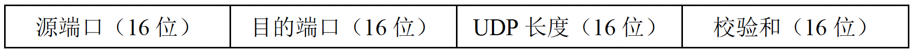
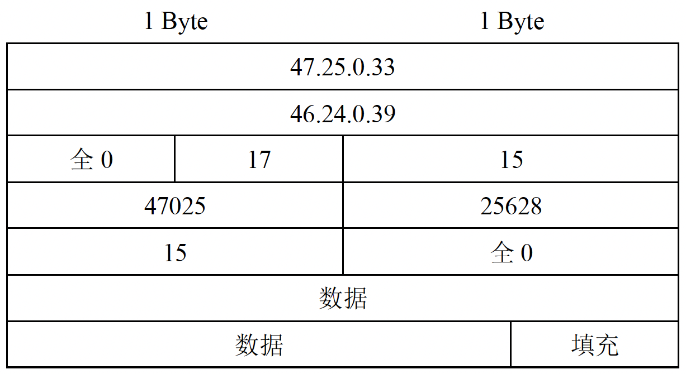
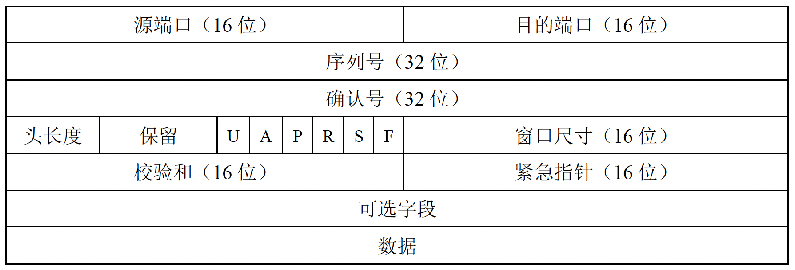
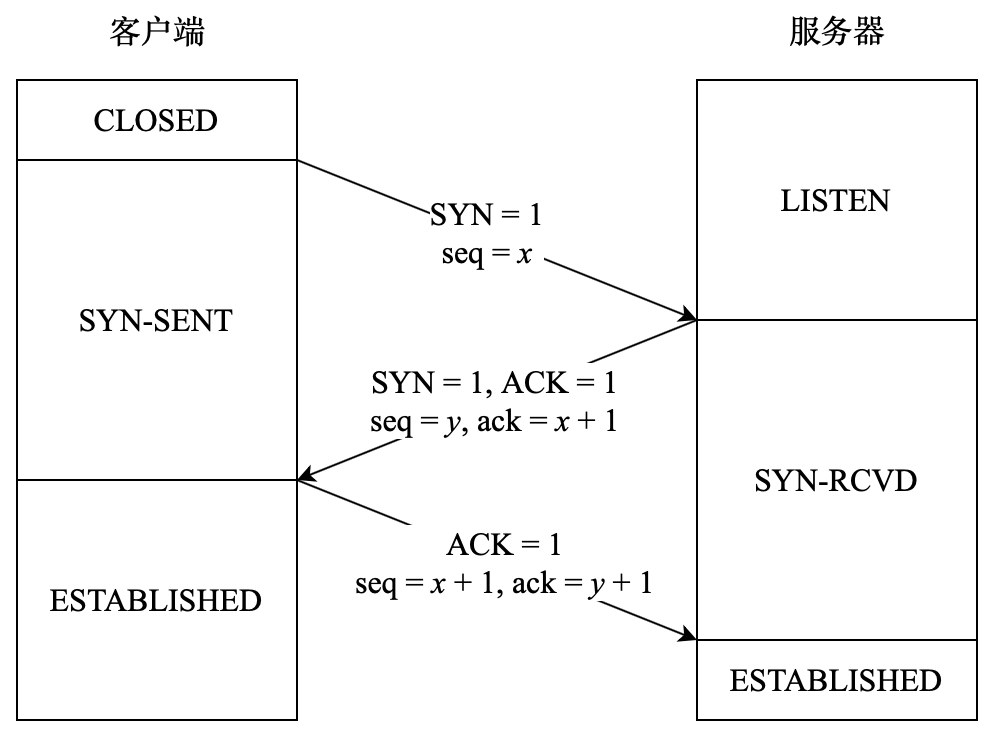
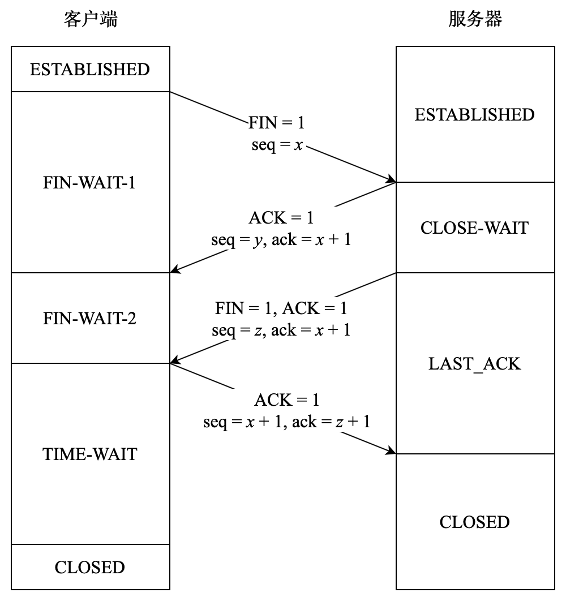
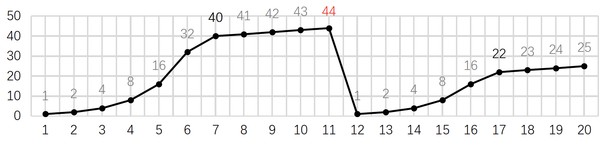
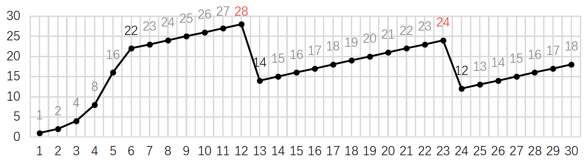

# 五、传输层

传输层的主要功能：

1. 提供应用进程之间的逻辑通信（即端到端的通信）。

2. 复用和分用：复用是指不同的应用进程可以使用同一个传输层协议；分用是指传输层能把数据正确的交付给相应的应用进程。

   **注**：网络层也有复用和分用的功能，指的是不同协议都可以封装成 IP 数据报来发送，收到 IP 数据报后也可以交付给相应的协议。

3. 对报文的头部和数据都进行差错检验（网络层只检验 IP 分组的头部，没有检验数据部分）。

4. 提供面向连接和无连接两种不同的协议。

## 5.1 端口（Port）

端口是传输层的服务访问点（TSAP），类似于数据链路层的 SAP 为 MAC 地址，网络层的 SAP 为 IP 地址，而传输层的 SAP 为端口。

### 5.1.1 端口号

端口号长度为 16 bit，能表示 65536 个不同的端口。

端口号只有本地意义，不同计算机的端口号没有必然联系（即端口号只标识本计算机中的各应用进程）。

端口号分为**<u>服务器端口号</u>**和**<u>客户端端口号</u>**：

#### 服务器端口号

服务器端口号又分为**<u>熟知端口号</u>**和**<u>登记端口号</u>**：

**<u>熟知端口号</u>**：这是最重要的一类，范围从 0 ~ 1023。

互联网地址指派机构（IANA）把这些地址指派给了 TCP/IP 一些最重要的应用程序，例如：

| 应用程序    | FTP           | TelNet        | SMTP          | DNS           | TFTP | HTTP          | SNMP |
| ---------- | ------------- | ------------- | ------------- | ------------- | ---- | ------------- | ---- |
| 熟知端口号  | <u>**21**</u> | <u>**23**</u> | **<u>25</u>** | **<u>53</u>** | 69   | **<u>80</u>** | 161  |

**<u>登记端口号</u>**：范围从 1024 ~ 49151。

供其他的服务器应用程序使用。需要在 IANA 登记，以防止重复。

#### 客户端端口号

范围从 49152 ~ 65535。

这类端口号仅在客户进程活动时才被动态地选择，因此也叫**<u>临时端口号</u>**或短暂端口号。进程结束后，这些端口号就被释放，可以再次被其他的客户进程使用。

### 5.1.2 套接字（Socket）

套接字由 IP 地址和端口号构成，写作 { IP 地址：端口 }，例如 110.64.87.83:47025，用来唯一地标识一台主机上的一个进程。

## 5.2 用户数据报协议（UDP）

User Datagram Protocol，是一个无连接的非可靠传输协议。

UDP 仅在 IP 数据报服务上增加了两个最基本的服务内容：复用分用和差错检测。用 UDP 协议开发应用程序几乎相当于直接面向 IP。

**特点**：

1. UDP 常用与对延迟要求较高、一次性传输内容较少的应用。

2. UDP 不保证可靠交付，可以在应用层自主选择可靠性机制。

3. **<u>UDP 是面向报文的</u>**，也就是说 UDP 对于应用层交付的数据**<u>不进行合并，也不进行拆分</u>**，直接添加 UDP 报头后就交给网络层；从网络层接收到的 UDP 报文在去除报头之后也直接交给应用层，一次交付一个完整报文。

**优点**：

1. 没有建立连接所带来的时延。

2. 不维护连接状态，资源开销小。

3. 支持一对多、多对一和多对多。

4. 应用层能更好地控制发送速率和发送时间：UDP 没有拥塞控制，也可以不使用差错检测，可以满足某些对实时性要求高，可以容忍一些数据丢失的应用需求（例如流媒体）。

### 5.2.1 UDP 报头格式

UDP 报头共 8 Byte，由 4 个字段组成，每个字段均为 2 Byte。

1. 源端口：在需要对方回信时可填入，不需要时可填全 0。

2. 目的端口：目的端口号作为终点交付的必要信息必须填入。
3. UDP 长度：整个 UDP 数据报（包括报头和数据）的长度，单位为 Byte 。UDP 数据报可以没有数据部分仅有头部，所以这个字段的最小值为 8。
4. 校验和：校验范围是整个 UDP 数据报，如果不需要目的主机进行校验就填全 0。

如果接收方发现报文中的目的端口不正确（即目的端口没有应用进程），则丢弃该报文并向源点发送 ICMP “端口不可达” 差错报告报文。

### 5.2.2 UDP 校验

在计算 UDP 校验和之前，要先在 UDP 数据报之前添加 12 B 的 “伪头部”，这个伪头部只在计算校验和时出现，既不向上递交也不向下传送。

伪头部的组成结构如下：

1. 源 IP 地址：占 32 位。
2. 目的 IP 地址：占 32 位。
3. 第三、第四个字段：各占 8 位即 1 Byte，分别为 0 和 17（即 UDP 协议的编号）。
4. UDP 长度：与 UDP 真正报头中的 UDP 长度一致，即 UDP 报头和数据的长度，不包括伪头部。

**<u>发送方计算 UDP 校验和的步骤</u>**：

1. 发送方首先添加伪头部，并把全 0 放进校验和字段。

2. 把添加了伪头部的 UDP 数据报划分为多个 16 位的二进制串（即每 2 Byte 划分一次，如果 UDP 数据报的数据部分不足偶数个字节，则在数据末尾填充至偶数个字节）。

   如下图所示，一行即为一个二进制串。

3. 将这些二进制串按照二进制反码运算求和，求得的和再求反码就得到校验和。将校验和填入 UDP 报头的校验和字段并发送。
4. 接收方收到需要校验的 UDP 数据报后，也添加伪头部并进行同样的划分操作，求所有划分出来的 16 位二进制串的二进制反码和：如果结果为全 1，则说明该数据报无差错；否则说明该数据报有误，丢弃这个 UDP 数据报。

## 5.3 传输控制协议（TCP）

Transmission Control Protocol，是一个面向连接的可靠的传输协议。

**特点**：

1. TCP 是面向连接的，每一条连接只能是一对一的。

2. TCP 提供可靠交付服务，保证传输的数据**<u>无差错、不丢失、不重复、有序</u>**。

3. TCP 提供全双工通信，为此 TCP 发送方和接收方都各自设有发送缓存和接收缓存。

   发送缓存用于暂存 ① 应用进程递交的准备发送的数据；② 已经发送但尚未被确认的数据。

   接收缓存用于暂存 ① 按序整理好的但尚未被读取的数据；② 不按序到达的数据。

4. TCP 是面向字节流的，视应用进程递交的数据为无结构的字节流。
5. TCP 报文长度由协议动态决定，而 UDP 报文长度由应用进程决定。

### 5.3.1 TCP 报文段格式

1. 源端口、目的端口：各占 16 位。
2. 序列号：表示本报文段的数据的第一个字节的编号（TCP 传送的每个字节都被按顺序编号）。
3. 确认号：表示期望收到对方发来的**<u>下一个数据段的序列号</u>**（TCP 使用了累计确认的肯定确认重传技术）。
4. 段头长度：占 4 位，表示这个数据段的头部有多长（也叫**<u>数据偏移</u>**），**<u>单位为 4 Byte</u>**，由于 4 位二进制数的限制，TCP 头部长度最大为 60 B（15 × 4 B）。
5. 保留字段：占 6 位，已经有部分被使用，用于拥塞控制等功能，如不使用则填全 0。
6. **<u>紧急位 URG</u>**（Urgent）：当 URG = 1，该数据段会被尽快传送，接收方收到后会尽快紧急数据。需要配合 (.) 紧急指针字段使用。
7. **<u>确认位 ACK</u>**（Acknowledge）：当 ACK = 1 确认号字段有效。
8. 推送位 PSH（Push）：接收方收到 PSH = 1 的报文段后，应立即向上传递而不缓存。
9. 复位位 RST（Reset）：当 RST = 1 时表明 TCP 连接已经出现严重错误，必须释放连接后再重新建立连接。如果在连接建立阶段就收到这个信号则直接拒绝建立连接。
10. **<u>同步位 SYN</u>**（Synchronize）：用于表明目前位于连接建立的哪个环节（SYN = 1 时表明这是一个连接请求或链接接受报文）。
11. **<u>终止位 FIN</u>**（Finish）：当 FIN = 1 时单向释放连接：表明发送这个报文段的一方已经没有数据要传输了，但连接还没有断开，还可以接收另一方发送的数据。
12. 窗口尺寸：表示发送这个报文的一方目前接收窗口的大小，是另一方设置发送窗口大小的依据。
13. 校验和：校验范围是整个数据段（段头和数据）和一个伪头部，**<u>校验过程与 UDP 校验基本一致</u>**，只有伪头部与 UDP 有一点差别。
14. 紧急指针：只有当 URG = 1 时这个字段才有意义，表明紧急数据共有多少字节，**<u>单位为 Byte</u>**（**<u>紧急数据都在报文段数据部分的最前面</u>**，紧急数据：即使接收方窗口大小为 0 也可以发送的数据，例如 Control C 中断命令）。
15. 可选字段：最初 TCP 只规定了一种可选项，即最大报文段长度（MSS，Maximum Segment Size），表示数据字段的最大长度。如果加入可选字段后头部长度不是 4 Byte 的整数倍，就要在最后**<u>填充报头至 4 Byte 的整数倍</u>**。

### 5.3.2 TCP 连接管理

TCP 连接的端点为 Socket，采用客户端 / 服务器模式，主动发起连接的应用进程称为客户端（Client），而被动等待连接的到来的应用进程称为服务器（Server）。

#### 1) TCP 连接的建立：三次握手

在三次握手的过程中双方会交换序列号信息，这个过程也称为**<u>同步</u>**。三次握手如下：

1. 第一次握手：客户端发给服务器的**<u>连接请求报文段</u>**中 **<u>SYN = 1</u>**，**<u>ACK = 0</u>**，还包含了一个初始序列号 **<u>seq = *x*</u>**（随机生成）。**<u>SYN 报文段不能携带数据</u>**，但是要消耗一个序列号。
2. 第二次握手：服务器收到连接请求后回发一个**<u>确认报文段</u>**，其中 **<u>SYN = 1</u>**，**<u>ACK = 1</u>**，也包含了一个初始序列号 **<u>seq = *y*</u>**（随机生成），并且确认号为 **<u>ack = *x* + 1</u>**，表明下次希望收到序列号为 *x* + 1 的段。**<u>确认报文段不能携带数据</u>**，但也要消耗一个序列号。**<u>此时服务器会为这个 TCP 连接分配资源</u>**。
3. 第三次握手：客户端也要向服务器发送**<u>确认报文段</u>**，其中 **<u>SYN = 0</u>**，**<u>ACK = 1</u>**，序列号 **<u>seq = *x* + 1</u>**，确认号为 **<u>ack = *y* + 1</u>**，该报文段可以携带数据。**<u>此时客户端会为这个 TCP 连接分配资源</u>**。服务器收到这个确认后连接正式建立。

**注**：可以看到，服务器的资源是在第二次握手时分配的，而客户端资源是在第三次握手时分配的，这就使得服务器容易受到 **<u>SYN 泛洪攻击</u>**：攻击者不断向服务器发送大量第一次握手信息，服务器回复第二次握手后会挂起大量进程等待第三次握手信息的到来，而攻击者不会回发第三次握手信息（或使用虚假的源 IP 地址让第二次握手信息无法到达实际的客户端），最终服务端会因为资源耗尽而拒绝服务正常的连接，这种攻击也叫拒绝服务攻击（DoS，Denial of Service）。

#### 2) TCP 连接的释放：四次挥手

TCP 连接的**<u>两端都能主动单向地释放连接</u>**，两端都释放连接后该 TCP 连接才真正断开。

1. 第一次挥手：客户端想要释放连接时，发给服务器的**<u>连接释放报文段</u>**中 **<u>FIN = 1</u>**，还包含了一个初始序列号 **<u>seq = *x*</u>**，*x* 为传送过的最后一个字节的序号加 1。FIN 报文段即使不携带数据，也**<u>要消耗一个序列号</u>**。发送完该报文后，发送方将不能再向对方发送数据，但还可以接收对方发来的数据。
2. 第二次挥手：服务器收到连接释放报文段后发送**<u>确认报文段</u>**，其中 **<u>ACK = 1</u>**，序列号 **<u>seq = *y*</u>**，确认号为 **<u>ack = *x* + 1</u>**。此时连接完成了单向释放。服务器如果仍有数据需要发送，可以继续发送。
3. 第三次挥手：如果服务器已已经没有数据需要发送给客户端，则也发送**<u>连接释放报文段</u>**给客户端，其中 **<u>FIN = 1</u>**，**<u>ACK = 1</u>**，序列号**<u>seq = *z*</u>**，确认号仍为 **<u>ack = *x* + 1</u>**。
4. 第四次挥手：客户端收到连接释放报文段后发送发送**<u>确认报文段</u>**，其中 **<u>ACK = 1</u>**，序列号 **<u>seq = *x* + 1</u>**，确认号为 **<u>ack = *z* + 1</u>**。此时 TCP 连接还未释放，客户端需等待计时器设置的 2 MSL（最长报文段寿命）后才会关闭连接（防止服务端没有收到第四次挥手的确认报文段，而重传第三次挥手的连接释放报文段，并一直等待第四次挥手）。服务器则在收到第四次挥手的确认报文段后直接关闭连接。

常考与 TCP 三次握手和四次挥手有关的 ACK、SYN、FIN 位和 ack、seq 的内容，牢记：

|           | ACK  | SYN  | FIN  | seq   | ack   |
| --------- | ---- | ---- | ---- | ----- | ----- |
| 第一次握手 | 0    | 1    |      | x     |       |
| 第二次握手 | 1    | 1    |      | y     | x + 1 |
| 第三次握手 | 1    | 0    |      | x + 1 | y + 1 |
| 第一次挥手 | 0    |      | 1    | x     |       |
| 第二次挥手 | 1    |      | 0    | y     | x + 1 |
| 第三次挥手 | 1    |      | 1    | z     | x + 1 |
| 第四次挥手 | 1    |      | 0    | x + 1 | z + 1 |

  

### 5.3.3 TCP 可靠传输

可靠传输服务可以保证接收方进程从缓存里读出的字节流与发送方发出的字节流完全一致。

TCP 使用了校验、序号、确认和重传的机制来达到这一目的。

#### 1) 校验

TCP 校验使用的伪头部与 UDP 使用的伪头部基本一致，**<u>只将协议字段中的 17 改为 6（TCP 协议的编号），UDP 长度改为 TCP 长度</u>**。

TCP 的校验过程与 UDP 完全一致，这里不再赘述。

#### 2) 序号

TCP 视数据为无结构但有序的字节流，数据中的每一个字节都有自己的序列号。

#### 3) 确认

TCP 报头中的确认号表示期望收到对方发来的下一个数据段的序列号。

虽然 TCP 每个字节都有序列号，但 TCP 按照每个报文段确认一次，而不是每个字节确认一次。

**注**：TCP 使用了累计确认的肯定确认重传技术，即确认最后一个按顺序正确收到的字节，并且接收方也会缓存那些已正确收到但失序的报文段，发送方只需要重传未被确认的一个报文段即可，不需要重发后面所有的报文段。TCP 使用的确认协议看起来像 GBN 和 SR 的混合体。

#### 4) 重传

在两种情况下 TCP 会进行重传：

1. 超时：

   TCP 每发送一个报文段，就给这个报文段设置一个计时器。计时器超时时还未收到确认就对这个报文段进行重传。

   TCP 的超时计时器使用了一种自适应算法：TCP 记录一个报文段从发出到收到确认所用的时长为 RTT，而设置的超时重传时间（RTO，Retransmission Time-Out）为**<u>加权平均 RTT</u>**（RTTS），RTO 会随着新测量到的 RTT 而变化。显然，RTO 应设置为略大于 RTTS ，但也不能大太多，否则报文段丢失时需要等待很长时间才能重传。

2. 收到冗余确认：

   接收方多次发送某个报文段的确认，来通知发送方有报文段丢失需要重传。

   TCP 规定**<u>每当</u>**比期望序列号大的失序报文段到达时，就发送一个冗余 ACK，指名期待收到的字节序列号。发送方收到对**<u>同一个报文段的 3 个冗余 ACK</u>** 时就认为这个报文段丢失了，立即进行重传。这种技术成为**<u>快速重传技术</u>**。

   **例**：如果发送方发送了序列号分别为 0、100、200、300、400 的五个报文段，接收方只收到了序列号为 0、200、300、400 的五个报文段

   ① 接收方在收到序列号为 0 的报文段后正常回发 ACK = 100 的确认报文段，表示希望收到序列号为 100 的报文段。

   ② 接收方在收到序列号为 200 的报文段后发现收到的不是想要的报文段，发送一次 ACK = 100 的冗余 ACK。

   ③ 接收方在收到序列号为 300 的报文段后发现收到的还不是想要的报文段，发送第二次 ACK = 100 的冗余 ACK。

   ④ 接收方在收到序列号为 400 的报文段后发现收到的仍然不是想要的报文段，发送第三次 ACK = 100 的冗余 ACK。

   ⑤ 发送方发现序列号为 0 的报文段被正常确认后又收到了三次冗余 ACK，说明序列号为 100 的报文段已经丢失，立即重传序列号为 100 的报文段，并重新启动该报文段的超时计时器。

   ⑥ 接收方收到序列号为 100 的报文段，向发送方回发 ACK = 500 的确认报文段。

### 5.3.4 TCP 流量控制

接收方通过报头中的窗口尺寸字段（单位一般为字节）将接收窗口（rwnd）大小告知发送方，让发送方调整自己的发送窗口。

发送方在收到下一个确认之前最多只能发送 rwnd 大小的一个或多个报文段。接收方的每个确认报文段中都携带 rwnd 的更新。

如果发送方收到了对方的 0 窗口通知，那么在下一次窗口大小变为非 0 前将不能再发送数据。 为了防止窗口更新的报文段丢失，发送方在收到 0 窗口通知后将启动一个计时器，计时器超时后向发送方发送一个 **<u>0 窗口探测报文段</u>**，接收方收到探测报文段后回复当前 rwnd 的大小。如果 rwnd 仍未 0，则重新启动该计时器并等待窗口更新。

**注**：传输层和数据链路层流量控制的区别是：传输层控制端到端的流量，数据链路层控制结点之间的流量；数据链路层滑动窗口协议的窗口大小不能改变，而传输层的窗口大小会动态变化，**<u>发送窗口大小由 rwnd 和拥塞窗口（cwnd）中较小的那一个决定</u>**。

### 5.3.5 TCP 拥塞控制

拥塞控制是防止过多的数据注入网络，与流量控制的区别是：拥塞控制是一个全局性的过程，涉及所有的主机和路由器；而流量控制是一个端到端的过程，只关心接收方能不能收得下发送方发来的数据。流量控制与拥塞控制的相同之处是：它们都通过限制发送速率来达到控制效果。

因此，**<u>发送方的发送窗口上限值应取接收窗口（rwnd）和拥塞窗口（cwnd）中较小的那一个</u>**。

rwnd 反映的是接收方的可用缓存容量，由接收方使用 TCP 报头通知发送方，单位一般为 Byte。

cwnd 反映的是目前网络的拥塞情况，**<u>由发送方自己动态地估算得来的</u>**，单位一般为最大报文段长度（MSS）。

**例**：假设 MSS = 2 KB，此时接收方通知 cwnd = 100 KB，发送方估计的 rwnd 为 32，那么此时发送窗口上限应设置为 min { 100 KB, 32 × 2 = 64 KB } = 64 KB。

拥塞控制的四种算法：慢开始、拥塞避免、快重传和快恢复。

#### 1) 慢开始（Slow Start）和拥塞避免

**<u>慢开始</u>**：

在 TCP 刚建立连接准备发送报文时，**<u>先设 cwnd = 1，即 1 个 MSS</u>**。从发出报文到收到对方确认（时间即为 **<u>1 个 RTT</u>**）称为**<u>一个传输轮次</u>**，每完成一个传输轮次如果没有检测到拥塞就把 cwnd 翻一倍。

慢开始的 “慢” 指的是 cwnd 大小从 1 开始，而不是增长速度慢。

**<u>拥塞避免</u>**：

慢开始算法中 cwnd 逐轮翻倍，但不是一直指数级增长：当 cwnd 的大小达到或超过慢开始门限（ssthresh）时，不再让 cwnd 每轮都翻倍，而是每轮 cwnd 只加 1。

即：如果某轮 cwnd 准备翻倍时，发现 2 cwnd > ssthresh，则将 cwnd 设置为 ssthresh，此后 cwnd 每轮只 + 1。

**<u>当网络出现拥塞时</u>**：

发送方没有按时收到确认，判断网络出现拥塞后，**<u>将 ssthresh 设置为当前 cwnd 的一半（但不能小于 2），并将 cwnd 设为 1 重新进行慢开始</u>**。这样做可以迅速减少主机发送到网络中的分组数，缓解网络压力。

TCP Tahoe 版本使用的就是慢开始和拥塞避免的算法（现已弃用 TCP Tahoe）。

**例**：假设当前连接 rwnd 足够大，发送窗口大小由 cwnd 决定。

假设当前连接 ssthresh = 40，在 cwnd = 44 的时候检测到了拥塞，下图为发送窗口大小的变化：

ssthresh 就会被设置为 22，并且重新慢开始。第 17 轮发现 16 × 2 > 22，就将 cwnd 设为 22，此后每轮 cwnd 只 + 1。

#### 2) 快重传和快恢复

**<u>快重传</u>**：

在 TCP 可靠传输机制中介绍过冗余 ACK 可以直接通知发送方重传，这里的快重传就是指前面所讲的 “发送方收到三个冗余 ACK 后直接进行重传而不必等待定时器超时”。

冗余 ACK 也可以作为判断网络是否发生拥塞的依据，

**<u>快恢复</u>**：

当发送方收到三个冗余 ACK 后认为网络出现拥塞，将 ssthresh 设置为当前 cwnd 的一半（但不能小于 2），**<u>并将 cwnd 直接设为 ssthresh</u>**（而不是从 1 重新慢开始）。

**<u>TCP Reno 版本使用的就是快重传和快恢复的算法</u>**。

**例**：假设当前连接 rwnd 足够大，发送窗口大小由 cwnd 决定。

假设当前连接 ssthresh = 22，在 cwnd = 28 的时候第一次检测到了拥塞，下图为发送窗口大小的变化：

ssthresh 就会被设置为 14，并将 cwnd 也设置为 14。

在 cwnd = 24 的时候第二次检测到了拥塞，就将 ssthresh 和 cwnd 都设为 12。

**<u>需要注意的是，发送窗口大小取决于 rwnd 和 cwnd 中较小的那一个，注意题目条件，别光顾着翻倍了</u>**。
