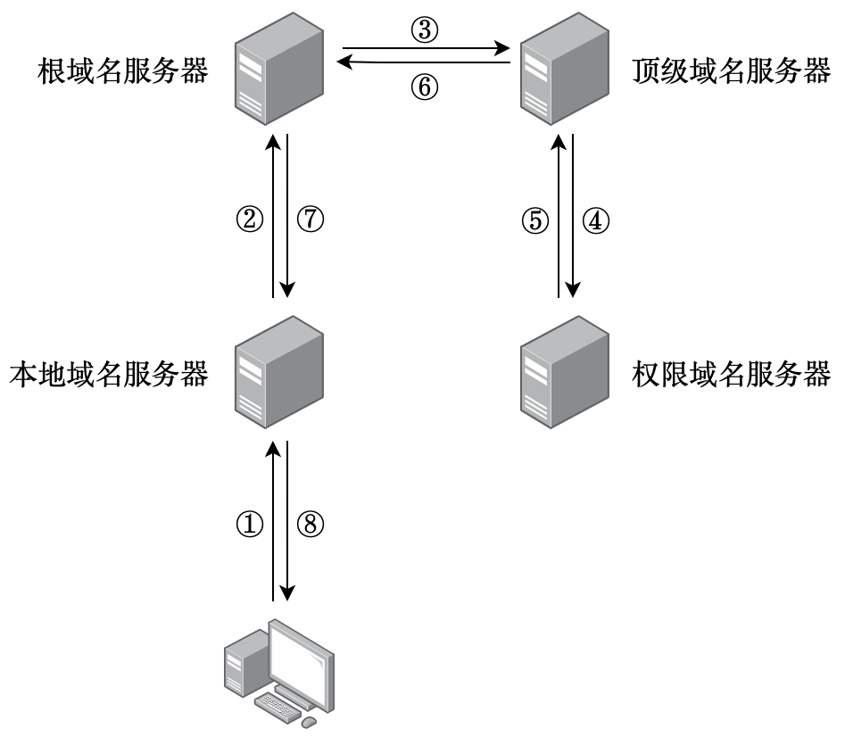
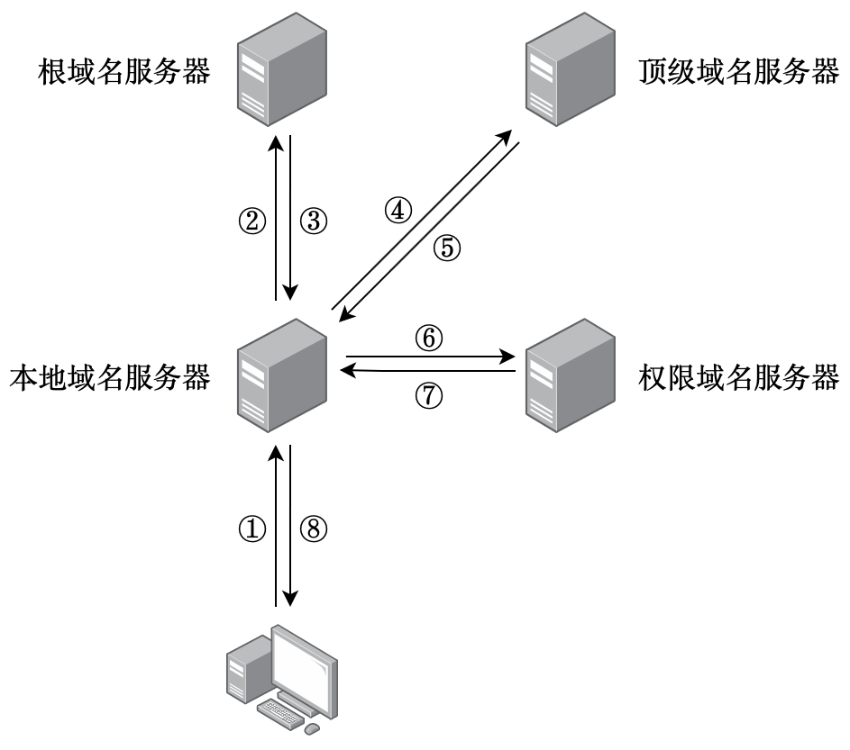

# 六、应用层

为应用程序的通信提供服务。


## 6.1 网络应用模型


### 6.1.1 客户端 / 服务器模型（C/S）

Client / Server，客户端是服务请求方，服务器是服务提供方。客户端程序必须知道服务端程序的地址；服务端程序不需要知道所有的客户端程序的地址，只需要被动的等待连接请求到来即可。


### 6.1.2 对等模型（P2P）

Peer-To-Peer，主要思想是网络中传输的内容不再被中心化地保存在服务器上，每个结点都有上传和下载的功能。

使用 P2P 的任意两台主机（即对等方，Peer）之间可以直接进行通信。

其实在每对通信的主机上使用的仍是客户端 / 服务器模型，请求资源的主机在这个通信中是客户端，提供资源的主机在这个通信中是服务器。

**优点**：

1. 减轻了服务器计算的压力，可以将任务分配到各个结点上，网络中使用 P2P 的主机越多反而性能越好，大大提高了系统效率和资源利用率。
2. 可拓展型强，而传统服务器有请求数量和带宽的限制。
3. 网络健壮性（Robust，或译为 “鲁棒性”）强，单个结点故障不会影响其它的结点提供服务。

**缺点**：

1. 在获取服务的同时还要为其它主机提供服务，P2P 会占用主机资源。
2. P2P 会产生大量的网络通信，使网络变得拥塞。


## 6.2 域名系统（DNS）

Domain Name System，网络越来越庞大，计算机无法在本地储存所有的主机对应的 IP 地址，而且主机的 IP 地址也不便于人们记忆，于是出现了 DNS 服务。

DNS 将方便记忆的、有特定含义的字符串映射为便于机器处理的 IP 地址。

DNS 采用**<u>客户端 / 服务器模式</u>**，**<u>运行在 UDP 上</u>**，使用 **<u>53 号端口</u>**。


### 6.2.1 域名划分

DNS 是分层次的基于域（Domain）的命名方案，一个域可以被划分为多个子域，而子域还可以再划分，就形成了根域、顶级域、二级域、三级域等。每个域的域名都用英文的点 “.” 隔开。

根域名为一个 “.”，写在顶级域名例如后面（例如 “github.com.”），但一般不用写出来。

顶级域名（TLD）是域名中最靠右的第一个。目前互联网有大约 250 个顶级域名，分为 3 种：

1. **<u>通用顶级域名</u>**（gTLD），例如 com、edu、org 等。
2. **<u>国家（地区）顶级域名</u>**（nTLD）例如 cn、us、ru 等。
3. **<u>基础结构域名</u>**，也叫**<u>反向域名</u>**，这种顶级域名只有一个，即 arpa，用于反向域名解析（将 IP 地址映射为域名）。

**例**：现有一个域名 scut.edu.cn，可以看出一级域名是 cn，二级域名是 edu，三级域名是 scut。


### 6.2.2 域名管理

每个域由不同的组织进行管理，管理某个域的组织可以将这个域再分为不同的子域，并把这些子域授权给其它组织进行管理。

顶级域名由 ICANN 管理，需要向 ICANN 申请，而二级域名只需要向拥有顶级域名的组织申请即可，三级域名只需要向拥有二级域名的组织申请即可。

**例**：

1. 中国拥有 “.cn” 顶级域名，由中国互联网络信息中心（CNNIC，China Internet Network Information Center）管理。

2. 中国教育科研计算机网络信息中心（CERNIC，China Education and Research Network Information Center）想要申请 “.edu.cn” 的域名，只需要向 CNNIC 申请即可。

3. 华南理工大学（SCUT，South China University of Technology）想要获得 “scut.edu.cn” 的域名，只需要向 CERNIC 申请即可。


### 6.2.3 域名服务器

域名映射为 IP 地址的过程称为解析，解析由运行在域名服务器上的特定程序完成。每台域名服务器不仅能够进行一些域名到 IP 地址的解析，还必须知道连向其它域名服务器的信息（当自己不能解析时，知道到什么地方去找其它的域名服务器）。

一个域名服务器可以管辖多个域。没有任何一台域名服务器知道因特网中所有的映射，整个网络的映射分布在所有的域名服务器上。

DNS 使用了大量的域名服务器，按层次分为三种：**<u>根域名服务器</u>**、**<u>顶级域名服务器</u>**和**<u>授权域名服务器</u>**。还有一种至关重要但是却不在 DNS 层次结构中的域名服务器，即**<u>本地域名服务器</u>**。

#### 1) 根域名服务器

根域名服务器知道所有顶级域名服务器的 IP 地址。

全球共有 13 个根域名服务器，每个根域名 “服务器” 实际上是多个冗余服务器的集群，有上百个根域名服务器，来保证安全性和可靠性。

根域名服务器用来管理顶级域（如 com），但通常它并不直接把待查询的域名转换为 IP 地址，而是回复一个顶级域名服务器的 IP 地址，告知下一步应该找哪个顶级域名服务器进行进一步的查询。

####  2) 顶级域名服务器

顶级域名服务器管理所有在该服务器注册的二级域名。收到 DNS 查询请求时，给出的回复可能是解析结果，也可能是下一步应查询的域名服务器的 IP 地址。

#### 3) 授权域名服务器

也叫权限域名服务器，每台主机都必须在管辖本域的授权域名服务器登记。授权域名服务器总能给出它所管辖的主机的 IP 地址。

为了更加可靠地工作，一台主机最好至少在两个授权域名服务器上登记过。

#### 4) 本地域名服务器

每一个 SIP，或一所大学、一家公司，甚至一个学院、一个部门都可以使用一台本地域名服务器。

实际上，许多域名服务器同时充当本地域名服务器和授权域名服务器。

当一台主机发出 DNS 查询请求时，查询请求报文是直接发送给本地域名服务器的。如果本地域名服务器无法解析，就首先向根域名服务器查询。


### 6.2.4 域名解析过程

当主机需要域名解析时，通过本机的 DNS 客户端构造一个 DNS 请求报文，以 UDP 数据报的方式发给本地域名服务器。

域名解析有两种方式：**<u>递归解析</u>**和**<u>迭代解析</u>**。

#### 1) 递归解析

当本地域名服务器没有这个域名的记录时，本地域名服务器以 DNS 客户端的身份向根域名服务器发出查询请求，根域名服务器再以 DNS 客户端的身份向顶级域名服务器发出查询请求，以此类推（对于每个 DNS 客户端来说，都只向域名服务器请求一次查询）。得到结果后再返回给主机。

这种做法对于根域名服务器的压力太大，在实际中几乎不使用。




#### 2) 迭代解析

根域名服务器告诉本地域名服务器下一步应该请求哪个域名服务器去请求查询，下一个域名服务器再告诉本地域名服务器下一步去哪里查询，直到解析出结果为止。

实际使用中，**<u>主机向本地域名服务器请求查询时一般是递归解析，本地域名服务器向根域名服务器请求查询时一般是迭代解析</u>**，如下图所示。



为了提高 DNS 的查询效率，减少网络上 DNS 查询报文的数量，在域名服务器中广泛地使用了高速缓存，缓存最近查询过的 DNS 解析记录。当另一个相同域名的 DNS 查询到达时，服务器就能直接返回解析的 IP 地址而不需要再去询问其他 DNS 服务器。**<u>由于域名和 IP 地址之间的映射并不是永久的，所以服务器需要在一段时间后丢弃缓存中的解析记录</u>**。


## 6.3 文件传输协议（FTP）

File Transfer Protocol，是因特网上使用的最广泛的文件传输协议。

FTP 提供不同类型的主机系统（软、硬件体系都可以不同）之间的文件传输能力。

FTP 不仅可以通过用户账户和密码，以用户权限管理的方式提供读写远程 FTP 服务器上的文件的能力，还能以匿名 FTP 的方式提供公用文件共享的能力。

FTP 采用**<u>客户端 / 服务器模式</u>**，**<u>运行在 TCP 上</u>**，使用 **<u>20 和 21 号端口</u>**。


### 6.3.1 FTP 工作流程

一个 FTP 服务器进程可以为多个 FTP 客户端进程提供服务。

FTP 服务器进程由主进程和从属进程组成，主进程负责接收新的请求，从属进程负责处理单个请求。

工作步骤如下：

1. 打开控制连接的端口（熟知端口 21），等待客户端连接。
2. 拉起从属进程来处理客户端发来的请求，主进程与从属进程并发执行。
3. 客户端断开连接后从属进程终止，主进程重新回到等待状态。

服务器必须把指定的用户账户和控制连接联系起来，必须追踪用户在远程目录树上的当前位置。


### 6.3.2 控制连接和数据连接

FTP 在工作时使用两个并行的 TCP 连接，分别是**<u>控制连接</u>**和**<u>数据连接</u>**。他们都由从属进程实现。

#### 1) 控制连接

**<u>控制连接使用 21 号端口</u>**，用来控制传输信息（如连接请求、传输请求等），并且控制信息都以 7 位 ASCII 码传输。

**<u>控制连接在整个会话期间一直保持打开</u>**，在传输文件时还可以使用控制连接（例如中途终止传送）。

由于 FTP 使用了数据连接和控制连接分离的模式，所以也称 FTP 的控制信息是带外（Out-of-Band）传送的。

#### 2) 数据连接

数据连接用来实际传输文件。

控制进程收到客户端的文件传输请求后，就创建数据传送进程并与客户端建立数据连接。**<u>在传送完成后，数据连接会被关闭</u>**，数据传送进程也会终止。

数据连接有 2 种模式：

1. **<u>主动模式（PORT）</u>**：客户端登录成功后要读取文件时，随机开放一个端口并通过控制连接告知服务器；服务器收到 PORT 命令和端口号后，**<u>通过 20 端口与客户端开放的端口主动建立数据连接</u>**，再开始传输数据。

2. **<u>被动模式（PASV）</u>**：客户端登录成功后要读取文件时，发送 PASV 命令给服务器，**<u>服务器随机开放一个端口并告知客户端，等待客户端建立数据连接</u>**，再开始传输数据。

FTP 的数据传输有 2 种模式，文本模式（传送 ASCII 码）和二进制模式。


## 6.4 电子邮件

电子邮件系统应具有 3 个最主要的构件：

1. **<u>用户代理（UA）</u>**：User Agent，用户与电子邮件系统直接交互的接口，通常来说是一个运行在 PC 上的电子邮件客户端应用程序。UA 至少应当具有撰写、查看、处理邮件的功能。
2. **<u>邮件服务器</u>**：至少应当具有发送和接受邮件、向发件人报告邮件传送状态（成功送达、被拒绝、找不到收件人等情况）的功能。邮件服务器采用客户端 / 服务器模式，而且需要能同时充当客户端和服务器。
3. **<u>邮件发送和读取协议</u>**：邮件发送协议（如 SMTP 等）用于 UA 向邮件服务器或在邮件服务器之间发送邮件，使用的是推送（Push）的通信方式。邮件读取协议（如 POP3 等）用于客户端从邮件服务器取回邮件，使用的是拉取（Pull）的通信方式。


### 6.4.1 电子邮件格式

电子邮件的内容分为**<u>首部</u>**和**<u>主体</u>**两部分：主体是用户自由撰写的内容，首部有一些固定字段和可选字段自动生成或需要用户填写。

首部最主要的字段为 To 和 Subject。

To 是必须的关键字，需要用户填入一个或多个收件人的电子邮件地址。电子邮件地址的格式为 “邮箱名@主机域名”，由于邮箱名在域内唯一，而域名在网络上也唯一，所以邮箱地址是唯一的。

Subject 是可选字段，由用户填入邮件的主题。

还有一个必须关键字 From，通常由 UA 自动填入发件人的邮箱地址。

首部和主体之间使用一个空行来分隔。典型的电子邮件内容如下：

```
From: leopoldchou@zhoujun.email.cn
To: example@email.com
Subject: An Classical Email Format

this is the body part (just writes whatever you want) ...
```


### 6.4.2 简单邮件传输协议（SMTP）

Simple Mail Transfer Protocol，是一种可靠、有效的**<u>邮件传输协议</u>**。控制两个相互通信的 SMTP 进程交换信息。

**<u>SMTP 只能传送 ASCII 码</u>**，所以 SMTP 无法传送任何非英文的文字和特殊符号。

SMTP 采用**<u>客户端 / 服务器模式</u>**，**<u>运行在 TCP 上</u>**，使用 **<u>25 号端口</u>**。

SMTP 通信主要分为三个阶段：**<u>连接建立</u>**、**<u>邮件传送</u>**、**<u>连接释放</u>**。


### 6.4.3 邮局协议（POP）

Post Office Protocol，目前使用的是他的第三个版本 POP3，是一种非常简单但功能有限的**<u>邮件读取协议</u>**。

POP3 有两种工作方式：**<u>下载并删除</u>**（客户端从服务器取回邮件后，邮件就被从服务器上删除）和**<u>下载并保留</u>**（客户端从服务器取回邮件后，邮件依然存在与服务器上，可以再次取回）。

POP3 采用**<u>客户端 / 服务器模式</u>**，**<u>运行在 TCP 上</u>**，使用 **<u>110 号端口</u>**。


### 6.4.4 交互邮件访问协议（IMAP）

Interactive Mail Access Protocol，是一种比 POP3 复杂得多但非常有用的协议。

IMAP 提供创建和管理文件夹、在不同文件夹之间移动邮件等联机命令。

IMAP 还允许客户端**<u>只获取邮件的部分内容</u>**，例如只读取邮件首部。这个功能非常适用于低带宽或邮件中含有大附件的情况。


### 6.4.5 多用途互联网邮件拓展（MIME）

Multi-purpose Internet Mail Extensions。由于 SMTP 无法承载非 ASCII 内容，而且无法传送音频、视频和其他二进制文件，提出了 MIME 来拓展邮件可以传输的内容。

MIME 不是来取代 SMTP 的，而是在仍使用 SMTP 的基础上进行拓充。**<u>MIME 使用特定的传送编码将所有非 ASCII 内容都转换为 ASCII 编码，再进行传送</u>**。

MIME 工作在 SMTP 上层，并在邮件首部新增了 5 个字段，分别为 MIME 版本、内容描述、内容识别、内容类型和传送编码。MIME 定义了许多邮件内容的格式，并对多媒体内容的表示方法进行了标准化。


## 6.5 万维网（WWW）

World Wide Web，是一个分布式的信息储存空间。

WWW 的内核是由**<u>统一资源定位符（URL）</u>**、**<u>超文本标记语言（HTML）</u>**和**<u>超文本传输协议（HTTP）</u>**三个标准构成的。


### 6.5.1 统一资源定位符（URL）

Uniform Resource Locator，万维网上的每个资源都拥有一个全域唯一的 URL 来标识。

URL 的一般形式是：

**<u>协议://主机:端口/路径</u>**

“协议” 指使用什么协议来获取这个资源，常见的有 http、ftp 等；“主机” 是存放这个资源的主机名或 IP 地址；“端口” 和 “路径” 字段有时候可以省略。


### 6.5.2 超文本标记语言（HTML）

HyperText Markup Language，使用一些约定好的标记来描述 Web 页面上的信息和格式，便于浏览器获取到资源后正确地展示给用户。


### 6.5.3 超文本传输协议（HTTP）

HyperText Transfer Protocol，是万维网客户端和服务器交互所必须遵守的协议。HTTP 定义了浏览器如何向万维网服务器请求页面资源，以及服务器如何把页面资源传送给浏览器。

HTTP 采用**<u>客户端 / 服务器模式</u>**，**<u>运行在 TCP 上</u>**，使用 **<u>80 号端口</u>**。

#### 1) 浏览器请求资源的过程

1. 浏览器要请求万维网资源时，首先要通过 DNS 把 URL 中的主机名解析为 IP 地址。
2. 获得 IP 地址之后，浏览器就向服务器 80 号端口发送 TCP 连接请求。
3. TCP 连接建立后，浏览器发出 **<u>HTTP 请求报文</u>**，请求路径字段所指向的资源。
4. 服务器通过 **<u>HTTP 响应报文</u>**传送浏览器所请求的资源。
5. 传输完成后，释放 TCP 连接。
6. 浏览器解析得到的 HTML 文件，将 Web 页面展示给用户。

#### 2) HTTP 的特点

1. HTTP 在传输层使用 TCP 协议，但 **<u>HTTP 自己是无连接的协议</u>**，通信双方在传送 HTTP 报文之前不需要建立连接（在已经建立好的 TCP 连接上直接传输 HTTP 报文即可）。
2. HTTP 是无状态的，同一个客户端不管第几次访问同一个资源，获得的内容都和第一次访问一致。

#### 3) HTTP 报文结构

HTTP 是面向文本的，报文中的每一个字段都是一些 ASCII 码串，并且每个字段的长度都是不确定的。

HTTP 报文可以分为开始行、首部行和实体主体。

请求报文的开始行三个字段分别为方法、URL和版本，三个字段之间用空格隔开。

响应报文的开始行三个字段分别为版本、状态码和短语，三个字段之间用空格隔开。

首部行由若干行组成，每行都由首部字段名加上 “: ” 后面跟着值组成。

请求报文通常不需要实体主体；有些响应报文可以没有实体主体。

#### 4) HTTP 非持久连接与持久连接

1. **<u>非持久连接</u>**：网页上每个元素对象（如 JPEG 图像、GIF 图像或 MP4 视频等）的传输都需要单独建立一个 TCP 连接，为每个资源建立的 TCP 链接都会在这个资源传输完成后释放。

   这种连接方法会导致服务器的负载很高，传输时延也很高（每次建立 TCP 连接都要经历三次握手）。

2. **<u>持久连接</u>**：在完成响应后仍保持这个 TCP 连接，使同一对浏览器和服务器可以继续在这条连接上传送 HTTP 请求报文和响应报文。

   持久连接又分为**<u>非流水线方式</u>**（浏览器在收到服务器的响应后才能发出下一个请求）和**<u>流水线方式</u>**（浏览器可以连续地逐个请求所需资源）。


## 6.6 远程终端协议（TelNet）

Telecommunications Network，用于远程登录。

TelNet 为远程登录的客户端在服务器上创建一个进程。用户可以通过这个进程来创建子进程使用服务器，服务器的交互信息会通过 TelNet 发回给用户。TelNet 可以提供与本地用户登录几乎完全相同的使用体验。

TelNet 采用**<u>客户端 / 服务器模式</u>**，**<u>运行在 TCP 上</u>**，使用 **<u>23 号端口</u>**。


## 6.7 本章常见协议总结

| 应用程序                | 使用的传输层协议 | 熟知端口号     |
| ---------------------- | -------------- | ------------- |
| **<u>FTP 数据连接</u>** | **<u>TCP</u>** | **<u>20</u>** |
| **<u>FTP 控制连接</u>** | **<u>TCP</u>** | **<u>21</u>** |
| TelNet                 | TCP            | 23            |
| **<u>SMTP</u>**        | **<u>TCP</u>** | **<u>25</u>** |
| **<u>DNS</u>**         | **<u>UDP</u>** | **<u>53</u>** |
| TFTP                   | UDP            | 69            |
| **<u>HTTP</u>**        | **<u>TCP</u>** | **<u>80</u>** |
| POP3                   | TCP            | 110           |
| SNMP                   | UDP            | 161           |
