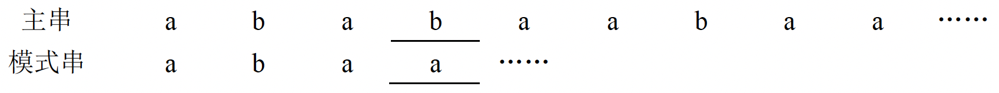
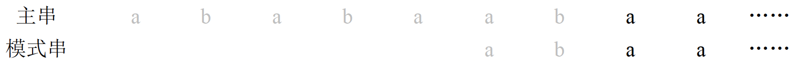
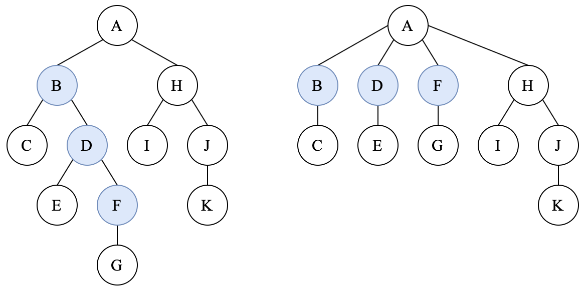

# 数据结构

## 一、绪论

### 1.1 概念

**<u>数据结构三要素</u>**：逻辑结构、储存结构、运算。

**<u>算法的 5 个特性</u>**：有穷性、确定性、可行性、输入、输出。

**<u>一个好的算法应达到目标</u>**：正确性、可读性、健壮性、高效率、低储存。

### 1.2 算法效率的度量——复杂度

**<u>时间复杂度 T(n)</u>**：问题规模 n 的函数，表示规模为 n 时算法需要的运行时间。

**<u>空间复杂度 S(n)</u>**：问题规模 n 的函数，表示规模为 n 时算法需要的储存空间。

*O*(*f*(*n*))：*f*(*n*) 的上界。

*Ω*(*f*(*n*))：*f*(*n*) 的下界。

一般总是考虑最坏情况下的时间复杂度，保证算法运行时间不会比期望时间长。

**<u>复杂度量级比较</u>**：*O*(1) < **<u>*O*(log*n*) < *O*(*n*)</u>** < *O*(*n*log*n*) < **<u>*O*(*n*²) < *O*(2*ⁿ*) < *O*(*n*!) < O(*nⁿ*)</u>**

## 二、线性表（Linear List）

### 2.1 顺序表（Sequential List）

插入平均时间复杂度：*O*(*n*)，时间花费在移动后续所有节点上。

删除平均时间复杂度：*O*(*n*)，时间花费在移动后续所有节点上。

按值查找（顺序查找）平局时间复杂度：*O*(*n*)

按序号查找（随机查找）平均时间复杂度：*O*(1)

### 2.2 单向链表（Singly Linked List）

插入平均时间复杂度：*O*(*n*)，时间花费在找到前驱节点上。

**<u>在指定节点后</u>**插入平均时间复杂度：*O*(1)

删除平均时间复杂度：*O*(*n*)，时间花费在找到前驱节点上。

**<u>在指定节点后</u>**删除平均时间复杂度：*O*(1)

按值查找（顺序查找）平局时间复杂度：*O*(*n*)

按序号查找（随机查找）平均时间复杂度：*O*(*n*)

### 2.3 双向链表（Doubly Linked List）

插入平均时间复杂度：*O*(1)

删除平均时间复杂度：*O*(1)

按值查找（顺序查找）平局时间复杂度：*O*(*n*)

按序号查找（随机查找）平均时间复杂度：*O*(*n*)

### 2.4 循环链表（Circular Linked List）

循环单向链表：尾节点的 next 指向头结点。

循环双向链表：尾节点的 next 指向头结点，头结点的 prev 指向尾节点。

### 2.5 静态链表

在不支持指针的高级语言上，可以用两个顺序表分别储存值和下一个值的序号来实现链表。

## 三、队列、栈、数组

### 3.1 队列（Queue）

只有一端可以进行插入，另一端只能进行删除的线性表，**<u>先进先出</u>**（FIFO，First In First Out）。

插入操作称为入队（Enqueue），删除操作称为出队（Dequeue）。

使用一组地址连续的储存单元存放栈睇到栈顶的数据，还有两个指针，分别为队首指针 front 和队尾指针 rear。

队列长度：rear – front + 1

循环队列长度：((rear + size) – front + 1) % size，其中 size 为这个循环队列可储存的最大长度

### 3.2 双端队列

两端都可以做入队和出队操作的队列。

输出受限的双端队列：其中一端可以插入和删除，另一端只能插入的队列。

输入受限的双端队列：其中一端可以插入和删除，另一端只能删除的队列。

### 3.3 栈（Stack）

只有一端可以进行插入或删除的线性表，**<u>先进后出</u>**（FILO，First In Last Out）。

插入操作称为**<u>入栈或压栈（Push）</u>**，删除操作称为**<u>出栈或弹栈（Pop）</u>**。

使用一组地址连续的储存单元存放栈睇到栈顶的数据，还有一个栈顶指针 top 指示当前栈顶元素（**<u>栈顶指针可以简化出入栈操作</u>**：出栈后只需要向栈底方向移动 top 指针即可，可以不用修改内存中已经不在栈内的数据）。

**<u>共享栈</u>**：两个栈共享一个一维数组空间，两个栈的栈底分别设在共享空间的两端。

**<u>链式栈</u>**：使用链表储存栈，**<u>表头指针指向栈顶</u>**（因为表头方便操作，否则每次操作都要顺着链表找到表尾）。

### 3.4 栈和队列的应用

#### 栈的应用

1. 括号匹配

2. 表达式求值

   **例**：中缀表达式 A + B × (C – D) – E ÷ F 的后缀表达式为 A B C D – × + E F ÷ –。

   求该表达式的值时，按顺序扫描后缀表达式的每一项：① 如果该项是操作数 *X*，则将其压入栈中；② 如果该项是操作符 {op}，则从栈中连续弹出两个操作数 *Y*、*X*，计算 *X* {op} *Y* 的值 *Z*，再将 *Z* 压入栈中。

3. 管理函数递归调用

#### 队列的应用

1. 二叉树的层次遍历（根节点入队，访问根节点，左右孩子入队，根节点出队，访问左孩子，……）
2. 计算机的输入输出缓冲区、CPU 请求队列等

### 3.5 数组（Array）

数组是线性表的推广。一维数组可以看做线性表，二维数组可视为**<u>元素是定长线性表</u>**的线性表。

数组一旦被定义，其维数和**<u>维界（数组下标的取值范围）</u>**就不再改变，所以数组除了初始化和销毁以外，只有存、取和修改元素的操作。

矩阵可以用一个二维数组来储存。

特殊矩阵（如对称矩阵、上下三角矩阵、三对角矩阵等）可以用一些方法压缩成一维数组来储存。

稀疏矩阵可以用三元组（行号、列号、值）来储存非零值，但用这种方法压缩储存后会失去随机访问的特性。

## 四、串（String）的模式匹配

### 4.1 简单模式匹配算法

也叫 Brute-Force，暴力模式匹配算法。

核心思想：

1. 从主串 S 的第一个字符开始，与模式串 T 的第一个字符作比较，若相等则继续逐个比较后续字符；
2. 否则从主串的下一个字符开始，重新和模式串的字符逐个比较。
3. 以此类推，直到在主串中找到一个与模式串完全匹配的**<u>连续的字符序列</u>**，则匹配成功。

若主串长度为 *n*，模式串长度为 *m*，那么简单模式匹配算法的最差时间复杂度为 *O*(*nm*)。

### 4.2 KMP 算法

用 *i* 和 *j* 分别表示主串和模式串当前正在比较的字符的序号。

为了达到简化算法，降低时间复杂度的目的，KMP 算法中**<u>主串指针 *i* 不回溯</u>**，*j* 的移动需要遵循一定的规律，**<u>这个规律与主串无关，仅于模式串有关</u>**。

要求出 *j* 移动的规律，需要了解一些概念。

**例**：假设模式串为 “abaabcaba”。

#### 1) 前缀、后缀、部分匹配值

前缀：不包含最后一个字符的所有头部子串。

后缀：不包含第一个字符的所有尾部子串。

**<u>部分匹配值（PM，Partial Match）</u>**：**<u>最长的相等前后缀的长度</u>**。

**例**：以字符串 “abaabcaba” 为例：

1. “a” 的前缀和后缀都为空集；部分匹配值即最长的相等前后缀的长度为 0。
2. “ab” 的前缀为 { a }，后缀为 { b }；交集为 ∅，即部分匹配值为 0。
3. “aba” 的前缀为 { a, ab }，后缀为 { ba, a }；交集为 { a, ab } ∩ { ba, a } = { a }，即部分匹配值为 1。
4. “abaa” 的前缀为 { a, ab, aba }，后缀为 { baa, aa, a }；交集为 { a, ab, aba } ∩ { baa, aa, a } = { a }，即部分匹配值为 1。
5. “abaab” 的前缀为 { a, ab, aba, abaa }，后缀为 { baab, aab, ab, b }；交集为 { ab }，即部分匹配值为 2。
6. “abaabc” 的前缀为 { a, ab, aba, abaa, abaab }，后缀为 { baabc, aabc, abc, bc, c }；交集为 ∅，即部分匹配值为 0。
7. “abaabca” 的前缀为 { a, ab, aba, abaa, abaab, abaabc }，后缀为 { baabca, aabca, abca, bca, ca, a }；交集为 { a }，即部分匹配值为 1。
8. 同理，这里略过。
9. “abaabcaba” 的前缀为 { a, ab, aba, abaa, abaab, abaabc, abaabca, abaabcab }，后缀为 { baabcaba, aabcaba, abcaba, bcaba, caba, aba, ba, a }；交集为 { a, aba }，即部分匹配值为 3。

#### 2) PM 表

将模式串的每个子串的部分匹配值写成一个表。

**例**：模式串 “abaabcaba” 的 PM 表：

| 序号 | 1    | 2    | 3    | 4    | 5    | 6    | 7    | 8    | 9    |
| ---- | ---- | ---- | ---- | ---- | ---- | ---- | ---- | ---- | ---- |
| 字符 | a    | b    | a    | a    | b    | c    | a    | b    | a    |
| PM   | 0    | 0    | 1    | 1    | 2    | 0    | 1    | 2    | 3    |

#### 3) KPM 算法的实施过程

1. 先对模式串求出 PM 表。
2. 假设匹配过程中，在主串指针为 *i* 和模式串指针为 *j* 的位置发生了不匹配（即模式串的前 *j* – 1 个字符都匹配上了），则**<u>模式串需要向后移动的位数为：已匹配的字符数 – 对应的部分匹配值</u>**，即移动的位数 **<u>Move = (*j* – 1) – PM[*j* – 1]</u>**。
3. **<u>主串指针 *i* 不移动</u>**，移动模式串后重新开始匹配。重复这个过程直到找到匹配串。

整个匹配过程中，**<u>主串始终没有回溯</u>**，故 **<u>KMP 算法可以在 *O*(*m* + *n*) 的时间复杂度上完成</u>**，大大提高了匹配效率。

**例**：还是原先的模式串 “abaabcaba”。假设主串为 “ababaabaa……”。

可以看到，在 *i* = 4，*j* = 4 的位置发生了不匹配。所以已匹配的序号为 *j* – 1 = 3，模式串需要向后移动的位数是 (*j* – 1) – PM[*j* – 1] = 3 – PM[3] = 3 – 1 = 2。

在这个过程中，*i* 不回溯，只有模式串向后移动了 2 位。

此时重新开始匹配，可以看到在 *i* = 8，*j* = 6 的位置发生了不匹配。所以已匹配的序号为 *j* – 1 = 5，模式串需要向后移动的位数是 (*j* – 1) – PM[*j* – 1] = 5 – PM[5] = 5 – 2 = 3。

模式串向后移动了 3 位后重新开始匹配。

重复上述步骤，直到找到匹配串。

#### 4) 使用 next 数组的 KPM 算法

因为每次匹配失败时，都会去找前一个字符的 PM 值，所以直接**<u>将 PM 表右移一位得到 PM'</u>**，这样哪个字符匹配失败直接找自己的表项即可。

由于右移后左边的第 1 位会空缺，这个**<u>空缺用 –1 来填充</u>**，表明如果第一个元素匹配失败，就直接将字符串向右移一位。

此时 Move = *j* – 1 – PM'[*j*]，**<u>相当于将模式串指针 *j* 回退到 *j* = *j* – Move = PM'[*j*] + 1</u>**。

为了不用每次都计算，直接将这个模式串的各个字符发生失配时 *j* 的变化先算好，储存到一个 next 数组中。从 *j* = PM'[*j*] + 1 可以看出，**<u>next 数组其实就是 PM'[*j*] 每个项都 + 1</u>**。

所以，**<u>发生失配时模式串指针的变化公式为 *j* = next[*j*]</u>**。

综上所述，**<u>next[*j*] 的含义是：模式串的第 *j* 个字符与主串发生失配时，跳到模式串的 next[*j*] 位置与主串当前位置进行比较</u>**。

**例**：模式串 “abaabcaba” 的 PM 表：

| 序号 | 1    | 2    | 3    | 4    | 5    | 6    | 7    | 8    | 9    |
| ---- | ---- | ---- | ---- | ---- | ---- | ---- | ---- | ---- | ---- |
| 字符 | a    | b    | a    | a    | b    | c    | a    | b    | a    |
| PM   | 0    | 0    | 1    | 1    | 2    | 0    | 1    | 2    | 3    |

右移一位后得到 PM'：

| 序号 | 1    | 2    | 3    | 4    | 5    | 6    | 7    | 8    | 9    |
| ---- | ---- | ---- | ---- | ---- | ---- | ---- | ---- | ---- | ---- |
| 字符 | a    | b    | a    | a    | b    | c    | a    | b    | a    |
| PM'  | –1   | 0    | 0    | 1    | 1    | 2    | 0    | 1    | 2    |

next 数组：

| 序号 | 1    | 2    | 3    | 4    | 5    | 6    | 7    | 8    | 9    |
| ---- | ---- | ---- | ---- | ---- | ---- | ---- | ---- | ---- | ---- |
| 字符 | a    | b    | a    | a    | b    | c    | a    | b    | a    |
| next | 0    | 1    | 1    | 2    | 2    | 3    | 1    | 2    | 3    |

得到 next 数组后，重新审视刚才的 KPM 过程：

可以看到，在 *i* = 4，*j* = 4 的位置发生了不匹配。所以 *i* = 4 不动，将模式串的 *j* = next[4] = 2 的位置与 *i* 对齐，再从 *i* = 4，*j* = 2 开始匹配。

在 *i* = 8，*j* = 6 的位置发生了不匹配。所以 *i* = 8 不动，将模式串的 *j* = next[6] = 3 的位置与 *i* 对齐，再从 *i* = 8，*j* = 3 开始匹配。

#### 5) 进一步优化的 KPM 算法

当模式串 next[*j*] 位置的字符与 *j* 位置的字符一致时，如果移动 *j* 到 next[*j*] 依然会发生失配。

修正的办法：如果发生 next[*j*] 位置的字符与 *j* 位置的字符一致的情况，就将 next[*j*] 递归地修正为 next[ next[*j*] ]，直到跳转位置的字符与原先 *j* 位置的字符不相同为止。修正后的数组一般命名为 nextval 数组。

## 五、树、二叉树

### 5.1 树（Tree）

基本术语：

1. 祖先节点、子孙节点；父节点、子节点；兄弟节点、堂兄弟节点（父节点在同一层的节点）。

2. 度：一个节点的子节点个数。

   树的度：整棵树所有节点的度中**<u>最大的度数</u>**。

   度大于 0 的节点称为分支节点，度等于 0 的节点称为叶节点。

3. 层次：从根节点开始，根节点为第 1 层，根节点的子节点所在的层为第 2 层，以此类推。

4. 深度：从根节点开始自顶向下累加。

   高度：从叶节点开始自底向上累加。

   树的高度（或深度）数值等于**<u>树的最大层数</u>**。

5. 有序树：节点的各个子节点从左到右有序，不能互换。互换后认为是不同的树。

   无序树：节点的各个子节点可以互换。

6. 平衡树：任意一个节点的左子树和右子树的深度差不超过 1。

7. 路径：两个节点之间连线需要经过的**<u>节点</u>**序列称为路径。注意：树的分支是有方向的，方向从父节点指向子节点，所以兄弟节点或堂兄弟节点等**<u>需要回溯的节点之间不存在路径</u>**。

   路径长度：路径需要经过的**<u>边</u>**的个数。

8. 森林：多棵**<u>互不相交</u>**的树的集合。实际上，将一个树的根节点删去就变成了森林；反之把森林中多棵互不相交的树接到同一个根节点上，森林就变成了一棵树。

### 5.2 二叉树（Binary Tree）

每个节点最多只能有两颗子树。

**<u>二叉树是有序的</u>**（子节点不能左右互换）。

#### 特殊的二叉树

1. 满二叉树（Full Binary Tree）：除了叶节点外的**<u>每个节点都拥有两个子节点</u>**，即高度为 *h* 时节点数为 2^*h* – 1 的二叉树。

2. 完全二叉树（Complete Binary Tree）：每一层的节点都必须**<u>从左到右依次填满的树</u>**。

   给完全二叉树的节点按照从上到下、从左到右的顺序，用 1 ~ *n* 编号，有这些性质：

   ① 若某个节点的编号 *i* ≤ ⌊ *n* / 2 ⌋，则该节点为分支节点，否则为叶节点。

   ② 若存在度为 1 的节点，那么仅有一个度为 1 的节点，并且这个节点的编号为 *n* / 2 ，这个节点只有左子树。

   ③ 求父节点：当 *i* > 1 时，节点 *i* 的父节点编号为 ⌊ *i* / 2 ⌋。

   ④ 求左孩子：当 2*i* ≤ *n* 时，节点 *i* 的左孩子编号为 2*i*，否则没有左孩子。

   ⑤ 求右孩子：当 2*i* + 1 ≤ *n* 时，节点 *i* 的左孩子编号为 2*i* + 1，否则没有右孩子。

   ⑥ 求节点深度：节点 *i* 所在的深度（层次）为 ⌊ log₂*i* ⌋ + 1。

   ⑦ 求树的高度：拥有 *n* 个节点的完全二叉树的高度为 ⌊ log₂*n* ⌋ + 1 或 ⌈ log₂(*n* + 1) ⌉。

3. 二叉搜索树（BST，Binary Search Tree）：也叫二叉排序树，特征为：**<u>左子树上所有节点的关键字均小于根节点的关键字，右子树上所有节点的关键字均大于根节点的关键字</u>**，并且左子树和右子树各自都是 BST 树。

#### 二叉树的性质

1. 非空二叉树上的叶节点的个数等于度为 2 的节点数 + 1，即 *n*₀ = *n*₂ + 1。
2. 非空二叉树第 *k* 层上最多有 2*k* – 1 个节点。
3. 高度为 *h* 的二叉树最多有 2*h* – 1 个节点。

#### 二叉树的储存结构

1. 顺序储存：按照从上到下、从左到右依次将二叉树的所有节点储存在数组中。

   为了反映二叉树的逻辑结构，需要在二叉树中添加不存在的空节点，让每个节点与完全二叉树上的节点相对应，再将整个完全二叉树储存进数组。

2. 链式储存：每个结点都使用一个链表节点来表示。二叉树的链表节点至少需要三个域：数据 data、左指针 leftChild 和右指针 rightChild。

### 5.3 二叉树的遍历

**注**：以下列出的先序、中序、后序遍历的执行步骤皆使用**<u>递归</u>**的方法实现（如果不使用递归，则需要借助**<u>栈</u>**和**<u>循环</u>**来实现）。

#### 先序遍历

1. 访问根节点。
2. 如果根节点有左子树，**<u>先序遍历</u>**左子树。
3. 如果根节点有右子树，**<u>先序遍历</u>**右子树。

#### 中序遍历

1. 如果根节点有左子树，**<u>中序遍历</u>**左子树。
2. 访问根节点。
3. 如果根节点有右子树，**<u>中序遍历</u>**右子树。

#### 后序遍历

1. 如果根节点有左子树，**<u>后序遍历</u>**左子树。
2. 如果根节点有右子树，**<u>后序遍历</u>**右子树。
3. 访问根节点。

#### 层序遍历

按从上到下、从左到右的顺序遍历每一层的每一个节点。

层序遍历的实现可以借助队列：① 根节点 A 入队；② 访问 A，A 的左右孩子 B、C 入队；③ 访问 A 的左孩子 B，B 的左右孩子入队；访问 A 的右孩子 C， C 的左右孩子入队；④ 以此类推，直到队列为空。

**例**：现有如下一棵树：

先序遍历：A B C D E G H I F

中序遍历：B C A G E I H D F

后序遍历：C B G I H E F D A

层序遍历：A B D C E F G H I

### 5.4 从遍历序列还原出二叉树

#### 先序遍历和**<u>中序遍历</u>**可以唯一的确定一颗二叉树。

**<u>先序遍历中，第一个节点一定是二叉树的根节点，由此可以把中序遍历的序列分为两段</u>**，这两段也是中序遍历的序列；**<u>根据分出来的这两段序列的长度，也可以确定先序遍历序列中两段的长度</u>**。这样就得到了根节点的左子树和右子树各自的先序遍历和中序遍历的序列，依此类推可以还原出完整的二叉树。

**例**：先序遍历序列为 ABCDEGHIF，中序遍历序列为 BCAGEIHDF。

1. 根据先序遍历可以得到根节点为 A，于是可以把中序遍历序列分为 BC 和 GEIHDF 两段。
2. 分出来的两段长度分别为 2 和 6，说明左子树的先序遍历长度为 2，右子树的先序遍历长度为 6，可以把先序遍历序列分为 BC 和 DEGHIF。
3. 按照同样的思路处理左子树的先序遍历序列 BC 和中序遍历序列 BC：左子树的根节点为 B；左子树没有左子树，有右子树，为单一节点的 C。
4. 处理右子树的先序遍历序列 DEGHIF 和中序遍历序列 GEIHDF：右子树的根节点为 D；右子树的左子树的中序遍历序列为 GEIH，先序遍历序列为 EGHI，右子树为单一节点 F。
5. 同样的道理处理右子树的左子树的先序遍历序列 EGHI 和中序遍历序列为 GEIH，直到还原出整棵树。

以上步骤较为复杂，做题时还原出整棵树之后，记得按照先序遍历和中序遍历验证一次，以防出错。

#### 后序遍历和**<u>中序遍历</u>**也可以唯一的确定一颗二叉树。

**<u>后序遍历中，最后一个节点一定是二叉树的根节点</u>**，除了这点不一样以外，其他的思路和上面一致。

#### 层序遍历和**<u>中序遍历</u>**也可以唯一的确定一颗二叉树。

思路也与上面的大致一致。

### 5.5 线索二叉树

由于每个二叉链表的节点都有两个指针域，分别指向左子树和右子树，但是当一个节点没有左子树或右子树时，指针会指向 NULL，这个空间就浪费了。

线索二叉树规定：如果一个节点没有左子树，那么 leftChild 指针指向其**<u>前驱节点</u>**；如果一个节点没有右子树，那么 rightChild 指针指向其**<u>后继节点</u>**。并且每个链表节点都要新增两个域，分别为 leftTag 和 rightTag：如果 leftTag = 0 说明 leftChild 指针指向的是左孩子节点，Tag = 1 说明 Child 指针指向的是前驱节点；rightTag 和 rightChild 同理。

将普通的二叉链表线索化很简单，遍历一遍整个链表，在遍历的过程中将空指针改为指向前驱或后继节点即可。

#### 中序线索二叉树的遍历

1. 找到序列中的第一个节点（最左下的节点），然后依次找节点的后继：如果该节点的右标志为 1，说明右指针为线索，指向的是后继；否则后继为该节点右子树的最左下的节点。
2. 重复这个过程，直到后继为 NULL。

### 5.6 树的储存结构

#### 1) 父指针表示法

用一组连续空间来储存每个节点，每个节点的储存空间都包含节点的值和父节点编号。

**注**：父指针表示法的 “指针” 实际上是伪指针：因为储存空间连续，所以只需要记录父节点在数组中的序号（即下标）即可，不需要用真正的内存地址。根节点的父节点编号用一个特殊值（如 –1）表示即可。

#### 2) 子指针表示法

将每个节点的所有子节点都用一个链表储存。*n* 个节点就有 *n* 条子节点链表。

#### 3) 孩子兄弟表示法（二叉树表示法）

**<u>树的结构可以被唯一地映射为一颗二叉树</u>**，也就是说可以使用二叉链表储存一棵树。

二叉链表的节点有两个指针域，分别为 leftChild 和 rightChild，用于储存树时变为 firstChild 和 nextSibling，分别指向**<u>该节点的第一个子节点</u>**和**<u>该节点的下一个兄弟节点</u>**。

树在转化为二叉树时，遵从 “左孩子右兄弟” 的规则。

**例**：

### 5.7 森林的储存结构

森林也可以映射为一颗二叉树，方法如下：

1. 先将所有的树使用**<u>孩子兄弟表示法</u>**唯一地映射为一颗二叉树。
2. “左孩子右兄弟” 的规则决定了一棵树的根节点不可能有右孩子，所以可以用一棵树根节点的右指针指向森林中下一棵树的根节点。

### 5.8 树和森林的遍历

#### 树的遍历

1. 先根遍历：先访问根节点，再依次**<u>先根遍历</u>**根节点的每棵子树。

   先根遍历得到的遍历序列与这棵树对应的二叉树的**<u>先序遍历序列</u>**相同。

2. 后根遍历：先依次**<u>后根遍历</u>**根节点的每棵子树，再访问根结点。

   后根遍历得到的遍历序列与这棵树对应的二叉树的**<u>中序遍历序列</u>**相同。

#### 森林的遍历

1. 先序遍历森林：① 访问森林中**<u>第一棵树的根节点</u>**；② **<u>先序遍历</u>**第一棵树中**<u>根节点的子树森林</u>**；③ 先序遍历**<u>其余的树</u>**构成的森林。

   先序遍历森林得到的遍历序列与这个森林对应的二叉树的**<u>先序遍历序列</u>**相同。

2. 中序遍历森林：① **<u>中序遍历</u>**第一棵树中**<u>根节点的子树森林</u>**；② 访问森林中**<u>第一棵树的根节点</u>**；③ 中序遍历**<u>其余的树</u>**构成的森林。

   有些地方也称森林的中序遍历为后序遍历。

   中序遍历森林得到的遍历序列与这个森林对应的二叉树的**<u>中序遍历序列</u>**相同。

树和森林的遍历与对应二叉树的遍历的关系总结：

| 树      | 森林     | 树或森林对应的二叉树 |
| ------- | ------- | ------------------ |
| 先根遍历 | 先序遍历 | 先序遍历            |
| 后根遍历 | 中序遍历 | 中序遍历            |

### 5.9 树和二叉树的应用

首先了解两个概念：

1. 带权路径长度：从树的根节点到任意节点的路径长度乘以该节点的权重。
2. 树的带权路径长度（WPL）：Weighted Path Length of Tree，为该树所有**<u>叶节点</u>**的带权路径长度之和。

#### 哈夫曼树

在所有含有 *n* 个带权叶节点的二叉树中，WPL 最小的二叉树称为哈夫曼树，也称为最优二叉树。

哈夫曼树中，**<u>权重越大的节点越靠近根节点</u>**。

哈弗曼树的构造方法是贪心算法：

1. 将所有节点按照权重按从小到大排序。
2. 将最小权重的两个节点合并成一棵树，并删除原先的两个节点，添加一个权重为这两个节点权重值之和的新节点作为树根，插入到合适位置。
3. 反复执行该操作，直到只剩下一个节点，即为根节点。

**例**：将权重为 2、7、24、32、37、42、42、120 的节点构造成哈弗曼树：

后续同理，篇幅问题不再演示具体构造过程。

#### 哈弗曼编码

是一种**<u>可变长度编码</u>**，多用于数据压缩（节点的权重代表内容的出现频率；因为哈夫曼树中权重越大的节点越靠近根节点，所以出现频率越高的内容编码长度越短）。

哈夫曼编码还是一种**<u>前缀编码</u>**，即没有任何一个编码是另一个编码的前缀。

如何得到哈弗曼编码：

1. 给每个节点的左孩子指针标上 0，右孩子指针标上 1。
2. 从根节点到叶节点的路径所经过的序列即为该叶节点的哈弗曼编码。

**例**：下图展示了如何用哈夫曼树生成哈夫曼编码。

从图中我们可以得知，C 的编码为 ***0***，F 的编码为 ***11***，Z 的编码为 ***100***，K 的编码为 ***101***。

#### 并查集（Disjoint Set）

将各个元素划分为若干个**<u>互不相交</u>**的子集。称为 “并查集” 是因为对这些集合主要执行的操作有：查询元素属于哪个集合、求几个集合的并集。

并查集一般使用树作为数据结构，一棵树表示一个集合；一般使用**<u>父指针表示法</u>**作为储存结构，方便进行并和查的操作。

##### 求并集

找到这表示两个集合的树，将其中一棵树的根节点接到另一棵树的根节点上即可。

##### 查询两个节点是否属于同一个集合

沿着父指针找到这两个节点各自的根节点，如果根节点相同即表明两个节点属于同一个集合，否则表明两个节点不属于同一个集合。

##### 优化的求并集操作：权重合并规则（Weighted Union Rule）

将节点较少的树接到节点较多的树上（即将小树的根节点作为大树根结点的子节点），此方法得到的树高度较小。

这样构造出来的并查集可以将查询的最差时间复杂度从 *O*(*n*) 降到 *O*(log*n*)。

##### 优化查询操作：路径压缩（Path Compression）

每当对一个某节点执行查找根节点的操作时，就把从这个节点到根节点**<u>经过的路径上所有的节点</u>**都改接到根节点上。

这样构造出来的并查集可以将查询的最差时间复杂度降到 *O*(*α*(*n*))（函数 *α*(*n*) 的增长速度比 log*n* 还慢）。

**例**：假设原并查集结构如左图所示，执行查询 F 属于哪个集合的操作后，F 到 A 的路径上经过的 D 和 B 节点也要被直接接到根节点 A 上。

## 六、图

图 G 由顶点（Vertex）的有限**<u>非空</u>**集合 V，和边（Edge）的有限集合 E 构成，记为 G = (V, E)。

用 |V| 表示顶点的个数，|E| 表示边的条数。

**注 1**：线性表可以是空表，树可以是空树，但**<u>图不可以是空图</u>**。V 一定不为空集，E 可以为空集。

**注 2**：每条边的两端都必须有顶点，不能出现只有一个顶点的边或 “漂浮” 的边。

### 6.1 图的相关基本概念

#### 无向图

若 E 为**<u>无向边（称为边）</u>**的集合，则 G 为无向图。

v 和 w 互相邻接记作边 (v, w) 或 (w, v)。

#### 有向图

若 E 为**<u>有向边（称为弧）</u>**的集合，则 G 为有向图。

v 邻接到 w（或称为 v 指向 w）的弧记作 <v, w>。

#### 简单图、多重图

如果图 G 满足**<u>不存在重复的边</u>**、**<u>不存在顶点到自身的边</u>**，那么称图 G 为简单图；否则成为多重图。

#### 简单完全图（完全图）

对于**<u>无向图</u>**，任意两个顶点之间都有**<u>直接联系的边</u>**的无向图称为完全图。

对于**<u>有向图</u>**，任意两个顶点之间都存在**<u>一对方向相反的弧</u>**的有向图称为完全图。

- 如果 |V| = n，那么**<u>无向完全图的 |E| = n · (n – 1) / 2</u>**，**<u>有向完全图的 |E| = n · (n – 1)</u>**。

#### 回路（环）

经过的第一个顶点和最后一个顶点是相同顶点的路径称为回路，也称为环。

#### 简单路径、简单回路

顶点不重复出现的路径称为简单路径。

除了第一个顶点和最后一个顶点之外，其余顶点不重复出现的回路称为简单回路。

#### 权重、带权图（网）

如果图中每条边都有一个具有某种含义的数值，那么这个数值称为边的权重。

有权重的图称为带权图，也称为网。

#### 路径长度、带权路径长度

一条路径经过的边的数量称为路径长度。

- 有 **<u>n 个顶点的无向图</u>**如果**<u>边的数量大于 n – 1</u>**，那么这张无向图一定存在环。

一条路径经过的所有边的权重之和称为带权路径长度。

#### 距离

从顶点 v 到顶点 w 的最短路径如果存在，则称 v 到 w 的距离为这条最短路径的长度。若 v 到 w 不存在路径，则记距离为无穷（∞）。

#### 顶点的度（TD）、入度（ID）、出度（OD）

在无向图中，依附于顶点 v 的边数称为顶点 v 的度 TD(v)。

在有向图中，以顶点 v 作为起点的边数称为顶点 v 的出度 OD(v)，以顶点 v 作为终点的边数称为顶点 v 的入度 ID(v)。

#### 有向树

**<u>只有一个入度为 0 的顶点</u>**并且**<u>其余顶点的入度均为 1</u>**的有向图称为有向树。

#### 稠密图、稀疏图

边数很多的图称为稠密图，边数很少的图称为稀疏图。**<u>这是一个模糊的概念</u>**，稀疏和稠密通常是相对而言的。

#### 子图、生成子图

对于 G = (V, E)，如果 V' 为 V 的子集，E' 为 E 的子集，并且 **<u>E' 中的边所有的顶点都在 V' 中</u>**（即满足图的基本定义：没有漂浮的边），那么称 G' = (V', E') 称为 G 的子图。

如果 V' = V（即子图**<u>包含了原图的所有顶点</u>**），那么称 G' 称为 G 的生成子图。

#### 连通、连通图、连通分量

在**<u>无向图</u>**中，顶点 v 到顶点 w 如果有路径存在，则称 v 和 w 是连通的。

如果 G 中任意两个顶点都是连通的，则称 G 为连通图，否则称为非连通图。

- 有 **<u>n 个顶点的无向图</u>**如果**<u>边的数量小于 n – 1</u>**，那么这张图一定是非连通的。

- 有 n 个顶点的非连通图最多可以拥有 (n – 1) · (n – 2) / 2 条边（即 n – 1 个顶点的完全图的边数）。

无向图的**<u>极大连通子图</u>**称为该图的连通分量。观察下图的例子来理解。

**例**：

#### 强连通、强连通图、强连通分量

在**<u>有向图</u>**中，顶点 v 到顶点 w 如果有**<u>双向的路径</u>**存在，则称 v 和 w 是强连通的。

如果 G 中任意两个顶点都是强连通的，则称 G 为强连通图。

- 有 **<u>n 个顶点的有向图</u>**如果是强连通图，那么**<u>最少需要 n 条边</u>**，并且这 n 条边要形成回路。

有向图的**<u>极大强连通子图</u>**称为该图的强连通分量。观察下图的例子来理解。

**例**：

#### 生成树、生成森林

对于**<u>连通图</u>**，包含图中所有顶点的**<u>极小连通子图</u>**称为该连通图的一颗生成树。一张连通图的**<u>生成树不唯一</u>**。

生成树如果删掉一条边会变成非连通图，如果增加一条边会出现回路。

- 有 **<u>n 个顶点的连通图</u>**的生成树**<u>一定含有 n – 1 条边</u>**。

### 6.2 图的储存结构

#### 邻接矩阵

用一个 n × n 的二维数组储存图中 n 个顶点之间的邻接信息。

- 对于无权图：用 1 来表示两个顶点之间存在边，用 0 来表示两个顶点之间没有边。

- 对于带权图：邻接矩阵中储存的是每条边的权重，两个顶点之间不存在边通常用 0 或 ∞ 来表示。

无向图的邻接矩阵是对阵矩阵。

无向图的邻接矩阵第 i 行（或第 i 列）的非零元素的个数就是 vᵢ 的度 TD(vᵢ)。

有向图的邻接矩阵第 i 行的非零元素的个数就是 vᵢ 的出度 OD(vᵢ)，第 i 列的非零元素的个数就是 vᵢ 的入度 ID(vᵢ)。

**<u>稠密图适合用邻接矩阵来储存</u>**。

#### 邻接表

图中的顶点是顺序储存的，每个顶点都拥有一个链表，储存依附于该顶点的所有边。

链表的节点拥有两个域：邻接节点域（储存该顶点通过这条边邻接的顶点）、指针域（指向该顶点的下一条边）。

对于无向图，第 i 个链表中储存着所有依附于节点 vᵢ 的边，这个链表称为 vᵢ 的边表。

对于有向图，第 i 个链表中储存着所有以顶点 vᵢ 为尾（即以顶点 vᵢ 为起点）的弧，这个链表称为 vᵢ 的出边表。

**<u>稀疏图适合用邻接表来储存</u>**。

**例**：有向图和无向图的邻接表：

#### 十字链表

是储存**<u>有向图</u>**的另一种链式结构。

图中的顶点是顺序储存的，每个顶点都拥有两个链表：一个储存**<u>以该顶点为弧头（即以该顶点为终点）</u>**所有的弧，另一个储存以该顶点为弧尾的所有弧。

链表的节点拥有四个域：① 弧尾（即弧的起点）的顶点编号；② 弧头（即弧的终点）的顶点编号；③ 两个指向下一条弧的指针域：一个指针指向弧头相同的下一条弧，另一个指向弧尾相同的下一条弧。

如果弧有权重，链表的节点可以增加一个储存权重的域。

一张图的十字链表表示是不唯一的。

#### 邻接多重表

是储存**<u>无向图</u>**的另一种链式结构，与十字链表类似。

图中的顶点是顺序储存的，每个顶点都拥有一个链表，储存依附于该顶点的所有边。

链表的节点拥有四个域：两个顶点域（分别储存该边依附的两个顶点编号 i 和 j）、两个指向下一条弧的指针域（一个指针指向下一条依附于顶点 i 的边，另一个指向下一条依附于顶点 j 的边）。

如果边有权重，链表的节点可以增加一个储存权重的域。

### 6.3 图的遍历

#### 广度优先搜索（BFS）

Breadth-First Search，核心思想是分层查找，每次都将同一深度的（与开始的顶点相同距离的）所有顶点访问完再往更深一层前进。搜索过程中不会发生回退。

BFS 的实现可以借助队列。

#### 深度优先搜索（DFS）

Depth-First Search，核心思想是每次都深入到不能再深入为止（即访问到 “叶节点”），再回退到最近的仍拥有未被访问的邻接顶点的顶点，继续执行 DFS。

**注**：由于图的邻接矩阵是唯一的，而邻接表是不唯一的（边的输入次序不同会生成不同的邻接表），所以对于同一张图，基于邻接矩阵得到的 BFS 序列和 DFS 序列是唯一地，但基于邻接表得到的序列是不唯一的。

### 6.4 最小生成树（MST）

Minimum Spanning Tree。

对于无权图，最小生成树是包含所有 n 个顶点并且只含有 n – 1 条边的连通图。

对于带权图，最小生成树是所有边的权重之和最小的那棵生成树。当 G 的各边权重互不相等时，G 的最小生成树是唯一地，否则 G 的最小生成树不唯一。但 G 的**<u>最小生成树的权重总和是唯一的</u>**。

#### Prim 算法

1. 从起始顶点开始，添加一个**<u>距离它自己最近的顶点</u>**（即与自己直接相连的边中权重最小的那条边）。
2. 将这两个顶点看成一个 “超顶点”，找距离这个 “超顶点” 最近的一个顶点，再添加进子图中（即除了这两个顶点之间相连的边，选择这两个顶点到其他顶点的边中权重最小的一条边）。
3. 再将这三个顶点也看成一个 “超顶点”，重复上述步骤，直到所有的顶点都被添加进子图中。

得到的子图即为最小生成树。

时间复杂度为 *O*(|V|²)，适用于稠密图。

#### Kruskal 算法

1. 每次添加新的边进子图中时，优先选择原图中还未被包含进子图的**<u>权重最小的边</u>**。
2. 确认这条边的两个顶点不在同一个子图中（过程中可能会出现很多张子图，可以用父指针表示法判断两节点是否在同一个集合里，**<u>保证子图不会出现环</u>**），否则选择第二短的边进行判断和添加。
3. 重复这个步骤直到所有的顶点都被添加进生成子图。

得到的子图即为最小生成树。

时间复杂度为 *O*(|E|log|E|)，适用于稀疏图。

### 6.5 最短路径

最短路径问题可以分为单源最短路径和全对最短路径（All pairs shortest path）。

对于无权图，单源最短路径可以通过 BFS 算法求解。

对于带权图，单源最短路径可以通过 Dijkstra 算法求解。

对于全对最短路径问题，可以对所有顶点运行 Dijkstra 算法，时间复杂度为 *O*(|V|³)；也可以使用 Floyd 算法。

#### Dijkstra 算法

求 A 到其他顶点的最短路径：

1. 先建立一个数组，将 A 到自己的距离标为 0，到其他所有点的距离标为 ∞。
2. 将 A 到与之邻接的顶点的距离写入数组。
3. 在数组中找到一个最小值（表明了一个与 A 相距最近的顶点 B），将这个顶点标记为 “已找到最短距离”。
4. 从上一次标记的顶点 B 出发，用 A 到 B 的距离加上 B 到其它未被标记为 “已找到” 的顶点的距离，如果这个距离比数组中现有的距离小，就更新数组中的这个距离。
5. 重复上述步骤，直到所有顶点都被标记为“已找到”。

得到的数组即为 A 到其他所有顶点的最短路径的长度。

Dijkstra 算法不允许图中有距离为负数的边。

时间复杂度为 *O*(|V|²)。

#### Floyd 算法

假设顶点编号为 1 ~ n。

首先，需要定义 **<u>K-path</u>**：从顶点 u 到顶点 v 的路径中，除 u 和 v 以外任意一个**<u>中间顶点的序号</u>**的都小于 k 的路径。

再定义 **<u>Dk(v, u)</u>**：从 v 到 u 的 K-path 里最短路径的长度。

Floyd 算法实施步骤：

1. 先得到 G 的邻接矩阵，记作 D₀，矩阵储存的内容是每条边的权重，没有直接相连的边则用 ∞ 表示。
2. 将矩阵按照 Dk+1(v, u) = min { Dk(v, u), Dk(v, k) + Dk(k, u) } 的逻辑更新矩阵的每个单元。
3. 此过程一共执行 n 遍，得到 Dn。

此时矩阵内储存的即是所有顶点之间的最短路径。

Floyd 算法允许图中有距离为负数的边，但不允许负权重的边出现在某条回路中。

### 6.6 有向无环图（DAG）

Directed Acyclic Graph，是描述含有公共子式的表达式的有效工具。

#### 顶点表示活动（AOV）网络

Activity On Vertex，用图表示一个工程，用顶点表示活动；用有向边 <v, u> 表示活动 v 必须先于活动 u 进行。这样的 DAG 图称为 AOV 网。

v 和 u 之间如果存在有向边 <v, u>，则称 v 是 u 的直接前驱，u 是 v 的直接后继。前驱和后继具有传递性，任何活动不能以自己为自己的前驱或后继。

#### 拓扑排序（Topological Sort）

在实际工程中，各个活动之间可能有先决条件，需要不违反这些先决条件对活动进行排序。

用一张 AOV 图来表示这个工程：将每一个活动看成一个顶点，活动有多少直接先决条件，对应的顶点就有多少直接前驱（直接前驱的数量就是这个顶点的入度）。任何一个活动如果要开始，它的所有前驱都必须已经完成。

拓扑排序的算法：

1. 先从图中找到入度为 0 的顶点，将这个顶点从图中删除，再将这个顶点的所有出边指向的顶点的入度都减 1。
2. 重复以上步骤，直到图中所有顶点入度都变成 0 后被删除。

此时得到的顶点删除顺序即为拓扑排序的结果。

如果有入度始终不为 0 的顶点，说明**<u>有向图中存在环，无法进行拓扑排序</u>**。

#### 边表示活动（AOE）网络

Activity On Edge，用图表示一个工程，用顶点表示事件用有向边表示活动，用边上的权重表示完成该活动所需的开销，这样的 DAG 图称为 AOE 网。

AOE 网中只能有一个入度为 0 的顶点（源点），表示工程的开始；只能有一个出度为 0 的顶点（汇点），表示工程的结束。

源点到汇点可能有多条路径，需要所有路径上的活动都完成工程才能结束。

关键路径：源点到汇点的所有路径中具有最大长度的路径。

关键活动：关键路径上的活动。

如果权重表示所需时长，那么要缩短工期，则需要缩短关键活动所需要的时间。

关键路径缩短到一定长度，也可能会转变为非关键路径。

# 以下两章没有详细内容，只有大纲

## 七、查找

衡量查找算法效率的指标：平均查找长度（ASL）

### 7.1 顺序查找（Sequential Search）

### 7.2 二分查找（Binary Search）

### 7.3 分块查找（字典查找）

### 7.4 启发式算法

按实际访问频率排序（Count Heuristic）

只要被访问就直接移动到最前（Move-to-Front Heuristic）

访问一次就向前移动一位（Transpose Heuristic）

### 7.5 二叉搜索树（BST）查找

#### 查找

#### 插入

#### 构造

#### 删除

### 7.6 平衡二叉树（AVL 树）查找

#### 查找

#### 插入

#### 删除

### 7.7 红黑树

#### 插入

#### 删除

### 7.8 B 树

#### 高度

#### 查找

#### 插入

#### 删除

### 7.9 B+ 树

### 7.10 散列表（Hashing）

#### 散列函数

直接定址法

除取余数法

数字分析法

平方取中法

#### 冲突处理

开放定址法（线性探测、平方探测、双散列函数、伪随机序列）

拉链法

## 八、排序

### 8.1 稳定性、内部排序与外部排序

### 8.2 直接插入排序（Insertion Sort）

### 8.3 二分插入排序

### 8.4 希尔排序（Shell Sort）

### 8.5 冒泡排序（Bubble Sort）

### 8.6 快速排序（Quick Sort）

操作步骤

优化 Pivot 选取的办法

### 8.7 选择排序（Selection Sort）

### 8.8 堆排序（Heap Sort）

大顶堆 / 小顶堆的构造

输出堆顶元素后恢复大顶堆 / 小顶堆

插入元素到叶结点后恢复大顶堆 / 小顶堆

### 8.9 归并排序（Merge Sort）

### 8.10 基数排序（Radix Sort）

### 8.11 内部排序算法比较

| 排序算法  | 最好时间复杂度        | 最差时间复杂度       | 平均时间复杂度               | 空间复杂度    | 稳定性 |
| -------- | ------------------- | ------------------- | -------------------------- | ----------- | ------ |
| 直接插入  | *O*(*n*)            | *O*(*n*²)           | ***O*(*n*²)**              | *O*(1)      | √      |
| 二分插入 | *O*(*n*²) | *O*(*n*²) | *O*(*n*²) | *O*(1) | √ |
| 希尔 | ≈ *O*(*n*1.3) | *O*(*n*²) | *O*(*n*) < *x* < *O*(*n*²) | *O*(1) | × |
| 冒泡     | *O*(*n*)            | *O*(*n*²)           | ***O*(*n*²)**              | *O*(1)      | √      |
| 快速     | *O*(*n*log*n*)      | *O*(*n*²)           | ***O*(*n*log*n*)**         | *O*(log*n*) | ×      |
| 选择 | *O*(*n*²) | *O*(*n*²) | ***O*(*n*²)** | *O*(1) | × |
| 堆       | *O*(*n*log*n*)      | *O*(*n*log*n*)      | ***O*(*n*log*n*)**         | *O*(1)      | ×      |
| 归并     | *O*(*n*log*n*)      | *O*(*n*log*n*)      | ***O*(*n*log*n*)**         | *O*(*n*)    | √      |
| 基数     | *O*(*d*(*n* + *r*)) | *O*(*d*(*n* + *r*)) | ***O*(*d*(*n* + *r*))**    | *O*(*r*)    | √      |

### 8.12 外部排序

#### 多路归并排序

#### 败者树

#### 置换 - 选择算法

#### 最佳归并树

