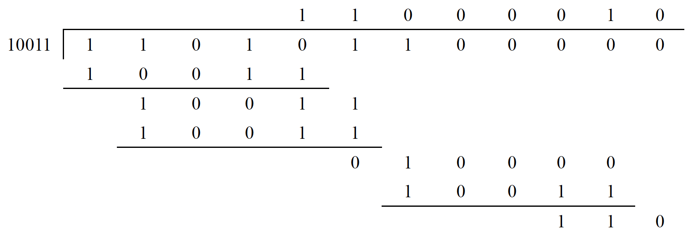
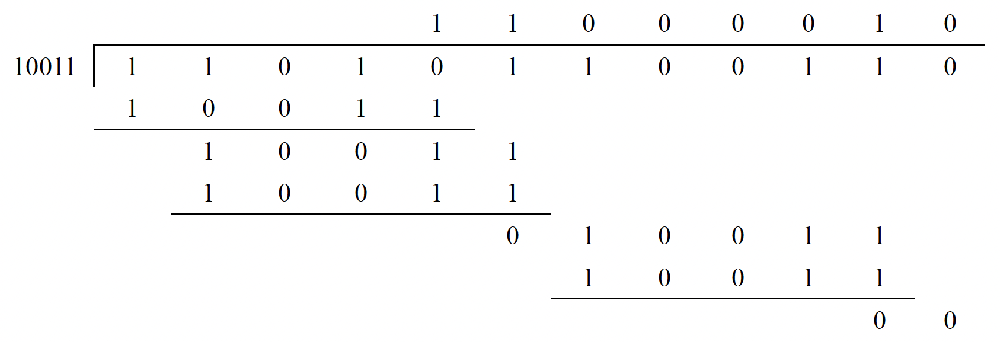
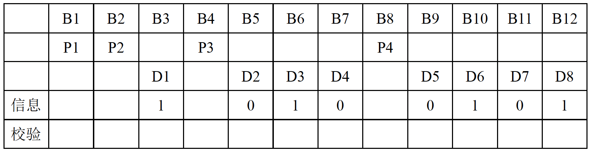
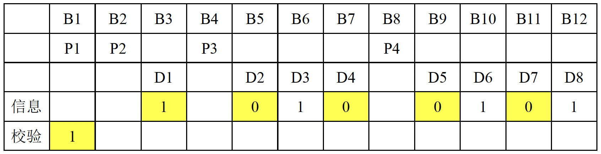
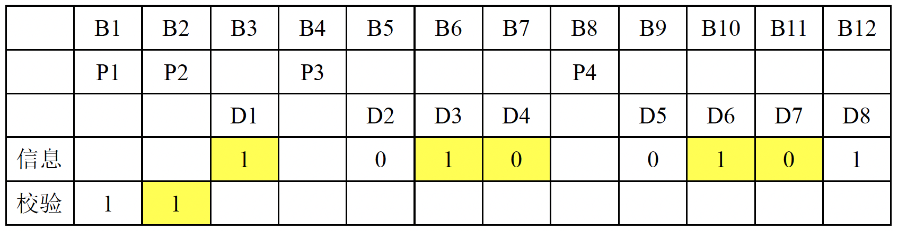
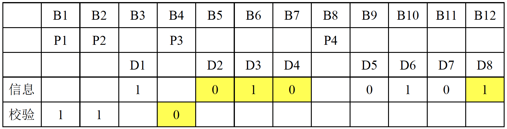
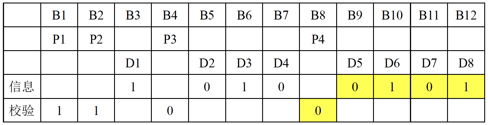

## 三、数据链路层

### 3.1 数据链路层可以为网络层提供以下几种服务

1. 无确认无连接服务，适合实时通信或误码率较低的通信信道，如以太网。

2. 有确认无连接的服务。适合误码率较高的通信信道，如无线通信。

3. 有确认面向连接的服务。适合通信可靠性、实时性要求较高的场合。

注：**<u>面向连接的服务一定有确认</u>**，不存在无确认但面向连接的服务。

### 3.2 链路管理

主要用于面向连接的服务，管理连接的建立、维持和释放。

### 3.3 组帧

将一段数据的前后分别添加**<u>首部</u>**和**<u>尾部</u>**就构成了一帧。

组帧主要解决帧界定、帧同步与透明传输的问题。

- 帧界定：帧的首部和尾部中有很多控制信息，它们的一个重要作用就是确定帧的界限。

- 帧同步：接收方能正确地收到发送方发来的帧。

- 透明传输：无论待传输的数据是什么比特组合，都能在链路上进行有效的传输。

通常有四种方法实现组帧：字符计数法、字节填充的首尾定界符法、零比特填充的首尾标志法和物理层违规编码法。**目前较常用后两种方法**。

#### 3.3.1 字符计数法

在每个帧的头部有一个计数字段，这个字段标明整个帧（包括这个字段本身）的长度。

**缺点**：如果计数字符在传输的过程中出错，就会失去帧边界的划分依据，后面所有的帧都无法正确接收，收发双方失去同步。

#### 3.3.2 字节填充的首尾定界符法

每一帧都有一个控制字符 SOH 放在帧的最前面，表示帧的开始；一个控制字符 EOT 放在帧的最后面，表示帧的结束。

如果传输的数据中恰巧包含与控制字符内容一样的字节，为了防止误判，会在传输数据中的 “假标记” 前加上一个转义符 ESC；如果数据中恰巧包含与转义符 ESC 内容一样的字节，会在 “假转义符” 前再加上一个 ESC。即 **<u>ESC 紧跟着出现的控制字符和转义字符都不会被认为是特殊标记</u>**。

**缺点**：兼容性差，只适用于整数个字节的帧例如ASCII信息流。

#### 3.3.3 零比特填充的首尾标志法

帧界标记为 0111 1110。规定在数据中不允许出现连续的六个 1，如果数据中有连续的五个 1，发送方就在这五个 1 后面加一个 0；接收方收到连续的五个 1 后，自动删除后面紧跟着的 0 就可以恢复原信息。

**优点**：零比特填充法很容易被硬件实现，性能优异。

#### 3.3.4 物理层违规编码法

将不可能出现在数据流中的序列用作帧界标记。

例如，在 4B/5B 编码中，有 16 种不会出现在 4B/5B 编码后的信息中的序列，可以使用这些序列作为标记；曼彻斯特编码中，也不会出现一个比特时间内一直维持高电平或一直维持低电平的信号，这两种冗余的信号可以作为帧界标记。

**优点**：不需要任何填充技术即可实现透明传输。

**缺点**：只适用于采用冗余编码的信道。

**<u>局域网 IEEE 802 就采用了这种方法。</u>**

### 3.4 差错控制

差错控制可以分为检错编码和纠错编码。

- 常见的检错编码有奇偶校验码和循环冗余码。

- 常见的纠错编码有海明码。 

#### 3.4.1 奇偶校验码

由n为信息位和1位校验位组成。

如果是奇校验码，则加上校验位后这 n + 1 位共中有奇数个 1；如果是偶校验码，则加上校验位后这 n + 1 位中共有偶数个 1。

**缺点**：如果出错位的个数是偶数，则无法发现出错。

#### 3.4.2  循环冗余码（CRC）

**<u>可以检测出最多 *r* 位错误的 CRC</u>**：

1. 收发双方约定一个**<u>阶数为 *r* 阶的生成多项式（写作二进制数共 *r* + 1 位）</u>**；
2. 发送方在 *m* 位的信息后加上 *r* 位的 0，用生成多项式去模 2 除（求异或）这 *m* + *r* 位的二进制数，得到一个余数，将这个余数拼接在这 *m* 位后面形成一个 m + *r* 位的码字；
3. 接收方收到一个码字字之后去除约定好的生成多项式，能被整除说明信息传输无误。

**优点**：CRC 可以在硬件上实现，速度很快。

**注**：CRC其实可以纠正错误，但在数据链路层中只用来检测错误。

**例**：假设生成多项式 G(*x*) = *x*^4 + *x* + 1（4 阶，写作二进制为 10011），待传输信息为 1101 0110。

发送方：

在原信息后加上 4 个 0，变成 1101 0110 0000，用模 2 除法除以生成多项式：

得到余数 0110。将 0110 追加到原信息后得 1101 0110 0110 即为一个码字。

接收方：

收到 1101 0110 0110 后对这个码字进行模 2 除法：

得到余数为 0 即可以被整除，则说明传输信息无误；不能被整除，则说明传输出错。

有一些特殊的多项式因为具有很好的特性，所以成为了标准。生成多项式的标准有 CRC-12，CRC-16，CRC-32（用于以太网）等。

#### 3.4.3 海明距离

对于两个不同的码字来说：两个码字之间不同位的个数（例：1001 0111 和 1100 0110 的海明距离为 3）。

对于一种编码方式来说：这种编码所有的码字中，**任意两个码字**的海明距离的**最小值**为这种编码方式的海明距离。

**海明距离的意义 —— 检错纠错码**：

如果一种编码方式**<u>能检测出 *d* – 1 位的差错</u>**，那么这种编码方式的<u>**海明距离为 *d***</u>：一个码字至少要变化 *d* 位才能变成另外一个码字（如奇偶校验码海明距离为 2，即至少需要变化 2 位才能变成另一个码字，奇偶校验码能检测出发生了 1 位跳变的错误码字）。

如果一种编码方式**<u>能纠正最多 *d* 位的差错</u>**，那么这种编码方式的**<u>海明距离为 2*d* + 1</u>**：一个码字变化 *d* 位后仍距离原来的码字最近（距离原来的码字 *d* 位，距离下一个码字 *d* + 1 位，距离其他的码字更远）。

#### **3.4.4 海明码**

如果要传输 *m* 位数据，要使编码方式能纠一位错，则至少需要 *r* 位冗余位，*m* 与 *r* 满足不等式：(*m* + *r* + 1) ≤ 2*r*。

纠一位错的海明码的校验位是：码字中所有编号为2的乘方的位；其他位均为数据位。

纠一位错的海明码的校验位的内容为：包括自身的值在内的一些位的奇偶校验结果。

如何找到错误：将所有不正确的校验位的编号相加得到的结果就是出错的位的编号。

**例（<u>纠一位错的偶校验海明码</u>）**：

数据位共 8 位（*m* = 8），则计算得到校验位应有 4 位，分别为 1、2、4、8 位。假设要传输的数据为 1010 0101：

**<u>注意：编号时最低位为 D1，最高位为 D*m*。</u>**

编码过程：

P1 为码字中编号转化为二进制数后，最低位是 1 的所有位的偶校验（即第 1、3、5、7、9、11 位的偶校验），分别是「P1」、1、0、0、0、0，则「P1」应为 1：

P2 为码字中编号转化为二进制数后，倒数第二位是 1 的所有位的偶校验（即第 2、3、6、7、10、11 位的偶校验），分别是「P2」、1、1、0、1、0，则「P2」应为 1：

P3 为码字中编号转化为二进制数后，倒数第三位是 1 的所有位的偶校验（即第 4、5、6、7、12 位的偶校验），分别是「P3」、0、1、0、1，则「P3」应为 0：

P4 为码字中编号转化为二进制数后，最高位是 1 的所有位的偶校验（即第 8、9、10、11、12 位的偶校验），分别是「P4」、0、1、0、1，则「P4」应为 0：

所以，传输数据 1010 0101 的纠一位错海明码为 1010 0010 0111。

纠错过程：

如果收到的信号第 9 位出错，变为 101<u>1</u> 0010 0111，此时对于 P1 来说 1<u>0</u>1<u>1</u> 001<u>0</u> 011<u>1</u> 偶校验出错，P2 1<u>01</u>1 0<u>01</u>0 0<u>11</u>1 偶校验无误，P3 <u>1</u>011 0<u>010 0</u>111 偶校验无误，P4 <u>1011 0</u>010 0111 偶校验出错；

而 P1 为码字中第 1 位，P4 为码字中第 8 位，所以出错的位编号是 8 + 1 = 9，此时接收方翻转第 9 位即可得到正确的信息。

### 3.5 流量控制

控制发送方帧发送的速率，保证接收方有足够的空间来接受帧。

数据链路层的流量控制控制的是相邻两节点之间数据链路上的流量（而传输层的流量控制控制的是源端到目的端之间的流量）。

#### 3.5.1 停止 - 等待流量控制

发送方每发送一帧，都要等待接收方的应答信号到来，收到应答后才能发送下一帧。如果收不到应答信号，发送方就会一直等待。

**缺点**：传输效率很低。

#### 3.5.2 滑动窗口流量控制

发送方将当前发送窗口中序列号对应的帧发出，接收方检查收到的帧的序列号是否是接收窗口中的序列号：如果接收到的帧在接收窗口内，则回发确认帧给发送方并将接收窗口向下滑动；发送方收到确认帧后，检查是否为发送窗口内的序号，如果是则表明接收方已成功接收，就滑动发送窗口，并根据窗口发送后面对应序列号的帧。

滑动窗口技术前后两次的窗口中序列号不能重叠，否则协议将失败。

相关计算：

**<u>信道利用率</u>**：滑动窗口技术中，在发送方没有收到确认帧时，一直是阻塞状态，假设信道速率为 *B* bps，发送一次只能发送一个大小为 *K* bits 的帧，从开始发送到收到第一个确认帧需要 *T* s，则信道利用率为 *K* / *BT*，信道利用率较低；如果发送方一次能发送 *W* 个帧（窗口大小为 *W*），则信道利用率为 *W* · *K* / *BT*。可计算出一次发送多少帧（窗口大小为多大）能使信道利用率为 100%。

**<u>信道吞吐率</u>**：信道利用率 × 发送方的发送速率。

**<u>信道容量（带宽 - 延迟积）</u>**：一帧从开始发送到到达目的地的时间（延迟）里信道上可以容纳多少帧，假设信道速率为 *B*，延迟为 *D*，则带宽 - 延迟积为 *B* · *D*（所以窗口大小 W = 2 × *BD* + 1 时可以使信道利用率达到 100%，应设置 W ≤ 2 × *BD* + 1）。

### 3.6 可靠传输机制

**注**：实际有线网络中连接本身较为可靠，在数据链路层很少使用可靠传输。本文档按照 408 考纲写在这里。

#### 3.6.1 自动重传请求技术（ARQ）

Automatic Repeat Request，也叫肯定确认重传技术（PAR, Positive Acknowledgement with Retransmission）。

发送方每发出一个帧就启动一个重传定时器，并等待接收方确认帧的到来：如果定时器超时之前收到确认帧，则发送下一帧并重置定时器；否则重传这一帧，并再次启动定时器等待确认帧的到来。

**<u>捎带确认：将确认捎带在一个要发送给对方的数据帧中。可以提高传输效率。</u>**

ARQ 协议主要有：停止 - 等待协议，回退 n 帧协议（GBN）和选择重传协议（SR）。

从滑动窗口的角度看，这三个协议的区别是：

- 停止 - 等待协议：发送窗口大小 = 1，接收窗口大小 = 1。
- 回退 n 帧协议：发送窗口大小 > 1，接收窗口大小 = 1。
- 选择重传协议：发送窗口大小 > 1，接收窗口大小 > 1。

窗口大小为 1 的时候可以保证收到的帧是有序的。

**<u>数据链路层的窗口大小在传输的过程中是固定的</u>**（与传输层的滑动窗口不同）。

#### 3.6.2 停止 - 等待协议

发送方在发送一次后停止并等待，接收方在接收到后回复一个确认帧，发送方收到确认帧再发送下一帧。

由于每次只发一帧就停止并等待，发送的帧交替使用 0 和 1 来标识即可，即**<u>只需要 1 bit 用于编号</u>**。

到达接收方的帧如果经过前面所述的差错检验技术后发现已被破坏，接收方就会丢弃这一帧，并不回发确认帧。发送方在发送时会启动一个超时计时器，如果计时器超时后仍未收到接收方回复的确认帧则认为传输出现问题，于是重发这个未被确认的帧并再次启动计时器。

如果是确认帧在回发的路上被破坏，发送方也收不到确认帧，超时后也会重发这一帧，接收方收到同样编号的数据帧时会丢弃并再次发送一个对应的确认帧。

**缺点**：信道利用率很低。

#### 3.6.3 回退 n 帧协议（GBN）

发送方无需等待上一帧的确认，可连续发送多帧。

传输的过程中可能中间的帧会损坏或丢失，当接收方检测出失序后，会保存最后收到的有序帧，并将这一帧后的所有帧丢弃（接收方只允许按顺序接收）。发送方未收到确认帧超时后，会重发收到的最后一个确认帧后的所有帧。

**例**：发送方发出了序列号为 0 ~ 9 的十个帧，只收到了 0、2、3 帧的确认，则发送方会重传 4 ~ 9 这六个帧（虽然没收到 1 的确认帧，但是收到了 3 的确认帧说明 1 已经被成功接收了，否则回退 n 帧的协议不会接收序列号为 3 的帧）。

**<u>累积确认：接收方不一定每个帧都回复一个确认帧，接收方对某一帧的确认表明该帧和此前所有的帧都已准确无误地收到。</u>**

若采用 *n* 比特对帧编号，则**<u>发送窗口的尺寸 Wt 应满足 1 < Wt < 2^n</u>**。若发送窗口尺寸大于 2^n – 1 接收方会无法分辨新旧帧。

**优点**：提高了信道利用率。

**缺点**：重传时必须把错误帧后的所有正确发送的帧也重传了，效率降低（当通信信道质量差错误率高的时候回退 n 帧协议效率可能比停止 - 等待协议还低）。

#### 3.6.4 选择重传协议（SR）

发送方和接收方的窗口大小都大于 1，一次可以发送或接收多个帧。

接收方发现接收到出错帧后，只丢弃出错帧，缓存并确认所有正确帧；发送方发现只有出错帧的定时器超时，其他帧都收到确认，所以只重传出错帧；接收方正确接收重发的帧后，再与缓存下来的之前收到的帧重新排序并提交。

适用于出错率较高的网络环境。

若采用 *n* 比特对帧编号，则**<u>发送窗口的尺寸 Wt 和接受窗口的尺寸 Wr 应满足 Wt = Wr = 2^(n – 1)</u>**。若窗口尺寸大于序号范围的一半，当确认帧丢失导致发送方重传时，接收方会无法分辨新旧帧。

